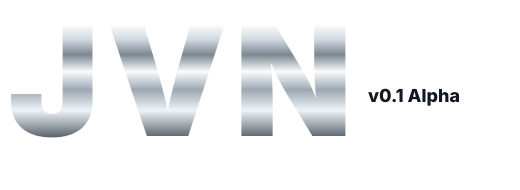

# Java Vector Nexus (JVN)

<div align="left">
  
  <br>
  <strong>Current version:</strong> v0.4.4.1 <em></em>
</div>

JVN is a young, modular cross-platform Visual Novel engine and 2D animation toolkit written in Java.

Documentation entrypoints:

- [Public Documentation Website](https://javavectornexus.com)
- [Documentation Index](docs/INDEX.md)
- [JVN Engine Hub](docs/editor/core/engine-hub.md)
- [JVN Editor Docs](docs/editor/README.md)
- [JVN Build And Release Docs](docs/project-setup/release/README.md)

The public website is the recommended reading surface for the latest organized docs. The Markdown
files in `docs/` remain the source of truth in this repository and are mirrored into the website.

## JVN Language Tools For VS Code

<div align="left">
  <a href="https://marketplace.visualstudio.com/items?itemName=Simplector.jvn-language-tools&ssr=false#review-details">
    
  </a>
</div>

JVN Language Tools is available on the Visual Studio Marketplace for VNS, JES, Story Map, and JVN config syntax highlighting and snippets:

[Install JVN Language Tools for VS Code](https://marketplace.visualstudio.com/items?itemName=Simplector.jvn-language-tools&ssr=false#review-details)

## Architecture

JVN is designed to be lightweight and predictable under load.
- Runtime, scripting, renderer backends, and editor tooling are clearly separated and extensible.

Typical memory footprint for the core runtime together with the full editor is around **70-130 MB RAM** in normal desktop usage (project/content dependent).

## Requirements

JVN is in heavy continuous development. Engine APIs, editor tooling, generated project structure, and scripting/file-format behavior may change between updates.

- JDK 21 installed locally on your machine. If multiple JDKs are installed, point `JAVA_HOME` at JDK 21 before building or running JVN.
- No global Gradle install required. Use `./jvnw` as the default JVN command wrapper.
- `./gradlew` remains available as the optional low-level Gradle entrypoint for uncommon/manual tasks.
- `git` is required when cloning from source and optional afterward for pulling updates from the repository or using hub/editor update workflows.
- For team version-control and large-asset workflows in editor: `git lfs` installed/configured.

### Recommended JDK

For local source builds, use [Eclipse Temurin 21 LTS](https://adoptium.net/temurin/releases/?version=21&package=jdk). It is the recommended JDK for JVN because it is a free, cross-platform OpenJDK distribution with long-term Java 21 support. Install the JDK package, then make sure `JAVA_HOME` points at that JDK before running `./jvnw`, `./jvn`, or `./gradlew`.

On Bazzite, `./jvn` and `./jvnw` can automatically enter a Distrobox container with Java 21+ and `javac`, so the hub/editor can use the JDK installed there. Override the container with `JVN_DISTROBOX_CONTAINER=<name>`, force detection on another distro with `JVN_DISTROBOX=1`, or disable this handoff with `JVN_DISTROBOX=0`.

## JVN's Current Distribution Status

JVN does not currently publish official prebuilt binaries for the engine. Until the first major release, use a source checkout and launch JVN with `./jvnw` or through the Engine Hub (`./jvn` / `jvn.bat`).

This is intentional for the current development phase:

- JVN is still moving quickly, including editor workflows, project templates, scripting behavior, and build/release tasks.
- Running from source keeps the Gradle wrapper, module classpath, generated resources, and Java toolchain in sync with the checkout you are actually testing.
- The Engine Hub can update, build, run, and install shortcuts for that same checkout, which avoids stale launcher binaries pointing at a different engine revision.
- Official binaries require stable packaging, signing/notarization, update channels, and platform QA. Those are planned for the first major release rather than the current preview builds.

Prebuilt binaries are planned to be included starting with the first major JVN release, currently expected by the end of 2026. Until then, the supported path is source-first: clone the repository, use `./jvnw` for commands, and use the Engine Hub for the desktop workflow.

## Quick Start

Clone the repository:

```bash
git clone https://github.com/S1mplector/Java-Vector-Nexus
```

Build everything:

```bash
./jvnw build
```

The build command also runs tests for applicable modules, so a failing build may be a test failure
rather than a compile failure.

Launch the Engine Hub:

```bash
# macOS / Linux
./jvn
```

Hub startup bypasses Gradle by default and reuses a tiny `javac` cache after the first launch. Use `./jvn --direct` to prohibit Gradle entirely, `./jvn --gradle` for the legacy launch path, or `./jvn --rebuild-launcher` to refresh the cache explicitly.

Editor, Launcher, and Runtime starts are cache-first as well. Their first launch after a source or build change asks Gradle to refresh the compiled runtime metadata; warm launches execute Java/JavaFX directly. Set `JVN_APP_LAUNCH_MODE=direct` to prohibit Gradle and require an already-current cache, or `JVN_APP_LAUNCH_MODE=gradle` to retain the legacy behavior.

```bat
:: Windows
jvn.bat
```

The hub is the recommended desktop entry point for day-to-day work. It can run the editor, launcher, builds, tests, repository updates, and shortcut installation without keeping a terminal output panel in the hub window.

Install native OS shortcuts from the hub with **Build Shortcuts**, or run the installer for your platform:

```bash
# macOS
./install-macos-launcher.sh

# Linux
./install-linux-launcher.sh
```

```powershell
# Windows PowerShell
.\install-windows-launcher.ps1
```

Installed shortcuts are user-local and launch without opening a terminal or command prompt. See [JVN Engine Hub](docs/editor/core/engine-hub.md) for install paths, logs, and troubleshooting.

Useful JVN commands:

```bash
./jvnw launcher
./jvnw editor
./jvnw runtime
./jvnw compile
./jvnw quick
./jvnw build
./jvnw ci
./jvnw test
./jvnw check
./jvnw clean
./jvnw build-info
./jvnw doctor
./jvnw jar
./jvnw dist -PjvnGameProject=/path/to/game
./jvnw dist-all -PjvnGameProject=/path/to/game
./jvnw dist-runtime -PjvnGameProject=/path/to/game
./jvnw dist-runtime-all -PjvnGameProject=/path/to/game
./jvnw dist-preflight -PjvnGameProject=/path/to/game
./jvnw dist-clean
./jvnw runtime-cache
./jvnw runtime-cache-clear
./jvnw native -PjvnGameProject=/path/to/game
./jvnw release-native -PjvnGameProject=/path/to/game
./gradlew validateJvnGameDependencies -PjvnGameProject=/path/to/game -PjvnShowInfo=true
```

Use `./jvnw` for normal development. It prints concise wrapper status by default. Drop to `./gradlew` or `./jvnw --raw ...` only when you need direct Gradle task control or full Gradle logs.

Run `./jvnw doctor` (recommended) for a shell-only preflight check before starting Gradle. It validates the Java 21 runtime and compiler, `JAVA_HOME`, Gradle wrapper, module checkout, Gradle cache permissions, macOS Java registration, and wrapper compatibility with the host Bash. On macOS, `jvnw` also discovers Homebrew's `openjdk@21` automatically when Apple's `/usr/bin/java` placeholder is present. If editor startup fails, the same diagnostics are printed automatically with corrective guidance.

The default Java build no longer requires any native toolchain.

Run editor:

```bash
./jvnw editor
```

Run runtime:

```bash
./jvnw runtime
```

## Build and Test

Default wrapper commands:

```bash
./jvnw build
./jvnw ci
./jvnw test
./jvnw check
./jvnw clean
./jvnw compile
./jvnw quick
./jvnw build-info
./jvnw doctor
./jvnw jar
./jvnw dist -PjvnGameProject=/path/to/game
./jvnw dist-all -PjvnGameProject=/path/to/game
./jvnw dist-runtime -PjvnGameProject=/path/to/game
./jvnw dist-runtime-all -PjvnGameProject=/path/to/game
./jvnw dist-preflight -PjvnGameProject=/path/to/game
./jvnw dist-clean
./jvnw runtime-cache
./jvnw runtime-cache-clear
./jvnw native -PjvnGameProject=/path/to/game
./jvnw release-native -PjvnGameProject=/path/to/game
./gradlew validateJvnGameDependencies -PjvnGameProject=/path/to/game -PjvnShowInfo=true
```

Optional direct Gradle tasks for focused work:

```bash
./gradlew compileAll
./gradlew quickCheck
./gradlew printJvnBuildEnvironment
./gradlew ci
./gradlew :core:compileJava :scripting:compileJava :fx:compileJava :runtime:compileJava :editor:compileJava
./gradlew :core:test :scripting:test :swing:test
```

Gradle build cache is enabled by default. Focused `./jvnw compile`, `./jvnw quick`, and `./jvnw jar`
commands also opt into configuration cache automatically on macOS/Linux. Full lifecycle commands
(`build`, `ci`, `test`, and `check`) use the regular task graph because every included language plugin
must be configuration-cache compatible before those aggregate tasks can safely enable it.

Game archives are written to `build/distributions/games/` by default. Set `jvnBuildDir=<dir>` in `gradle.properties` or pass `-PjvnBuildDir=<dir>` to relocate workspace build outputs; relative paths resolve from the workspace root. Use `-PjvnBuildOutputDir=<dir>` when you only want to redirect packaged game artifacts.

Use:

- `./jvnw dist -PjvnGameProject=/path/to/game` for a current-host portable zip
- `./jvnw dist-all -PjvnGameProject=/path/to/game` for cross-target portable zips
- `./jvnw dist-runtime -PjvnGameProject=/path/to/game` for a self-contained desktop bundle for the current target
- `./jvnw dist-runtime-all -PjvnGameProject=/path/to/game` for self-contained desktop bundles across all supported desktop targets
- `./jvnw dist-preflight -PjvnGameProject=/path/to/game` to validate a package plan and write JSON/Markdown reports without packaging
- `./jvnw dist-clean` to delete packaged game artifacts
- `./jvnw runtime-cache` to inspect cached prebuilt desktop runtimes
- `./jvnw runtime-cache-clear` to clear cached prebuilt desktop runtimes
- `./jvnw native -PjvnGameProject=/path/to/game` for a current-host native package
- `./gradlew validateJvnGameDependencies -PjvnGameProject=/path/to/game -PjvnShowInfo=true` for a release-oriented scan of missing assets, broken references, unused media, and packaging blockers
- `.github/workflows/native-builds.yml` for cross-host native installers and app bundles on matching GitHub runners

The editor also exposes this through **Build & Publish...** for the currently open game project. The **Ship Build** action builds the selected package plan and writes `release-manifest.json`/Markdown under `build/reports/jvn-game-release/`. **Scan Dependencies** renders an in-view report for missing media/scripts/config, bad menu/stage/timeline references, unused media, and packaging blockers, with copy/open actions per finding. Packaging validates `type=vn` and `type=jes` game manifests, rejects the engine workspace, writes `BUILD-METADATA.txt` sidecars/contents, and supports release profiles for signing, notarization, and publish commands.

## Runtime Usage

Entrypoint: `modules/runtime/src/main/java/com/jvn/runtime/JvnApp.java`

Basic run:

```bash
./jvnw runtime
```

Common examples:

```bash
# Run a specific VNS script with FX renderer
./jvnw runtime --args='--script scripts/story/prologue.vns --ui fx'

# Run with Swing renderer
./jvnw runtime --args='--script scripts/story/prologue.vns --ui swing'

# Load JES directly
./jvnw runtime --args='--jes game/minigames/brickbreaker.jes'

# Overlay filesystem assets onto classpath assets
./jvnw runtime --args='--assets /absolute/path/to/project --script story/prologue.vns'
```

Supported runtime CLI flags:
- `--title <text>`
- `--width <px>`
- `--height <px>`
- `--script <name>` optional override for startup VNS script
- `--locale <code>` default: `en`
- `--ui <fx|swing>` default: `fx`
- `--jes <path[,path2...]>`
- `--audio <fx|simp3|auto>` default: `auto`
- `--assets <dir>`

Notes:
- Script loading uses `AssetCatalog` script paths (typically relative to `game/scripts/` on classpath).
- If `--script` is omitted, runtime resolves entry script in this order:
  1. `jvn.project` -> `entryVns`
  2. system property `jvn.entryVns`
  3. first discovered `.vns` under `scripts/` (with `prologue/start/main` preference)
- Set project startup script in `jvn.project`:
  - `entryVns=scripts/story/prologue.vns`

## Editor

Run:

```bash
./jvnw editor
```

Editor currently features:
- Startup Welcome dashboard with recent projects + environment health checks.
- Project explorer with root-level run button (runs VN projects through runtime).
- VNS/JES code editors with lint and parser diagnostics.
- VNS quick-fix context actions (undefined labels, missing assets, unreachable blocks).
- Built-in Version Control panel (Git + Git LFS): init repo, status, commit, pull-rebase, push.
- Visual config editors:
  - `config/ui/dialogue.layout`
  - `config/menu/menus/*.menu`
  - `config/menu/layouts/*.layout`
- Story Map graph + DSL editor (`config/story/story.storymap`).
- Documentation website access from the editor and Engine Hub.

## Simp3 Backend (Default)

JVN ships with an embedded Simp3-compatible backend by default in `audio`.
No extra Maven install step or `-PuseSimp3` flag is required.

Runtime audio selection:

```bash
./jvnw runtime --args='--audio auto'
./jvnw runtime --args='--audio simp3'
./jvnw runtime --args='--audio fx'
```

`auto` prefers Simp3 and falls back to FX if needed.

## Gradle Lock Troubleshooting (Linux-heavy)

If a machine hits Gradle journal lock errors like:
`Failed to ping owner of lock for journal cache (.../journal-1)`

use this sequence:

```bash
./gradlew --stop
rm -f ~/.gradle/caches/journal-1/*.lock
./gradlew build --no-daemon --no-watch-fs
```

Project defaults already include:
- `org.gradle.vfs.watch=false` in `gradle.properties`

Editor-run tasks also isolate Gradle state in `.jvn-gradle-user-home` to avoid global lock contention.

## Wizard-Generated VN Project Layout

New projects created from the editor wizard are scaffolded in this shape:

```text
<project>/
|-- config/
|   |-- settings/vn.settings
|   |-- story/story.storymap
|   |-- ui/dialogue.layout
|   `-- menu/
|       |-- theme/menu.theme
|       |-- registry/menu.registry
|       |-- menus/*.menu
|       |-- layouts/*.layout
|       |-- styles/*.style
|       `-- assets/
|-- scripts/
|   |-- story/prologue.vns
|   |-- common/
|   `-- system/
|-- assets/
|   |-- backgrounds/
|   |-- characters/
|   |-- portraits/
|   |-- cg/
|   |-- ui/
|   |-- fonts/
|   `-- audio/{bgm,sfx,voices}
|-- save/
|-- .gitignore                  (if Git init enabled)
|-- .gitattributes              (if Git LFS defaults enabled)
|-- README.md
`-- jvn.project
```

## Team Version Control (Git + Git LFS)

JVN ships first-party Git/Git-LFS project tooling:

- **Wizard integration**:
  - initialize Git repository
  - add managed `.gitignore` defaults
  - add managed `.gitattributes` LFS defaults
  - optional initial commit
- **Editor integration**:
  - `Version Control` menu + addable side panel
  - refresh status, initialize repo, commit all, pull (rebase+autostash), push
  - changed-file list with quick open support

Default LFS tracking patterns include common VN binary assets (`png/jpg/webp/gif`, audio/video formats, and fonts).
Only prerequisites are `git` and `git lfs` on PATH.

## Module Overview

Engine modules live under `modules/`, while Gradle project names stay stable (`:core`, `:editor`, `:runtime`, etc.).

- `modules/core`: engine/runtime primitives, VN runtime, menus, save system, 2D/physics.
- `modules/scripting`: JES tokenizer/parser/AST/loader/runtime scene.
- `modules/fx`: JavaFX launcher, VN renderer, menu rendering, FX audio backend.
- `modules/swing`: Swing launcher/backend.
- `modules/runtime`: CLI app (`JvnApp`), runtime interop bridge, scene wiring.
- `modules/editor`: JavaFX authoring environment.
- `modules/audio`: bundled Simp3-compatible audio integration layer.
- `modules/plugin-api`: versioned public extension contracts.
- `modules/plugin-runtime`: plugin discovery, lifecycle, registries, and diagnostics.
- `modules/testkit`: shared testing dependencies/helpers.

## Contributing

Start with [CONTRIBUTING.md](CONTRIBUTING.md). It explains the `stable` branch model, module ownership,
focused test commands, language-contract requirements, documentation workflow, and pull-request
expectations.

Run the same contributor verification used by the primary CI job before requesting review:

```bash
./scripts/verify-contribution.sh
```

Community expectations and private vulnerability reporting are documented in
[CODE_OF_CONDUCT.md](CODE_OF_CONDUCT.md) and [SECURITY.md](SECURITY.md).

## Documentation Map

Public documentation website: **https://javavectornexus.com**

Use the website for browsing and search. Use the repository Markdown when editing documentation with
engine changes.

- [Documentation Home](docs/README.md) — short task routes and subsystem entrypoints
- [Complete Documentation Index](docs/INDEX.md) — exhaustive catalog and cross-system workflows
- [Getting Started](docs/guides/getting-started.md) — first build and editor launch
- [Guides](docs/guides/README.md) — tutorials, examples, and recipes
- [Editor](docs/editor/README.md) — editor and Engine Hub workflows
- [Scripting](docs/scripting/README.md) — VNS, JES, timelines, menus, and layout DSLs
- [Scripting Language Contract](docs/scripting/spec/README.md) — normative VNS/JES behavior
- [Runtime](docs/runtime/README.md) — runtime systems and platform backends
- [Project Setup And Delivery](docs/project-setup/README.md) — project creation through release
- [Architecture](docs/architecture/README.md) — engine design and engineering references
- [Documentation Maintenance](docs/MAINTENANCE.md) — structure, authority, and validation rules

## License

This repository is licensed under the MIT License. See `LICENSE.md`.
