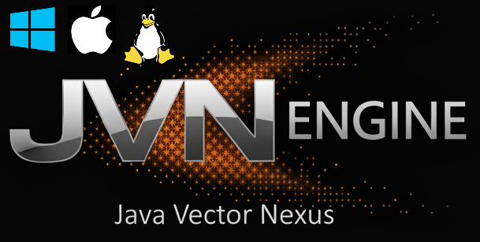

# Java Vector Nexus (JVN)

<div align="left">
  
</div>

JVN is a modular cross-platform Visual Novel engine written primarily in Java, C and C++.

## Architecture

JVN is designed to be lightweight and predictable under load.
- There is modular separation of runtime, scripting, renderer backends, editor tooling, and native acceleration layers.
- Performance ccritical paths are accelerated in `native-math` (SIMD text search, pooled batch scanning, math kernels, and atomic save-path I/O).
- Native bridges are isolated in `core/nativebridge`; some call sites still fall back to Java at runtime, but supported local builds and editor startup expect native binaries to be buildable.
- Hot paths are data-oriented where possible (compact buffers, reduced allocation churn, pooled native buffers for batch workflows).

Typical memory footprint for the core runtime together with the full editor is around **70-130 MB RAM** in normal desktop usage (project/content dependent).

## Requirements

- JDK 21 (toolchain auto-download is enabled, but local JDK 21 is still recommended)
- No global Gradle install required. Use `./jvnw` as the default JVN command wrapper.
- `./gradlew` remains available as the optional low-level Gradle entrypoint for uncommon/manual tasks.
- For team version-control workflows in editor: `git` and `git lfs` installed/configured
- `cmake` + C/C++ compiler toolchain (`clang`/`gcc`/MSVC)

`cmake` is currently a hard requirement for supported local builds and editor startup.
The editor preflight checks build and verify native libraries before launch.

## Quick Start

Clone with audio-fx submodules:

```bash
git clone --recurse-submodules <repo-url>
```

If you already cloned the repo:

```bash
git submodule update --init --recursive
```

Build everything:

```bash
./jvnw build
```

The build command also runs the core test suite, so if the build fails due to a test, it is still
safe to proceed. 

Useful JVN commands:

```bash
./jvnw launcher
./jvnw editor
./jvnw runtime
./jvnw build
./jvnw test
```

Use `./jvnw` for normal development. Drop to `./gradlew` or `./jvnw --raw ...` only when you need direct Gradle task control.

`./jvnw build` also auto-attempts a `native-math` CMake build when required native outputs are missing.
If you need to bypass this on a machine without CMake/toolchain:

```bash
./jvnw -PskipNativeMathBuild=true build
```

That flag is an escape hatch for limited scenarios only.
It is not the supported default workflow, and `:editor:run` still expects a working native toolchain.
If you want to use the editor, building the engine from source, you then must have CMake on your system. 

Run editor:

```bash
./jvnw editor
```

Run runtime:

```bash
./jvnw runtime
```

## Build and Test

Default wrapper commands:

```bash
./jvnw build
./jvnw test
./jvnw dist
```

Optional direct Gradle tasks for focused work:

```bash
./gradlew :core:compileJava :scripting:compileJava :fx:compileJava :runtime:compileJava :editor:compileJava
./gradlew :core:test :scripting:test :swing:test
```

## Native-Math Build

Treat this as required for normal development.
The current editor startup flow validates CMake, builds native libraries, and loads the JNI bridges before opening the editor.

Build commands:

```bash
# macOS/Linux
./native-math/build.sh

# macOS-only helper
./native-math/build_mac.sh

# Linux-only helper
./native-math/build_linux.sh
```

On Windows:

```bat
native-math\build_windows.bat
```

Or:

```powershell
.\native-math\build.ps1
```

Current runtime usage:
- `core` save pipeline attempts native atomic writes through `NativeIoBridge`.
- If unavailable, JVN automatically falls back to Java temp-file + atomic move flow.

## Runtime Usage

Entrypoint: `runtime/src/main/java/com/jvn/runtime/JvnApp.java`

Basic run:

```bash
./jvnw runtime
```

Common examples:

```bash
# Run a specific VNS script with FX renderer
./jvnw runtime --args='--script scripts/story/prologue.vns --ui fx'

# Run with Swing renderer
./jvnw runtime --args='--script scripts/story/prologue.vns --ui swing'

# Load JES directly
./jvnw runtime --args='--jes game/minigames/brickbreaker.jes'

# Overlay filesystem assets onto classpath assets
./jvnw runtime --args='--assets /absolute/path/to/project --script story/prologue.vns'
```

Supported runtime CLI flags:
- `--title <text>`
- `--width <px>`
- `--height <px>`
- `--script <name>` optional override for startup VNS script
- `--locale <code>` default: `en`
- `--ui <fx|swing>` default: `fx`
- `--jes <path[,path2...]>`
- `--audio <fx|simp3|auto>` default: `auto`
- `--assets <dir>`

Notes:
- Script loading uses `AssetCatalog` script paths (typically relative to `game/scripts/` on classpath).
- If `--script` is omitted, runtime resolves entry script in this order:
  1. `jvn.project` -> `entryVns`
  2. system property `jvn.entryVns`
  3. first discovered `.vns` under `scripts/` (with `prologue/start/main` preference)
- Set project startup script in `jvn.project`:
  - `entryVns=scripts/story/prologue.vns`

## Editor

Run:

```bash
./jvnw editor
```

Editor currently features:
- Startup Welcome dashboard with recent projects + environment health checks.
- Project explorer with root-level run button (runs VN projects through runtime).
- VNS/JES code editors with lint and parser diagnostics.
- VNS quick-fix context actions (undefined labels, missing assets, unreachable blocks).
- Built-in Version Control panel (Git + Git LFS): init repo, status, commit, pull-rebase, push.
- Visual config editors:
  - `config/ui/dialogue.layout`
  - `config/menu/menus/*.menu`
  - `config/menu/layouts/*.layout`
- Timeline graph + DSL editor (`config/timeline/story.timeline`).
- In-editor Help Center (`F1`).

## Simp3 Backend (Default)

JVN ships with an embedded Simp3-compatible backend by default in `audio`.
No extra Maven install step or `-PuseSimp3` flag is required.

Runtime audio selection:

```bash
./jvnw runtime --args='--audio auto'
./jvnw runtime --args='--audio simp3'
./jvnw runtime --args='--audio fx'
```

`auto` prefers Simp3 and falls back to FX if needed.

## Gradle Lock Troubleshooting (Linux-heavy)

If a machine hits Gradle journal lock errors like:
`Failed to ping owner of lock for journal cache (.../journal-1)`

use this sequence:

```bash
./gradlew --stop
rm -f ~/.gradle/caches/journal-1/*.lock
./gradlew build --no-daemon --no-watch-fs
```

Project defaults already include:
- `org.gradle.vfs.watch=false` in `gradle.properties`

Editor-run tasks also isolate Gradle state in `.jvn-gradle-user-home` to avoid global lock contention.

## Wizard-Generated VN Project Layout

New projects created from the editor wizard are scaffolded in this shape:

```text
<project>/
|-- config/
|   |-- settings/vn.settings
|   |-- timeline/story.timeline
|   |-- ui/dialogue.layout
|   `-- menu/
|       |-- theme/menu.theme
|       |-- registry/menu.registry
|       |-- menus/*.menu
|       |-- layouts/*.layout
|       |-- styles/*.style
|       `-- assets/
|-- scripts/
|   |-- story/prologue.vns
|   |-- common/
|   `-- system/
|-- assets/
|   |-- backgrounds/
|   |-- characters/
|   |-- portraits/
|   |-- cg/
|   |-- ui/
|   |-- fonts/
|   `-- audio/{bgm,sfx,voices}
|-- save/
|-- .gitignore                  (if Git init enabled)
|-- .gitattributes              (if Git LFS defaults enabled)
|-- README.md
`-- jvn.project
```

## Team Version Control (Git + Git LFS)

JVN ships first-party Git/Git-LFS project tooling:

- **Wizard integration**:
  - initialize Git repository
  - add managed `.gitignore` defaults
  - add managed `.gitattributes` LFS defaults
  - optional initial commit
- **Editor integration**:
  - `Version Control` menu + addable side panel
  - refresh status, initialize repo, commit all, pull (rebase+autostash), push
  - changed-file list with quick open support

Default LFS tracking patterns include common VN binary assets (`png/jpg/webp/gif`, audio/video formats, and fonts).
Only prerequisites are `git` and `git lfs` on PATH.

## Module Overview

- `core`: engine/runtime primitives, VN runtime, menus, save system, 2D/physics.
- `scripting`: JES tokenizer/parser/AST/loader/runtime scene.
- `fx`: JavaFX launcher, VN renderer, menu rendering, FX audio backend.
- `swing`: Swing launcher/backend.
- `runtime`: CLI app (`JvnApp`), runtime interop bridge, scene wiring.
- `editor`: JavaFX authoring environment.
- `audio`: bundled Simp3-compatible audio integration layer.
- `testkit`: shared testing dependencies/helpers.

## Documentation Map

Full documentation index: **`docs/INDEX.md`**

### Start Here
- `docs/guides/getting-started.md` — first-time setup, build, and run
- `docs/guides/cookbook.md` — practical recipes and end-to-end examples

### Architecture
- `docs/architecture/core/overview.md`
- `docs/architecture/core/system-architecture.md`
- `docs/architecture/core/2d-engine.md`
- `docs/architecture/quality/performance.md`
- `docs/architecture/native/native-library-audit.md`

### VNS Scripting (25 sub-documents)
- `docs/scripting/vns/overview/vns-scripting.md` — overview and quick reference
- `docs/scripting/vns/language/vns-directives.md` — @scenario, @character, @background, @charimg, @charlayer, @charpreset, @label, @var, @define, @include
- `docs/scripting/vns/language/vns-dialogue.md` — dialogue forms, text effects, typewriter
- `docs/scripting/vns/language/vns-choices.md` — choices, branching patterns
- `docs/scripting/vns/language/vns-commands.md` — complete command catalog
- `docs/scripting/vns/presentation/vns-audio.md` — BGM, SFX, voice, crossfade
- `docs/scripting/vns/presentation/vns-characters.md` — character system, layered sprites, motion
- `docs/scripting/vns/presentation/vns-layered-charpresets.md` — practical guide: @charlayer + @charpreset pipeline, asset organization, cross-character refs, editor tooling
- `docs/scripting/vns/language/vns-variables.md` — variables, conditions, if/elif/else
- `docs/scripting/vns/presentation/vns-transitions.md` — transitions, shake, flash, UI control
- `docs/scripting/vns/flow/vns-flow-control.md` — labels, jumps, call/return, script switching
- `docs/scripting/vns/integration/vns-interop.md` — JES/Java integration, inline timelines
- `docs/scripting/vns/language/vns-text-formatting.md` — ICU plurals, select, number formatting
- `docs/scripting/vns/runtime/vns-scene-lifecycle.md` — VnScene node loop, VnState, node types, preflight, character visuals
- `docs/scripting/vns/runtime/vns-save-system.md` — named slots, autosave, quick save/load, schema migration, thumbnails
- `docs/scripting/vns/runtime/vns-rollback-history.md` — rollback stack, forward/backward, dialogue backlog
- `docs/scripting/vns/runtime/vns-settings-modes.md` — text speed, volumes, skip, auto-play, UI hidden, key bindings
- `docs/scripting/vns/runtime/vns-localization.md` — locale-aware script loading, UI strings, multi-language structure
- `docs/scripting/vns/internals/vns-parsing.md` — parser internals
- `docs/scripting/vns/integration/java-jes-cross-development.md` — hybrid architecture
- `docs/scripting/vns/integration/vns-jes-architecture.md` — scene stack coordination, interop routing, timeline runners, bridge lifecycle
- `docs/scripting/vns/guides/vns-tutorial.md` — step-by-step full VN tutorial with choices, variables, audio, and JES integration
- `docs/scripting/vns/guides/vns-best-practices.md` — naming conventions, structure patterns, pitfalls, and performance tips
- `docs/scripting/vns/guides/vns-debugging.md` — parse/runtime diagnostics and troubleshooting workflows
- `docs/scripting/vns/guides/vns-project-organization.md` — directory conventions, include strategy, and scaling patterns

### JES Scripting (12 sub-documents)
- `docs/scripting/jes/overview/jes-scripting.md` — overview, quick start, quick reference
- `docs/scripting/jes/scene/jes-scenes-entities.md` — scene structure, entity declarations, lifecycle, merging
- `docs/scripting/jes/scene/components.md` — all 12 component types with properties
- `docs/scripting/jes/timeline/jes-timeline.md` — 22 timeline actions: move, rotate, scale, fade, camera, audio, combat
- `docs/scripting/jes/systems/jes-input.md` — keyboard mappings, continuous movement, custom handlers
- `docs/scripting/jes/systems/jes-camera.md` — position, zoom, shake, follow, dead zones, parallax
- `docs/scripting/jes/systems/jes-physics.md` — rigid bodies, sensors, triggers, restitution, raycasting
- `docs/scripting/jes/systems/jes-tilemaps.md` — tilesets, collision/trigger layers, pathfinding
- `docs/scripting/jes/gameplay/jes-ai.md` — chase, patrol, guard, flee, line-of-sight, A* pathfinding
- `docs/scripting/jes/gameplay/jes-rpg.md` — Stats, Inventory, Equipment, Items, damage/heal
- `docs/scripting/jes/gameplay/jes-ui-widgets.md` — Button2D, Slider2D, HUD patterns
- `docs/scripting/jes/integration/jes-bridge.md` — VNS↔JES bridge, call handlers, Java hooks
- `docs/scripting/jes/internals/jes-parsing.md` — tokenizer, parser, AST, validation

### Timeline (3 sub-documents)
- `docs/scripting/timeline/overview/timeline-scripting.md` — overview, quick start, key concepts
- `docs/scripting/timeline/story/timeline-story-arcs.md` — arc/link DSL, clusters, validation, story patterns
- `docs/scripting/timeline/animation/timeline-animation.md` — TimelineData, keyframes, audio cues, TimelineRunner, registry

### Runtime
- `docs/runtime/core/runtime.md`
- `docs/runtime/core/interop.md`
- `docs/runtime/systems/save-system.md`

### Menu & Layout System (6 sub-documents)
- `docs/scripting/ui/menus/menu-profiles.md` — overview, registry, loader discovery, action types
- `docs/scripting/ui/menus/menu-screens.md` — .menu files, items, actions, bounds, slot previews
- `docs/scripting/ui/layout/structure/menu-layouts.md` — .layout files, list positioning, built-in layouts
- `docs/scripting/ui/menus/menu-styles.md` — .style files, colors, fonts, button skins, backgrounds
- `docs/scripting/ui/layout/structure/menu-button-layouts.md` — per-button positional layouts, Bounds Studio
- `docs/scripting/ui/layout/components/dialogue-layout.md` — textbox geometry, name box, choices, action buttons

### Editor (22 sub-documents)
- `docs/editor/core/editor.md` — layout, editing modes, keyboard shortcuts
- `docs/editor/puppeteer/puppeteer.md` — Puppeteer overview, architecture, data pipeline, JES/VNS relationship
- `docs/editor/puppeteer/puppeteer-editor-guide.md` — complete usage guide: UI panels, keyframes, 12 presets, 26 easing types, audio cues, camera, groups, layers
- `docs/editor/puppeteer/puppeteer-jes-dsl.md` — exported timeline DSL: move, rotate, scale, fade, pivot, camera, audio, wait, parallel, easing values
- `docs/editor/sidebars/overview/sidebar-utilities.md` — landing page for the editor sidebar panels
- `docs/editor/sidebars/left/sidebar-project-explorer.md` — file tree, create/rename/delete, run project
- `docs/editor/sidebars/left/sidebar-story-timeline.md` — multi-arc story graph, arcs, links, clusters, validation
- `docs/editor/sidebars/right/sidebar-inspector.md` — entity property editing for Sprite2D, Label2D, Panel2D, physics, particles
- `docs/editor/sidebars/right/sidebar-puppeteer-launcher.md` — live VNS scene snapshot, 12 command patterns, one-click launch
- `docs/editor/sidebars/right/sidebar-vns-diagnostics.md` — live error/warning list, click-to-jump
- `docs/editor/sidebars/right/sidebar-label-flow-map.md` — visual label-to-label directed graph
- `docs/editor/sidebars/right/sidebar-asset-browser.md` — asset discovery, preview, drag-and-drop, type filter
- `docs/editor/sidebars/right/sidebar-layout-launcher.md` — status dashboard and launch for layout/style/screen editors
- `docs/editor/sidebars/right/sidebar-menu-flow-editor.md` — visual menu-to-menu navigation wiring, wire mode
- `docs/editor/sidebars/right/sidebar-layered-image-visualizer.md` — layered sprite exploration, 6 export formats, presets
- `docs/editor/sidebars/right/sidebar-image-attributes-tool.md` — attribute-based character image assembly, profiles
- `docs/editor/sidebars/right/sidebar-image-tint-tool.md` — scene lighting, grading, tint, and reactive character lights
- `docs/editor/sidebars/right/sidebar-version-control.md` — Git panel: init, commit, push, pull, branch, stash, remote setup
- `docs/editor/sidebars/right/sidebar-help-center.md` — in-app Markdown documentation browser, quick access, F1 shortcut
- `docs/editor/core/action-editor-design.md` — architecture and component breakdown
- `docs/editor/puppeteer/puppeteer-audit.md` — hardening audit and expansion roadmap
- `docs/editor/core/help-center.md` — in-app documentation browser

### Project Setup
- `docs/project-setup/onboarding/new-project-wizard.md`
- `docs/project-setup/content/title-screen.md`
- `docs/project-setup/content/text-effects.md`
- `docs/project-setup/collaboration/version-control.md`

## License

This repository is licensed under the MIT License. See `LICENSE.md`.
