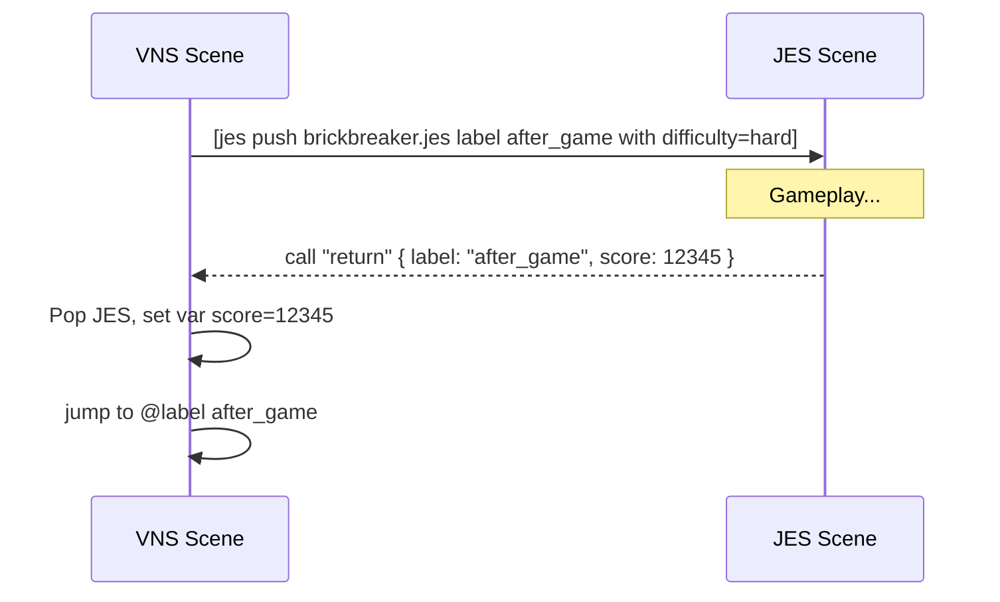

# VNS Scripting

This document describes the Visual Novel Script (VNS) format used by the engine and editor. VNS is a readable, line-based DSL parsed by the engine into runtime scenarios.

The parser lives at `core/src/main/java/com/jvn/core/vn/script/VnScriptParser.java`. All syntax below is based on its implementation.

## Quickstart

- Create a script under `game/scripts/`, e.g. `demo.vns`:
  ```vns
  @scenario demo
  @label start
  Alice: Hello VNS!
  [end]
  ```
- Run the runtime with your script:
  ```bash
  ./gradlew :runtime:run --args="--script demo.vns"
  ```
- Optional: select audio backend
  ```bash
  ./gradlew :runtime:run --args="--script demo.vns --audio fx"      # default
  ./gradlew :runtime:run --args="--script demo.vns --audio simp3"   # requires audio-engine installed
  ```
- See also: `docs/JES Scripting/JES Scripting.md` (on JES interop) and `docs/Timeline Scripting/Timeline Scripting.md` (on Timelines).
- See also: `docs/Interop.md` for a full interop provider map.

## File structure overview

- Lines are read top-to-bottom.
- Blank lines and lines starting with `#` are ignored (comments).
- Scripts typically begin with `@scenario` and resource definitions, then labels, dialogue, choices, and commands.

```vns
# Comment
@scenario my_story
@character alice "Alice"
@character bob   "Bob"
@background room game/images/bg_room.png

@label start
[background room]
Alice: Hello!
> Nice to meet you -> greet
> Maybe later

@label greet
Bob: Welcome.
[end]
```

## Declarations

### Scenario
```
@scenario <id>
```
- Declares or sets the scenario id. If omitted, defaults to `untitled`.

### Characters
```
@character <id> "Display Name"
```
- Registers a character id and display name.

### Backgrounds
```
@background <id> <path>
```
- Registers a background resource by id, with an image path.

### Labels
```
@label <name>
```
- Marks a jump target and a logical section of the script.
- Timelines may link to labels by name.

## Dialogue
```
<Speaker>: <text>
```
- Emission of dialogue attributed to `<Speaker>`.
- Example:
```
Alice: This is a line of dialogue.
```

## Choices
```
> <choice text> [-> <targetLabel>]
```
- Creates a menu choice. If `-> <targetLabel>` is present, choosing this option jumps to that label.
- Conditional choices can be written inline with a trailing condition in brackets appended to the choice text:
```
> Explore the cave [if flags.cave_open]
> Open the door -> entry [if stats.strength > 5]
```
- The parser recognizes the pattern `... [if <expr>]` at the end of the choice text and treats `<expr>` as a display condition.

## Commands

Commands are enclosed in square brackets:
```
[command arg...]
```
Supported commands:

- Background scene
```
[background <bgId>]
[bg <bgId>]
```

- Jumps and flow
```
[jump <label>]
[end]
```

- Audio
```
[bgm <path-or-id>]     # plays and loops BGM
[bgm_stop]             # stops BGM
[bgm_fadeout [<ms>]]   # fades out BGM over <ms>; if omitted or 0 → stop immediately
[sfx <path-or-id>]     # plays SFX once
[voice <path-or-id>]   # plays voice (dedicated voice channel when available; falls back to SFX)
```

- Advanced audio controls
```
[bgm_pause]                      # pause current BGM
[bgm_resume]                     # resume paused BGM
[bgm_seek <seconds>]             # seek current BGM position
[bgm_crossfade <id> <ms> [loop]] # crossfade from current BGM to <id> over <ms>; optional loop
```
Notes:
- Crossfade requires backend support. The default FX backend swaps instantly; the Simp3 backend enables timed crossfades.

- Timing
```
[wait <millis>]
```

- Character sprites
```
[show <charId> <pos> [expression]]
[hide <charId>]
```
  - Positions: `LEFT, CENTER, RIGHT, FAR_LEFT, FAR_RIGHT` and short forms `L, C, R, FL, FR`.
  - Expression is free-form (e.g., `happy`, `neutral`).

- Scene transitions
```
[transition <type> [durationMs] [bgId]]
```
  - Types: `NONE, FADE, DISSOLVE, CROSSFADE, SLIDE_LEFT, SLIDE_RIGHT, WIPE` (case-insensitive).
  - Duration defaults to 500ms when omitted.
  - Optional background id can be provided to transition to a new background.

- Screen effects
```
[screen shake [intensity] [durationMs]]
[screen flash [strength] [durationMs] [r g b]]
```
  - `intensity` is in pixels; default 8.
  - `strength` is 0.0–1.0; default 0.7.
  - `r g b` are 0.0–1.0 (default white).

- External calls / integration
```
[menu <payload>]
[settings]
[mainmenu [payload]]
[load <scriptPathOrId>]      # external: vns replace
[goto <label>]               # external: vns goto
[set <expr>]                 # external: var set
[inc <expr>]                 # external: var inc
[dec <expr>]                 # external: var dec
[flag <expr>]                # external: var flag
[unflag <expr>]              # external: var unflag
[clear <expr>]               # external: var clear
[if <expr>]                  # external: cond if
[call <provider> <payload>]
[jes <payload>]              # shortcut for [call jes <payload>]
[java <payload>]             # shortcut for [call java <payload>]
```

### Interop provider cheat sheet

These are routed through `VnExternalCommand` and handled by `VnInterop` (runtime uses `RuntimeVnInterop` which wraps `DefaultVnInterop`).

- `menu`: open menu scenes
  - `[menu settings]`, `[menu save]`, `[menu load <defaultScript>]`, `[menu main <script>]`
- `vns`: load or switch VNS
  - `[call vns push chapter2.vns label start]`
  - `[call vns replace prologue.vns]`
  - `[goto ArcB:label]` (shortcut, handled by `vns goto`)
- `jes`: bridge to JES scenes
  - `[jes push game/minigames/pong.jes label after with difficulty=hard]`
  - `[jes call restart]`
  - `[jes pop]`
- `settings`: runtime settings
  - `[textspeed 25]`, `[autodelay 2000]`, `[volume bgm 0.7]`
- `mode`: skip/auto toggles
  - `[skip on]`, `[auto toggle]`
- `ui` / `history`
  - `[ui hide]`, `[history show]`, `[history scroll 5]`
- `audio`: advanced BGM control
  - `[bgm_pause]`, `[bgm_seek 10]`, `[bgm_crossfade theme 1000]`
- `screen`: camera effects
  - `[screen shake 12 300]`, `[screen flash 0.8 150 1 1 1]`
- `save` / `quickload` / `hud` / `java` / `var` / `cond`
  - `[save]`, `[quickload]`, `[hud Saved!]`, `[java com.foo.Game#ping]`, `[set flags.met true]`

## Player settings and modes

These commands adjust runtime behavior while a VN is playing.

- Text and auto-play
```
[textspeed <msPerChar>]
[autodelay <msBetweenLines>]
```

- Volumes (0.0 .. 1.0)
```
[volume bgm <v>]    # e.g., [volume bgm 0.6]
[volume sfx <v>]
[volume voice <v>]
```

- Modes
```
[skip [on|off|toggle]]   # default: toggle
[auto [on|off|toggle]]   # default: toggle
```

- UI and history
```
[ui [hide|show|toggle]]           # toggle if omitted
[history [toggle|show|hide]]
[history scroll <lines>]          # positive = older, negative = newer
[history clear]                   # reset scroll offset
```

- Save/load helpers
```
[save]                 # quick save
[quickload]            # quick load (if available)
```

- HUD message
```
[hud <message>]
```

- Variable interpolation
```
${variableName}
```
  - Supported in dialogue text, choice text, and `[hud ...]` payloads.
  - Resolved against `VnState` variables set via `[set]`, `[inc]`, `[dec]`, JES return props, etc.
  - Missing variables resolve to an empty string.
  - Interpolation is single-pass (resolved values are not recursively expanded).
  - Use `${...}` (not `{...}`) to avoid conflicts with text-effect tags like `{shake}` / `{color=...}`.

Examples:
```vns
Alice: Welcome back, ${playerName}!
> Spend ${coins} coins -> shop
[hud Score: ${score}]
```

Notes:
- `menu`, `settings`, `mainmenu`, `load`, `goto`, and variable/condition ops are routed as external calls to the runtime. Exact behaviors depend on the runtime integration.
- `load` replaces the current script (e.g., load another `.vns`).
- `goto` jumps to a label, often used in cooperation with Timelines.
- `textspeed`, `autodelay`, and `volume` update the live `VnSettings` during playback.
- `skip` and `auto` are mutually exclusive; enabling one disables the other.
- `voice` currently uses the SFX channel under the hood.

## Best practices

- Keep label names descriptive and stable so timelines and links remain valid.
- Organize resources with `@background` and `@character` at the top of the file.
- Use `wait` and `transition` to pace scenes and add visual polish.
- Use conditional choices (`[if ...]`) for branching based on game state.

## Example

```vns
# Simple example
@scenario demo
@character alice "Alice"
@character bob   "Bob"
@background room game/images/bg_room.png

@label start
[bg room]
Alice: Hey there!
> Greet Bob -> greet
> Leave

@label greet
Bob: Nice to meet you.
[transition fade 600]
[end]
```

## Interop with Timelines

- Timelines reference VNS scripts and can specify an `entry` label.
- A timeline `link` to `ArcB` without an explicit `:label` will default to `ArcB`’s `entry` if defined.
- From within VNS, you can also instruct the runtime to `goto` a timeline arc/label if your game flow requires it:
```
[goto ArcB:optionalLabel]
```

This document reflects the parser’s supported constructs; if you add new commands to `VnScriptParser`, update this guide accordingly.

## JES interop from VNS

You can launch JES scenes (e.g., minigames) mid-VN and return with results.

- Launching a JES scene
```
[jes push <script.jes> [label <returnLabel>] [with k=v ...]]
[jes replace <script.jes> [label <returnLabel>] [with k=v ...]]
[jes pop]
[jes call <name> k=v ...]         # calls into the active JES scene
```

- Convenience shortcuts
```
[jes_push <script.jes>]
[jes_replace <script.jes>]
[jes_pop]
[jes_call <name> k=v]
```

- Returning to VNS from JES
  - In JES, call `return` (or `vns`) with optional props. Runtime will:
    - Pop the JES scene.
    - Copy props into VN variables (except `label`/`goto`).
    - Jump to `label` (from props) or to the `label` specified in the `[jes push ... label L]` call.

Notes:
- Prop parsing for `with k=v` and `[jes call <name> k=v ...]` auto-coerces values:
  - `true/false` → boolean
  - numbers with `.` → double; integers otherwise
  - anything else → string
- Values cannot contain spaces; for multi-word values, encode them (e.g., `title=Hello_World`).

### End-to-end example

VNS script:
```vns
@label start
Alice: Let’s play a quick minigame!
[jes push game/minigames/brickbreaker.jes label after_game with difficulty=hard lives=3]

@label after_game
Alice: Welcome back!
Alice: (The minigame stored your score in a VN variable named "score".)
> Try again -> start
> Continue
```

JES script snippet (inside the game):
```jes
// When the game ends
call "return" { label: "after_game" score: 12345 }
```

### Diagram



## Java interop from VNS

You can invoke public static Java methods directly from VNS via the `java` provider handled by `DefaultVnInterop`.

- **Syntax**
```
[java fully.qualified.Class#method arg1 arg2 ...]
[call java fully.qualified.Class#method arg1 arg2 ...]
```

- **Argument parsing and coercion**
- `true/false` → boolean
- numbers with `.` → double; integers otherwise
- anything else → string
- At invocation, arguments are coerced to the target parameter types (`int`, `long`, `double`, `boolean`; else `String`).

- **Resolution rules**
- Only public static methods are supported.
- Overload is resolved by name and arity (number of args).

- **Result and errors**
- Return value (if any) is shown as a temporary HUD message; it is not stored in VN variables.
- Invalid targets or reflection errors are surfaced as `java: ...` HUD messages.

- **Examples**
```vns
[java com.acme.Debug#toggle]
[java com.acme.Util#sum 2 3]         # calls Util.sum(int,int)
[call java com.acme.Log#info Started] # same as [java ...]
```

- **Limitations**
- No quoting support; arguments cannot contain spaces.
- Instance methods are not supported.
- Prefer small utility entry points that validate inputs if exposing them to scripts.

- **Combining with JES**
- VNS can sequence both interops:
```vns
[java com.acme.Session#begin]
[jes push game/minigames/brickbreaker.jes label after with difficulty=hard]
```

## Example project

See `demo-game/src/main/resources/game/scripts/` for `.vns` examples such as `demo.vns`. A minimal layout:

```
@scenario demo
@character alice "Alice"
@background room game/images/bg_room.png

@label start
[bg room]
Alice: Welcome!
> Greet -> greet
> Leave

@label greet
Alice: Nice to meet you.
[end]
```

## Diagrams

Conceptual label flow for the example (requires Mermaid support):

```mermaid
flowchart TD
  start[[@label start]] -->|choice: Greet| greet[[@label greet]]
  start -->|choice: Leave| end1([end])
  greet --> end2([end])
```
