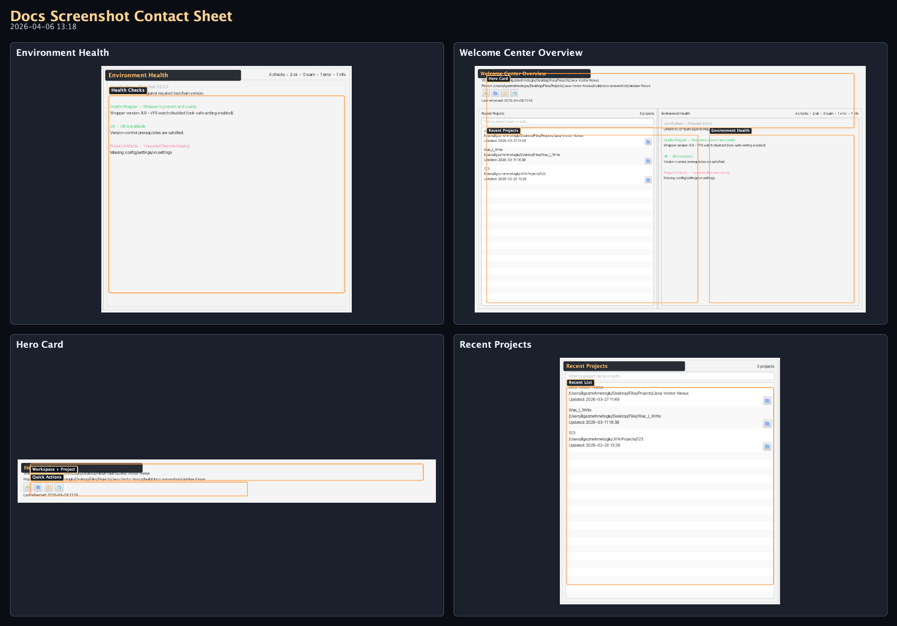
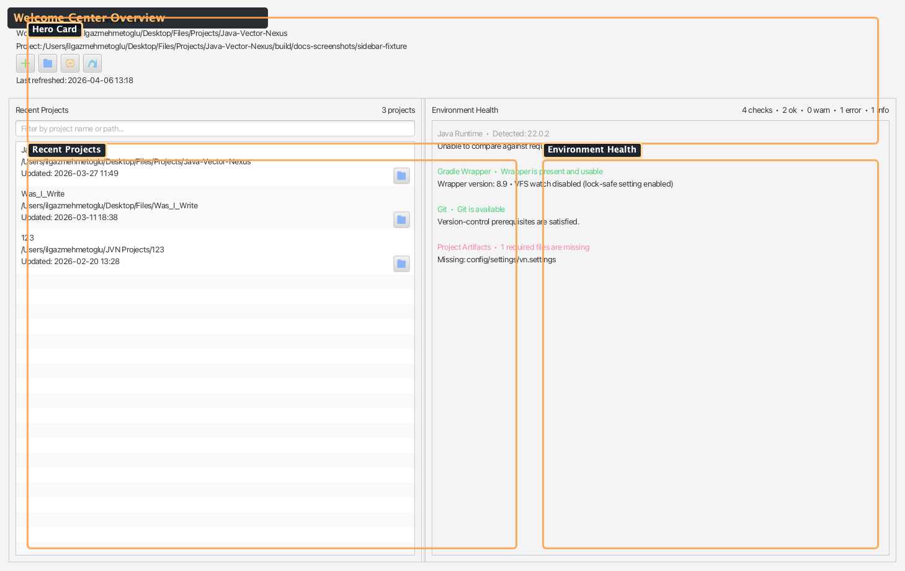
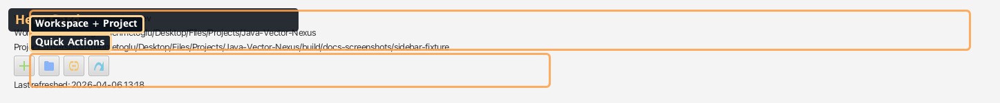
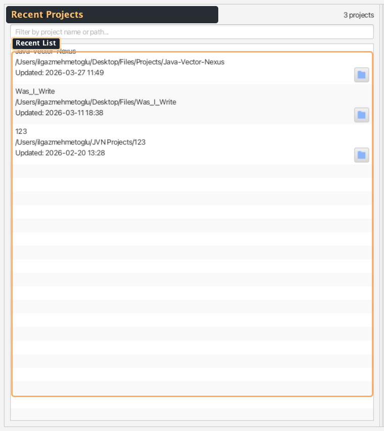
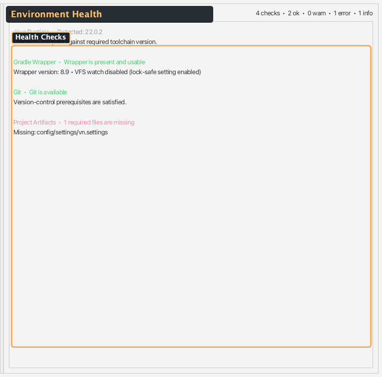

# Welcome Center Screenshots (Generated)

### Visual Reference (Auto-Generated)

_Generated by `./gradlew :editor:generateDocsScreenshots -Djvn.docs.profile=welcome-center` on 2026-04-06 13:18._

#### Contact Sheet

#### Welcome Center Overview

Startup dashboard with the hero card, recent projects, and environment health.

#### Hero Card

Workspace/project metadata and quick launch actions at editor startup.

#### Recent Projects

Project history list with filtering and quick-open actions.

#### Environment Health

Runtime, Gradle, Git, and project artifact diagnostics shown at startup.
