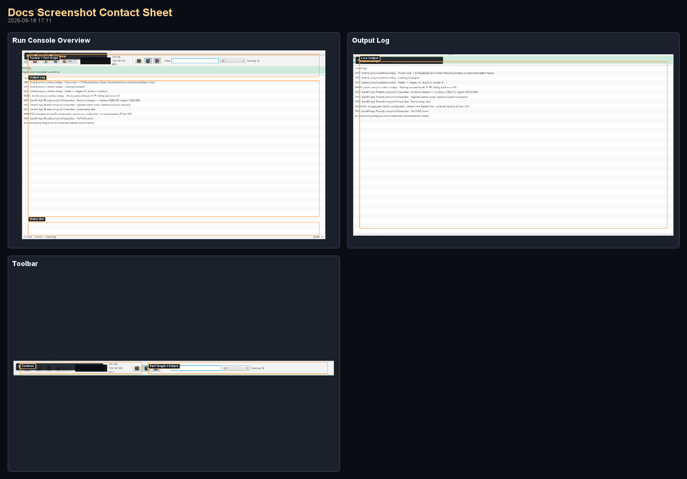
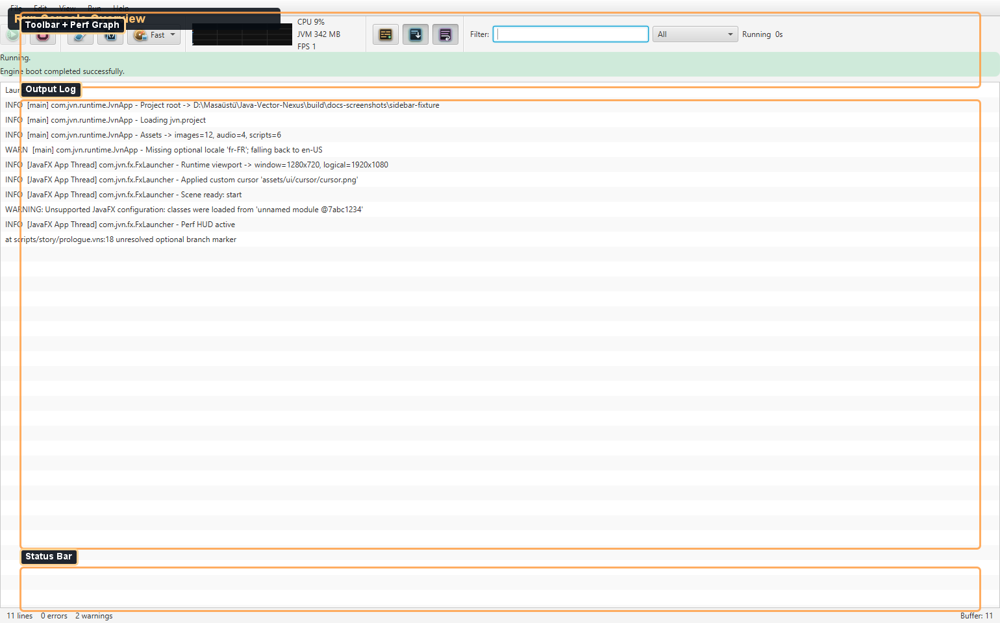
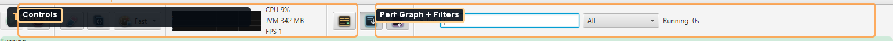
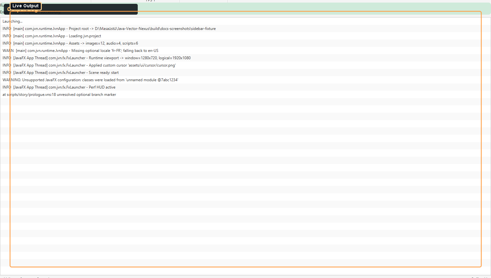

# Run Console

Integrated build and runtime output console that filters verbose Gradle noise and presents color-coded, searchable engine messages.

Source: `modules/editor/src/main/java/com/jvn/editor/ui/RunConsoleView.java`

---

## Overview

The Run Console opens in its own runtime window when a project is launched from the editor or
standalone launcher. It attaches to the Gradle build process, streams stdout in real time, and
classifies each line for smart filtering and coloring.

## UI Layout

<!-- AUTO-RUN_CONSOLE-SCREENSHOTS:START -->
### Visual Reference (Auto-Generated)

_Generated by `./gradlew :editor:generateDocsScreenshots -Djvn.docs.profile=run-console` on 2026-08-18 17:11._

#### Contact Sheet

#### Run Console Overview

Toolbar, live output, performance graph, and status bar during a runtime launch.

#### Toolbar

Run controls, filters, search, and the compact runtime performance graph.

#### Output Log

Color-coded runtime output with warnings, info lines, and filtered Gradle noise.
<!-- AUTO-RUN_CONSOLE-SCREENSHOTS:END -->

---

## Engine States

The console tracks a state machine displayed in the status bar:

| State | Color | Meaning |
|-------|-------|---------|
| **BUILDING** | Blue | Gradle build in progress |
| **STARTING** | Yellow | Build succeeded, engine is initializing |
| **RUNNING** | Green | Engine is running normally |
| **STOPPED** | Gray | Process exited cleanly (exit code 0) |
| **FAILED** | Red | Process exited with a non-zero exit code |

---

## Toolbar Actions

| Button | Description |
|--------|-------------|
| **Run** | Re-run the last build (enabled when stopped or failed) |
| **Stop** | Stop the Gradle build and its spawned runtime process tree |
| **Copy** | Copy the visible output to the clipboard |
| **Clear** | Clear all output |
| **Launch Options** | Choose cached/compatible Gradle behavior for the next run |
| **Build Output icon** | Toggle suppressed Gradle noise lines |
| **Auto-scroll icon** | Toggle scrolling to the latest output |
| **Wrap icon** | Toggle wrapping for long output lines |

The command strip uses purpose-built vector icons. Active toggle buttons receive a blue selection
rim, while Run and Stop retain distinct green and red treatments.

## Gradle Launch Options

Open the speedometer/cache button in the toolbar to configure the next launch. Changes are saved in
`~/.jvn-editor/runtime-gradle.properties` and shared by runtime windows opened from either the editor
or standalone launcher.

The default **Fast Launch** preset mirrors JVN's optimized source-launch policy:

- reuse a warm Gradle daemon;
- reuse the Gradle build cache and configuration cache;
- allow parallel project execution;
- use at most two Gradle workers so the editor remains responsive;
- share downloaded dependencies between JVN projects through
  `GRADLE_USER_HOME` when configured, or Gradle's normal `~/.gradle` home.

Use **Compatibility** when diagnosing a project-specific Gradle problem. It uses a single-use
daemon, disables configuration caching and parallel execution, and returns to the project's
`.jvn-gradle-user-home` directory. Build-cache reuse remains enabled because it does not retain a
configured project model.

Every option can also be changed individually. A running build is not altered mid-flight; the
selected policy applies when the project is next run or re-run.

---

## Filtering & Search

### Smart Line Classification

Lines are classified automatically using regex patterns:

| Category | Pattern | Behavior |
|----------|---------|----------|
| **Engine messages** | Lines starting with `[JVN]`, `[Engine]`, `[Scene]`, `[Audio]`, `[Script]`, `[VN]`, `[Menu]`, `[Runtime]`, `[Init]`, `[Asset]`, `[Error]`, `[WARN]`, `[INFO]` | Always shown, highlighted in light blue |
| **Errors** | Lines matching `Exception`, `Error`, `FAILED`, `fatal:`, `at line N` | Shown in red, increment error counter |
| **Warnings** | Lines matching `Warning`, `WARN`, `deprecated`, `could not` | Shown in orange, increment warning counter |
| **Gradle noise** | Lines matching `> Task`, `> Configure`, `BUILD SUCCESSFUL`, `Deprecated Gradle`, download progress, etc. | Suppressed by default (toggle with **Build Output**) |

### Log Level Filter

ComboBox with four filter modes:

- **All** — show everything (respecting Build Output toggle)
- **Engine** — only engine lifecycle messages
- **Errors** — only error lines
- **Warnings** — only warning lines

### Search

The search field performs a live substring match across all buffered lines and highlights matches. All raw output is retained in memory for re-filtering.

---

## Status Bar

Bottom strip showing:

| Element | Description |
|---------|-------------|
| **State badge** | Current engine state with color |
| **Elapsed time** | Time since process start |
| **Line count** | Total lines received |
| **Error count** | Running error counter (red when > 0) |
| **Warning count** | Running warning counter (orange when > 0) |

---

## Color Scheme

| Line Type | Color |
|-----------|-------|
| Error | `#f38ba8` (pink-red) |
| Warning | `#f0b673` (orange) |
| Engine message | `#dbe4f0` (light blue-white) |
| Info | `#8ab4f8` (blue) |
| Normal | `#b5bfd0` (gray-blue) |
| Gradle noise | `#6b7381` (dim gray) |

---

## Menu Bar

The console includes a mini menu bar with:

- **Console** menu — Clear, Copy All, Save to File, Close
- **View** menu — toggle Build Output, Auto-scroll, Word Wrap
- **Run** menu — re-run, stop, or open Gradle Launch Options
- Keyboard accelerators for common actions

Closing the runtime window stops the game process tree, including audio playback. When daemon reuse
is enabled, the idle Gradle daemon is deliberately left warm for the next launch.

---

## Related Docs

- [Editor Guide](editor.md) — project run behavior
- [Runtime Guide](../../runtime/core/runtime.md) — CLI options and launch patterns
