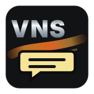

# VS Code Extension

The JVN VS Code extension lives at `tools/vscode-jvn`. It provides external-editor support for the project DSLs without replacing the JVN editor's diagnostics, previews, or visual tools.

## What It Covers

- VNS scripts (`.vns`) with directives, command blocks, speakers, choices, text formatting, values, and labels.
- JES scripts (`.jes`) with scene/entity structure, component types, timeline actions, built-ins, properties, and literals.
- Story Map files (`.storymap`, legacy `.timeline`) with arcs, links, scripts, positions, colors, and metadata.
- JVN config files (`.layout`, `.menu`, `.registry`, `.settings`, `.stagepreset`, `.style`, `.theme`, `jvn.project`) with sections, keys, values, placeholders, colors, and comments.
- Snippets for common VNS, JES, Story Map, and menu/config patterns.
- An optional **JVN DSL Icons** file icon theme for the VS Code Explorer.

## File Icons

VS Code explorer icons come from the active **File Icon Theme**. Installing JVN Language Tools registers the theme, but VS Code does not switch to it automatically.

To enable it:

1. Open Command Palette.
2. Run **Preferences: File Icon Theme**.
3. Select **JVN DSL Icons**.

## DSL Icon Set

| DSL | Icon | Files |
| --- | --- | --- |
| VNS |  | `.vns` |
| JES |  | `.jes` |
| Story Map |  | `.storymap`, `.timeline` |
| Menu |  | `.menu`, `.registry` |
| Layout |  | `.layout` |
| Style / Theme |  | `.style`, `.theme` |
| Stage Preset |  | `.stagepreset` |

## Run In Development Mode

```sh
cd tools/vscode-jvn
code --extensionDevelopmentPath="$PWD"
```

VS Code opens a new Extension Development Host window with the JVN language contributions active.

## Install Locally

```sh
mkdir -p "$HOME/.vscode/extensions/jvn-language-tools"
rsync -a --delete tools/vscode-jvn/ "$HOME/.vscode/extensions/jvn-language-tools/"
```

Restart VS Code after copying.

## Install From VSIX

```sh
cd tools/vscode-jvn
npm run package
code --install-extension jvn-language-tools-0.1.5.vsix
```

VS Code also supports installing the generated `.vsix` from the Extensions view with **Install from VSIX...**.

## Package

This extension uses the official VS Code extension packaging tool through `npx`:

```sh
cd tools/vscode-jvn
npm run package
```

## Publish

1. Create or choose the Visual Studio Marketplace publisher id `Simplector`.
2. Make sure the `publisher` field in `tools/vscode-jvn/package.json` matches that id.
3. Create an Azure DevOps personal access token with Marketplace manage scope.
4. Log in once with `npx @vscode/vsce login Simplector`.
5. Publish with `npm run publish`.

The extension is intentionally passive for now. It does not run analyzers or project scans; the source of truth for live diagnostics remains the JVN editor.
