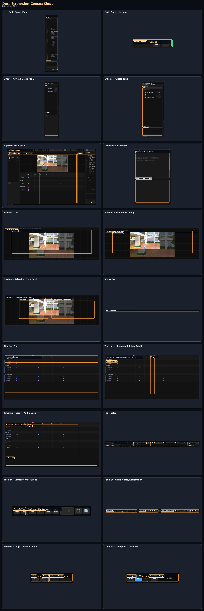
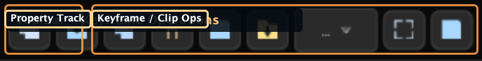
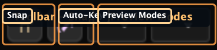
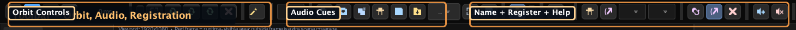
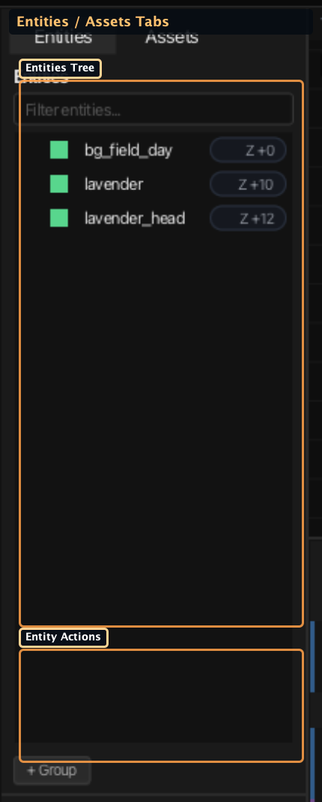
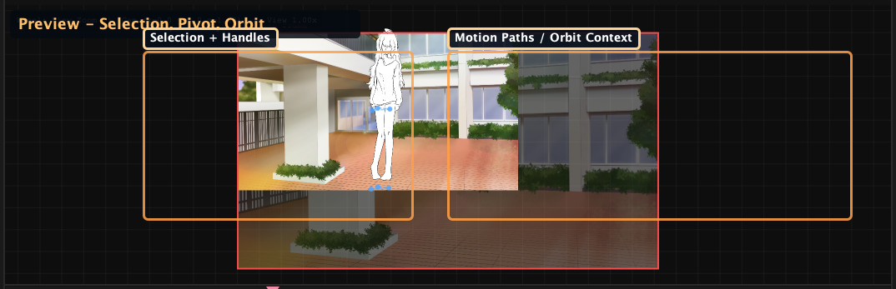
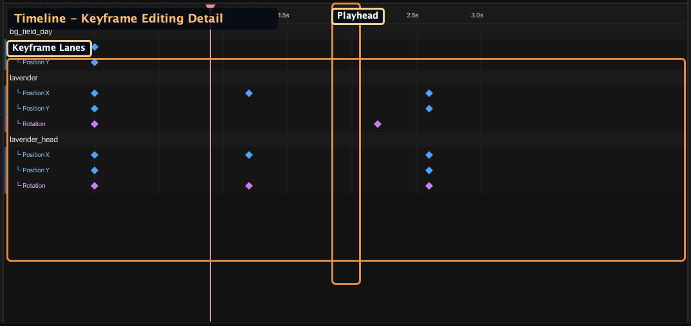
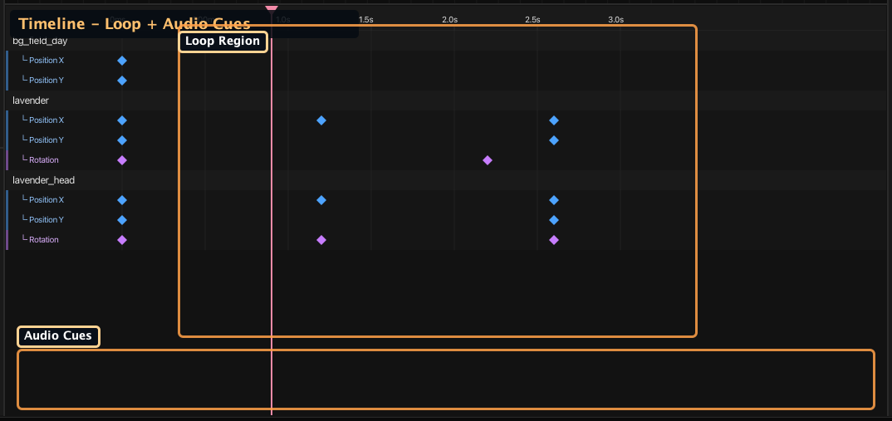
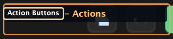

# Puppeteer Screenshots (Generated)

### Visual Reference (Auto-Generated)

_Generated by `./gradlew :editor:generateDocsScreenshots -Djvn.docs.profile=puppeteer` on 2026-03-06 21:13._

#### Contact Sheet

#### Puppeteer Overview

Complete editor layout: toolbar, entity list, preview, timeline, and code panel.

#### Top Toolbar

Transport, snapping, orbit tools, presets, audio cues, and timeline registration.

#### Toolbar - Transport + Duration

Playback controls, playhead readout, duration, and loop controls.

#### Toolbar - Keyframe Operations

Property target, copy/paste/duplicate, batch keyframe, clip save/load, slot placement, and zoom fit.

#### Toolbar - Snap + Preview Modes

Snap, auto-key, drag snapping helpers, playback speed, and wheel mode.

#### Toolbar - Orbit, Audio, Registration

Orbit/nail workflow controls, audio cue controls, timeline naming, register, and shortcuts help.

#### Entity + Keyframe Side Panel

Entity stack and keyframe controls for property/value/easing edits.

#### Entities / Assets Tabs

Entity hierarchy, filter field, Z-order badges, and access to assets browser.

#### Keyframe Editor Panel

Per-keyframe controls: time/value, interpolation, easing curve, pivot presets, and camera readout.

#### Preview Canvas

Scene viewport with runtime frame, selection controls, and motion visualization.

#### Preview - Runtime Framing

Runtime frame boundaries and scene-overview composition outside the runtime area.

#### Preview - Selection, Pivot, Orbit

Selection outlines, pivot handles, orbit anchor visualization, and motion paths.

#### Timeline Panel

Track rows, keyframes, and playhead for direct timing edits.

#### Timeline - Keyframe Editing Detail

Entity/property lanes, selected keyframes, and timeline scrubbing interactions.

#### Timeline - Loop + Audio Cues

Loop range visualization and timeline audio cue markers.

#### Live Code Export Panel

Auto-generated timeline code with diagnostics and apply/commit controls.

#### Code Panel - Actions

Copy/regenerate/preview/commit/discard actions used for text-first round-trip.

#### Status Bar

Undo/redo descriptions, auto-key indicator, and playback speed.
