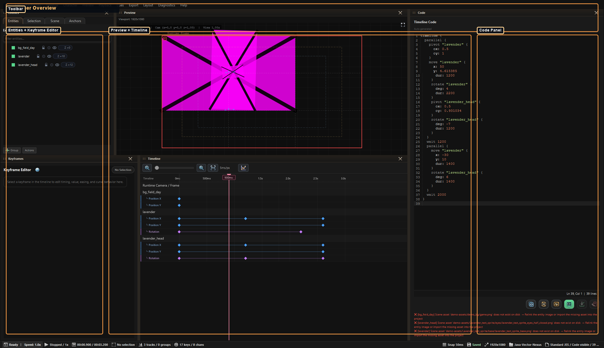
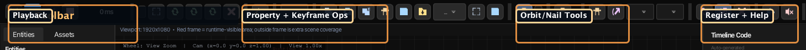
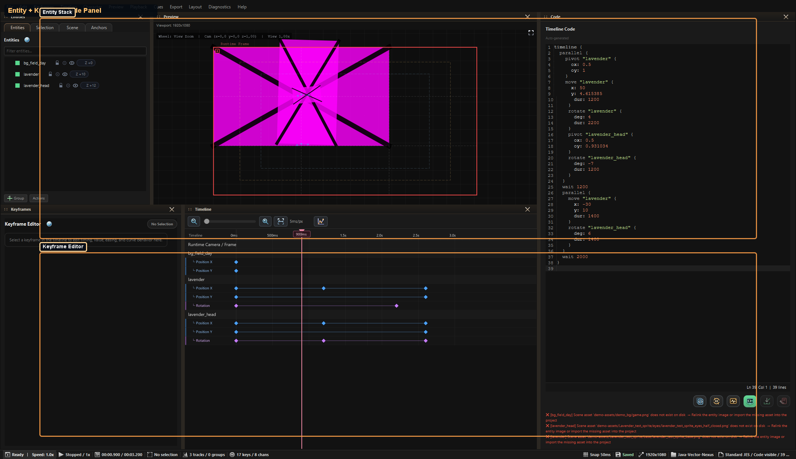
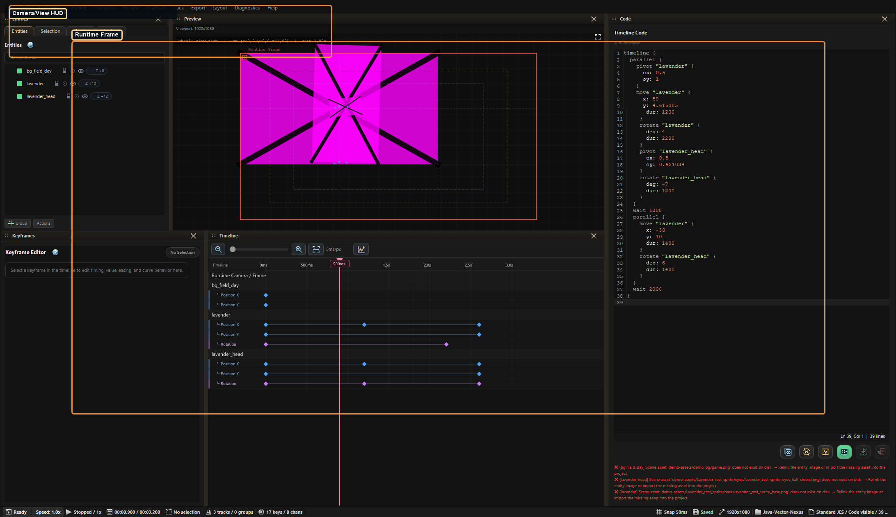
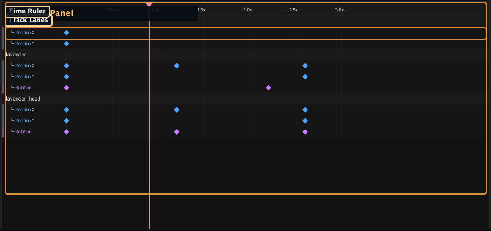
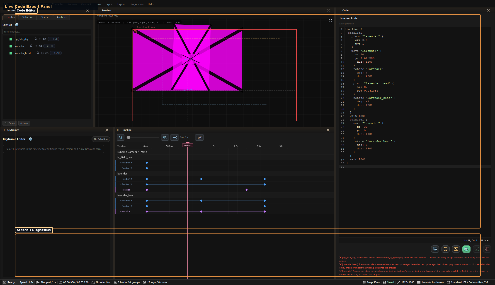

# Puppeteer — Editor Guide

Comprehensive guide to using the Puppeteer animation editor — launching, UI panels, entity management, keyframe editing, animation presets, event cues, advanced property inspectors, audio cues, camera animation, groups, layer ordering, preview controls, and export workflows.

Source: `modules/editor/src/main/java/com/jvn/editor/ui/actioneditor/PuppeteerWindow.java`

---

## Who This Is For

This page is the day-to-day usage guide for authors working inside Puppeteer itself.

Use it when you want to:

- animate characters or props visually
- time camera movement and framing
- save and reuse clips
- register a timeline for VNS runtime playback
- understand what each panel, button, and lane does

## What You Will Learn

This guide focuses on practical editor use:

- how to launch Puppeteer from VNS or JES context
- what each major UI region does
- how camera, clips, audio cues, and export work
- how runtime registration differs from simple code copy/export

## Read This Next

- Need the architecture view: [Puppeteer Overview & Architecture](puppeteer.md)
- Need the export syntax only: [Puppeteer JES DSL Reference](puppeteer-jes-dsl.md)
- Need reusable parameterized animation source: [Puppeteer Motifs](puppeteer-motifs.md)
- Need the timeline runtime model: [Puppeteer Animation Timelines](../../scripting/timeline/animation/timeline-animation.md)

## Contents

1. [Overview](#overview)
2. [Launching Puppeteer](#launching-puppeteer) — VNS snapshot, JES file, manual entities
3. [UI Layout](#ui-layout) — window regions overview
4. [Complete UI Reference](#complete-ui-reference-exhaustive) — toolbar, sidebars, panels, dialogs
5. [Animatable Properties](#animatable-properties) — entity, camera, advanced channels
6. [Keyframes](#keyframes) — adding, editing, multi-selection, interpolation
7. [Easing Types](#easing-types) — 37 options, families, spring, custom Bézier, project presets
8. [Animation Presets](#animation-presets) — 12 built-in templates
9. [Entity Groups](#entity-groups) — hierarchy, group animation, layer ordering
10. [Audio Cues](#audio-cues) — adding cues, properties, timeline markers
11. [Event Cues](#event-cues) — presets, payload, preview behavior
12. [Animation Clips](#animation-clips) — save, load, apply modes, storage
13. [VN Slot Positions](#vn-slot-positions) — character-aware positioning
14. [Eye Focus / Look At](#eye-focus-look-at) — keypad pupil rigs and runtime gaze
15. [Camera Animation](#camera-animation) — pan, zoom, DOF, runtime integration
16. [Preview Controls](#preview-controls) — playback, viewport, onion skinning, orbit tool
17. [Timeline Panel](#timeline-panel) — ruler, tracks, playhead, snap, loop, zoom
18. [Undo/Redo](#undo-redo)
19. [Export & Registration](#export-registration) — register, copy, export modes
20. [Code Round-Trip Editing](#code-round-trip-editing) — import workflow, fidelity
21. [Timeline Diagnostics](#timeline-diagnostics) — categories, easing suggestions
22. [Keyboard Shortcuts](#keyboard-shortcuts)
23. [Workflow Tips](#workflow-tips)
24. [Known Limitations](#known-limitations)

---

## Overview

Puppeteer is JVN's visual keyframe animation editor. It lets you:

- Animate entity properties (position, rotation, scale, opacity) on a timeline
- Animate the scene camera (pan, zoom)
- Author instant event cues for expression swaps, show/hide/replace beats, and scene cutaways
- Author advanced channels such as matrix transforms, color matrix values, blur, depth-of-field, and registry-backed custom numeric properties
- Place audio cues at precise timestamps
- Group entities and animate them together
- Preview animations in real-time with onion skinning
- Export animations as JES timeline code for use in VNS scripts and JES scenes
- Register animations to the `TimelineRegistry` for runtime playback

---

## Launching Puppeteer

### From a VNS File (Recommended)

1. Open a `.vns` file in the editor
2. Place the cursor on a line where characters are visible (after `[show]` commands)
3. Open the **Puppeteer Launcher** panel in the right sidebar (click the **+** tab → "Puppeteer Launcher")
4. Review the snapshot preview — it shows the background and visible characters at the cursor position
5. Click **Launch @ Cursor**

### Puppeteer Launcher Panel — In Detail

Source: `modules/editor/src/main/java/com/jvn/editor/ui/PuppeteerLauncherPanel.java`

The Puppeteer Launcher is a sidebar panel that provides live VNS scene state tracking and one-click Puppeteer launch. It updates automatically as you move the cursor within a `.vns` file.

#### Panel Display

| Element | Description |
|---------|-------------|
| **Line indicator** | Current cursor line number and trimmed line text (max 80 chars) |
| **Scene Snapshot at Cursor** | Section header |
| **Label** | The most recent `@label` / `label` before the cursor |
| **Background** | The active background from the most recent `[bg]` / `[background]` command |
| **Stage** | Active stage preset from `[stage ...]`, resolved through `@stagepreset` |
| **Visible Characters** | List of character entries: `charId @ position [expression]` |
| **Launch @ Cursor** | Creates a new animation from the exact current scene snapshot |
| **Launch @ Label Start** | Starts from the active label start snapshot |
| **Launch @ Scene Start** | Starts from the latest scene/background start within the label |

#### Scene Snapshot Resolution

The launcher parses every line from line 1 through the cursor position, tracking cumulative scene state. It recognizes these VNS commands:

| Command | Pattern | What It Captures |
|---------|---------|-----------------|
| **Label** | `@label start` / `label start` | Sets current label name |
| **Background command** | `[bg park]` / `[background park]` | Sets active background ID |
| **Background declaration** | `@background park assets/bg/park.png` | Maps background ID → asset path |
| **Character image** | `@charimg hero neutral assets/char/hero_neutral.png` | Maps `charId/expression` → asset path |
| **Character layer** | `@charlayer hero eyes assets/char/hero_eyes.png` | Maps `charId/layerId` → asset path |
| **Character preset** | `@charpreset hero happy $eyes=happy $mouth=smile` | Resolves layer references into a composite asset path |
| **Stage preset declaration** | `@stagepreset sunset_park config/stage/sunset_park.stagepreset` | Maps stage preset ID → `.stagepreset` path |
| **Stage activation** | `[stage sunset_park]` / `[stage preset=sunset_park]` | Sets the active lighting stage for the snapshot |
| **Stage clear** | `[stage clear]` / `[stage off]` / `[stage none]` | Removes active stage context |
| **Show character** | `[show hero center happy]` | Adds character with position and expression |
| **Hide character** | `[hide hero]` | Removes character from visible set |
| **External show** | `@external character hero show center happy` | Adds character via external command |
| **External hide** | `@external character hero hide` | Removes character |
| **External move** | `@external character hero move left` | Updates character position (preserves expression) |
| **External expression** | `@external character hero expr angry` | Updates character expression (preserves position) |

#### Scene Snapshot Data Model

The snapshot passed to Puppeteer contains:

```java
SceneSnapshot {
    String currentLabel;              // e.g., "battle_start"
    String backgroundId;              // e.g., "park"
    List<CharacterEntry> characters;  // each: characterId, position, expression
    Map<String, String> bgPaths;      // background ID → asset path
    Map<String, String> charImgPaths; // "charId/expression" → asset path
    Map<String, Map<String, String>> charLayerPaths; // charId → (layerId → path)
    Map<String, String> stagePresetPaths; // stage ID → .stagepreset path
    String activeStagePresetId;       // active stage at cursor, if any
}
```

Puppeteer uses this to construct a `JesScene2D` with:
- Background entity from the resolved `bgPaths` mapping
- Character `Sprite2D` entities positioned at VN slot locations (left, center, right, etc.)
- Correct expression images resolved from `charImgPaths` or composite `charLayerPaths`

This means the Puppeteer animation viewport matches exactly what the player would see at that point in the script.

If the cursor is inside a scene with an active stage preset, Puppeteer also receives the lighting handoff. The Scene sidebar shows the active **Lighting Stage** with its source path and counts for lights, occluders, and response zones. Named exports preserve that context in Puppeteer metadata comments so reopening the timeline keeps the staging information visible.

### From a JES File

1. Open a `.jes` file in the editor
2. Use the Puppeteer Launcher panel or menu
3. Puppeteer opens with all entities from the JES scene

### Adding Entities Manually

Use the **Assets** tab in the left sidebar:
1. Browse project images (png, jpg, gif, bmp, webp)
2. Import external images directly into `assets/puppeteer/imported` with **Import...**, or drag image files onto the panel
3. Select an image
4. Double-click it, press `Enter`, or click **+ Add to Scene** — creates a `Sprite2D` entity at center-screen

---

## UI Layout

Overview snapshot:



For raw generated captures and contact sheet, see:

- [Generated Puppeteer Screenshots](generated-puppeteer-screenshots.md)

---

## Complete UI Reference (Exhaustive)

This section is intentionally exhaustive and mirrors the current implementation in:

- `modules/editor/src/main/java/com/jvn/editor/ui/actioneditor/PuppeteerWindow.java`
- `modules/editor/src/main/java/com/jvn/editor/ui/actioneditor/EntitySelector.java`
- `modules/editor/src/main/java/com/jvn/editor/ui/actioneditor/AssetPickerPanel.java`
- `modules/editor/src/main/java/com/jvn/editor/ui/actioneditor/KeyframeEditor.java`
- `modules/editor/src/main/java/com/jvn/editor/ui/actioneditor/TimelinePanel.java`
- `modules/editor/src/main/java/com/jvn/editor/ui/actioneditor/AnimationPreview.java`
- `modules/editor/src/main/java/com/jvn/editor/ui/actioneditor/CodePreviewPane.java`

### Window Regions

| Region | UI Element | Notes |
|-------|------------|-------|
| Top | Toolbar | Transport, duration, presets, property track target, keyframe ops, snapping, preview modes, orbit tools, cues, registration, help |
| Left (top tab pane) | `Entities` tab | Entity/group tree with Z badges and context menu actions |
| Left (top tab pane) | `Assets` tab | Image browser + add-to-scene pipeline |
| Left (bottom) | Keyframe Editor | Fine-grained keyframe editing, easing controls, pivot presets, camera readout |
| Center (top) | Preview canvas | World-overview rendering plus runtime frame, camera HUD, selection handles |
| Center (bottom) | Timeline canvas | Time ruler, tracks, keyframes, playhead, loop region, audio cues, and a dedicated `Runtime Camera / Frame` lane above entity rows |
| Right sidebar | `Selection` tab | Selection summary plus advanced inspectors for matrix/blur, color matrix, runtime camera DOF, and custom channels |
| Right sidebar | `Scene` tab | Project stats, viewport/camera/code-pane state, orbit anchors, and active Lighting Stage handoff |
| Right | Timeline Code panel | Live JES source, diagnostics, preview-stage controls |
| Bottom | Status bar | Undo/redo state, auto-key status, playback speed |

### Top Toolbar (Left to Right)



#### Transport Group

| Control | Type | Default | Action |
|--------|------|---------|--------|
| Rewind | icon button | enabled | Set playhead to `0` (`Home`) |
| Play | icon button | enabled | Start playback (`Space`) |
| Pause | icon button | disabled until play | Pause playback (`Space`) |
| Stop | icon button | enabled | Pause + reset playhead to `0` |
| Time readout (`0 ms`) | label | current playhead | Live playhead text |

#### Duration + Loop Group

| Control | Type | Default | Action |
|--------|------|---------|--------|
| Duration field | text field | project total duration | Sets timeline duration in ms |
| Fit duration | icon button | enabled | `fitDurationToContent()` |
| Loop playback | icon toggle | mirrors project | Toggle loop mode |
| `In` | compact text button | enabled | Set loop start at playhead |
| `Out` | compact text button | enabled | Set loop end at playhead |
| Clear loop | icon button | enabled | Remove loop region |

#### Presets Group

| Control | Type | Default | Action |
|--------|------|---------|--------|
| Presets | icon menu button | enabled | Apply preset to selected entity at playhead |
| Preset entries | menu items | dynamic | Items from `AnimationPreset.ALL` grouped by category |

#### Property Target Group

| Control | Type | Default | Action |
|--------|------|---------|--------|
| Property dropdown | combo box | `X` | Sets active property track for add-keyframe + nudging |
| Values | selection-aware enum list | common `PropertyType` lanes | Entity lanes include `X`, `Y`, `Z`, `PIVOT_X`, `PIVOT_Y`, `ROTATION`, `SCALE_X`, `SCALE_Y`, `ALPHA`, `VISIBILITY`; group lanes include `X`, `Y`, `Z`, `PIVOT_X`, `PIVOT_Y`, `ROTATION`, `SCALE_X`, `SCALE_Y`, `ALPHA`; runtime camera lanes include `CAMERA_X`, `CAMERA_Y`, `CAMERA_ZOOM`, and DOF properties |

#### Keyframe Ops Group

| Control | Type | Default | Action |
|--------|------|---------|--------|
| Copy selected keyframes | icon button | enabled | Copy selected keyframes (`Ctrl/Cmd+Alt+C`) |
| Paste keyframes | icon button | enabled | Paste at playhead (`Ctrl/Cmd+Alt+V`) |
| Duplicate keyframes | icon button | enabled | Duplicate by snap step (`Ctrl/Cmd+Alt+D`) |
| Batch keyframe | icon button | enabled | Add current property keyframe for all entities |
| Save clip | icon button | enabled | Save selected track segment into the recursive clip library under `config/puppeteer/clips/`; nested paths create folders |
| Load clip | icon button | enabled | Open the clip browser with filter, metadata preview, duration scaling, and `Layer On Top` / `Replace Range` apply modes |
| Slot menu | text menu button | `Slot` | Place selected entity at VN slot positions |
| Slot menu entries | menu items | fixed | `FAR_LEFT`, `LEFT`, `CENTER`, `RIGHT`, `FAR_RIGHT` |
| Previous keyframe | icon button | enabled | Jump playhead to previous keyframe in the active context (`Page Up`) |
| Next keyframe | icon button | enabled | Jump playhead to next keyframe in the active context (`Page Down`) |
| Focus selection | icon button | enabled | Zoom timeline to selected keys or the active track (`Ctrl/Cmd+Alt+F`) |
| Timeline zoom fit | icon button | enabled | Fit timeline zoom to full duration |
| Compact export | icon toggle | off | Switch code preview to compact export |

#### Snap Group

| Control | Type | Default | Action |
|--------|------|---------|--------|
| Snap enabled | icon toggle | on | Toggle timeline snapping |
| Snap step | text field | `50` | Snap interval (ms), clamped to `>=1` |

#### Auto-Key Group

| Control | Type | Default | Action |
|--------|------|---------|--------|
| Auto-key | icon toggle | off | Mark auto-key mode flag (`Auto-Key ON` indicator in status bar) |
| `Auto` | label | static | Visual label next to toggle |

#### Preview Behavior Group

| Control | Type | Default | Action |
|--------|------|---------|--------|
| Snap to grid | icon toggle | off | Grid-snaps dragged entities in preview |
| Snap to entity | icon toggle | off | Snaps near other entity positions |
| Speed | combo box | `1x` | Playback multiplier: `0.25x`, `0.5x`, `1x`, `2x`, `4x` |
| Wheel mode | combo box | `Wheel: View` | Mouse wheel controls `View Zoom` or `Camera Zoom` |

#### Orbit Group

| Control | Type | Default | Action |
|--------|------|---------|--------|
| Orbit tool | icon toggle | off | Enables orbit-anchor workflows |
| Align rotation | icon toggle | on | Rotate entity to outward angle while orbiting |
| Clear orbit anchor | icon button | enabled | Remove selected entity orbit anchor |

#### Cues Group

| Control | Type | Default | Action |
|--------|------|---------|--------|
| Add cue | icon button | enabled | Open Add Audio Cue dialog at current playhead |
| Clear cues | icon button | enabled | Confirmation dialog, then remove all cues |
| Manage events | icon button | enabled | Open the event cue manager for expression/show/hide/replace/scene and custom cues |
| Clear events | icon button | enabled | Confirmation dialog, then remove all authored event cues |

#### Timeline Naming + Registration Group

| Control | Type | Default | Action |
|--------|------|---------|--------|
| Timeline name field | text field | `my_animation` | Name for exported/registered timeline |
| Register | success icon button | enabled | Runs runtime verification, then registers and writes `scripts/timelines/<name>.jes` when clean or confirmed |

#### Help Group

| Control | Type | Default | Action |
|--------|------|---------|--------|
| Shortcuts help | icon button | enabled | Opens keyboard shortcuts overlay |

### Left Sidebar: Entities Tab



| Element | Type | Behavior |
|--------|------|----------|
| `Entities` title | label | Section header |
| `Filter entities...` | text field | Filters tree by visible name |
| Empty hint | label | Shows when no entities exist |
| Entity/group tree | tree view | Select entity/group target for timeline + preview |
| Tree row icon | canvas icon | Type-specific icon (sprite, label, panel, animation, group) |
| Tree row name | label | Entity name or `📁 <group>` |
| Z badge (`Z +10`) | label badge | Shows effective layer order |
| `+ Group` | button | Opens create-group input dialog |

#### Entities Tab Context Menu (right-click on tree)

| Menu item | Behavior |
|----------|----------|
| Add to Group → `<group name>` | Add selected entity/group into target group |
| Remove from Group | Detach selected item from parent group |
| Layer Order → Raise (+10) | Increase layer order |
| Layer Order → Lower (-10) | Decrease layer order |
| Delete | Remove selected group or entity track |

### Left Sidebar: Assets Tab

| Element | Type | Behavior |
|--------|------|----------|
| `Assets` title | label | Section header |
| `Filter images...` | text field | Filters discovered asset paths |
| `Refresh` | button | Rescans project for images |
| Empty hint | label | Missing project root / no assets found message |
| Asset list | list view | Thumbnail + base name + relative path |
| `+ Add to Scene` | button | Adds selected image as new scene sprite |
| Status line | label | Shows scan counts and add status |

### Left Bottom: Keyframe Editor Panel

| Element | Type | Behavior |
|--------|------|----------|
| `Keyframe Editor` | label | Panel header |
| Empty hint | label | Visible when no keyframe selected |
| `Entity` value | label | Current selected target |
| `Property` value | label | Current property track |
| `Time (ms)` field | text field | Direct time edit (validation + error border); `Up/Down` or mouse wheel nudges by `10ms`, `Shift` increases to `50ms` |
| Time slider | slider | Drag changes keyframe time |
| `Value` field | text field | Direct value edit (validation + error border); `Up/Down` or mouse wheel nudges by property-aware increments |
| Value slider | slider | Drag changes property value |
| `Interp` | combo box | `TWEEN`, `HOLD`, `STEP` |
| `Easing` | searchable preset-aware combo box | custom popup search over built-ins and project presets; also supports save, update, and delete for presets stored in `config/puppeteer/easing-presets.properties` |
| `Expand Curve` | button | enlarges the curve editor within the left panel and gives the lower inspector more height |
| Easing curve editor | custom canvas widget | Supports cubic-bezier editing plus richer `curve(...)` multi-point editing; drag points directly, double-click or `+` to add anchors, `Delete` to remove, expanded mode for detailed tuning |
| `Pivot Presets` label | label | Visible only for `PIVOT_X`/`PIVOT_Y` |
| Pivot preset grid | 3x3 buttons | `TL`, `TC`, `TR`, `ML`, `C`, `MR`, `BL`, `BC`, `BR` |
| `Delete` | button | Deletes current keyframe |
| `Reset` | button | Resets value to property default |
| `Camera` readout | label | Shows preview camera `X`, `Y`, `Z` state; camera selection is treated as the special `Runtime Camera / Frame` target |

### Right Sidebar: Selection Tab

The `Selection` tab is the compact inspector for the current target, playhead, and advanced authored channels.

#### Selection Summary Card

| Element | Type | Behavior |
|--------|------|----------|
| `Target` | label | Selected entity, group, or `Runtime Camera / Frame` |
| `Scope` | label | Whether you are on an entity track, group track, runtime camera track, or a multi-key selection |
| `Property` | label | Currently selected property lane |
| `Playhead` | label | Current time in milliseconds |
| `Selected Keyframes` | label | Count of selected timeline keys |

#### Selection Actions Card

| Control | Type | Behavior |
|--------|------|----------|
| `Add Keyframe` | button | Adds a keyframe at the playhead for the active property |
| `Focus Timeline` | button | Zooms the timeline to the active track or selection |
| `Prev Key` | button | Jumps the playhead to the previous keyframe |
| `Next Key` | button | Jumps the playhead to the next keyframe |
| `Clear` | button | Clears target/keyframe selection |

#### Advanced Inspector Cards

These cards appear only when they are relevant to the current selection.

| Card | Visible For | Purpose |
|------|-------------|---------|
| `Matrix / Blur` | entity track | Author `matrix.mxx`, `matrix.mxy`, `matrix.myx`, `matrix.myy`, `matrix.tx`, `matrix.ty`, and `effect.blur` at the current playhead |
| `Color Matrix` | entity track | Author the full RGBA 4x5 color matrix (`color.m00` through `color.m34`) |
| `Camera DOF` | runtime camera track | Author `dof.focus`, `dof.strength`, and `dof.maxBlur` |
| `Custom Channels` | entity track or runtime camera track | Author any registry-backed numeric property key or a freeform custom numeric key |

#### Advanced Inspector Workflow

- Select an entity or `Runtime Camera / Frame`
- Move the playhead to the exact frame you want
- Enter values in the relevant card
- Click `Key At Playhead` to write keyframes
- Use `Fill Identity` or `Fill Neutral` to quickly reset matrix/color/DOF fields before keying
- Use `Remove Key` in `Custom Channels` to delete the custom-channel key at the current playhead

Built-in timeline-backed properties such as matrix channels and DOF channels round-trip through their dedicated runtime keys, while freeform values go through the generic custom-property path.

### Center Top: Preview Pane



| Element | Type | Behavior |
|--------|------|----------|
| Viewport info label | label above canvas | Shows project runtime resolution and red-frame explanation |
| Preview canvas | interactive canvas | Scene authoring surface |
| Runtime frame | red rectangle overlay | Runtime-visible camera viewport; draggable through the frame handle when the `Runtime Camera / Frame` target is selected |
| Safe/title guides | overlay inside runtime frame | Optional composition guides for shot framing |
| Camera HUD | top-left overlay | Wheel mode, camera position/zoom, view zoom |
| Grid | canvas overlay | World grid in overview space |
| Selection highlight | canvas overlay | Outline, pivot handle, orbit anchor visuals |
| Motion paths | canvas overlay | Spline visualization for animated movement |
| Onion skins | canvas overlay | Ghost transforms around playhead |
| Background overflow reference | canvas overlay | Shows full source background when source exceeds sprite dimensions |

#### Preview Gestures (Exact)

| Gesture | Condition | Result |
|--------|-----------|--------|
| Mouse wheel | cursor inside preview | Zooms `View` or `Camera` based on Wheel mode |
| Middle-drag / Right-drag | anywhere in preview | Pans view or camera (mode-dependent) |
| Left click on entity | normal mode | Select entity |
| Left drag selected entity | normal mode | Move entity (X/Y updates) |
| Left drag runtime-frame handle | runtime camera selected | Move the runtime camera visually and key camera X/Y at the playhead |
| Left click + drag pivot handle | pivot-capable entity | Move pivot and entity anchor together |
| Shift while dragging pivot | pivot drag active | Axis-lock pivot drag to horizontal or vertical |
| Shift+Left click | orbit tool ON | Set orbit anchor at cursor |
| Alt+Shift+Left click | orbit tool ON + selected entity | Link selected entity anchor to clicked source entity (joint/nail) |
| Left drag near orbit anchor handle | orbit tool ON | Reposition orbit anchor |
| Left drag entity with orbit anchor | orbit tool ON | Orbit around anchor; optional outward rotation alignment |
| Left click outside viewport | normal mode | Clear selection |

### Center Bottom: Timeline Panel



| Element | Type | Behavior |
|--------|------|----------|
| Time ruler | canvas row | Adaptive time ticks (`ms` / `s`) |
| Entity rows | canvas rows | Track headers |
| Property rows | canvas rows | Color-coded per property type |
| Keyframe diamonds | canvas glyphs | Select/drag keyframes |
| Playhead | red line + triangle | Current time |
| Playhead badge | compact label | Current time pinned to the ruler while the playhead is visible |
| Loop region | green overlay | Active loop segment |
| Audio cue markers | orange dots + waveform | Cue timing and channel indicator |
| Event cue markers | accent markers | Instant cue timing for expression/show/hide/replace/scene/custom events |
| Interpolation segments | colored lines | Connect neighboring keyframes on the same property lane |
| Hover readout | floating label | Shows time, target, property, value, interpolation, and easing when hovering keyframes |

#### Timeline Interactions (Exact)

| Gesture | Result |
|--------|--------|
| Click/drag near ruler top | Move playhead |
| Click keyframe | Select keyframe |
| Shift+click keyframe | Toggle keyframe in multi-selection |
| Drag selected keyframe(s) | Move keyframes in time (snapped if snap enabled) |
| Double-click property lane | Add keyframe at clicked time |
| Scroll | Pan timeline |
| Ctrl+Scroll | Horizontal zoom timeline centered at cursor |
| Hover property/keyframe lane | Show row or keyframe inspection readout |

### Right Panel: Timeline Code



| Element | Type | Behavior |
|--------|------|----------|
| `Timeline Code` | label | Header |
| Status line | label | `Auto-generated`, `Manually edited`, preview staged/committed states |
| JES editor | code editor widget | Editable export code |
| Copy button | icon button | Copy current code |
| Regenerate button | icon button | Rebuild code from current model |
| Preview Parse button | success icon button | Parse code and stage model preview |
| Commit button | icon button | Commit staged preview |
| Discard button | icon button | Drop staged preview and restore previous model |
| Diagnostics area | multiline label | Parse + timeline diagnostics |

### Bottom Status Bar

| Element | Type | Behavior |
|--------|------|----------|
| Status line | label | Shows undo/redo labels, auto-key state, playback speed |

### Dialogs and Popups

| Dialog | Trigger | Fields / Buttons |
|-------|---------|------------------|
| Keyboard Shortcuts | Help button | Informational shortcut list |
| Add Audio Cue | Add cue button | Path field, searchable project audio library, `Browse...`, `Import...`, `Preview`, `Stop`, channel dropdown (`music/sound/voice`), volume slider, `Add Cue` |
| Timeline Event Cues | Manage events button | Cue type preset, optional custom type field, time, target, value, path, position, extra payload, cue list, `New Cue`, `Save Cue`, `Delete Cue` |
| Clear Audio Cues confirmation | Clear cues button | Confirm / cancel |
| Clear Event Cues confirmation | Clear events button | Confirm / cancel |
| Create Group | `+ Group` button | Group name input |
| Load Clip | Load clip button | Clip selector list |
| Eye Focus / Look At | `Edit > Eye Focus / Look At...` | Character/expression, source point, target point, dead zone, max nudge, strength, keypad layer mapping |
| Register Timeline confirmation | Register button or `File > Save & Register` | Exact save path, metadata/write steps, diagnostics status, optional follow-up action |
| Unsaved close confirmation | close window with dirty or preview state | `Save & Register`, `Discard`, `Cancel` |
| Save / register error dialogs | save failures, parse failures | Error details and dismiss |

---

## Animatable Properties

Puppeteer now supports standard property lanes, dedicated advanced inspectors, and arbitrary custom numeric channels.

### Entity Properties

| Property | Code | Display Name | Default | Slider Range | Description |
|----------|------|-------------|---------|-------------|-------------|
| `X` | `x` | Position X | 0 | -2000 – 2000 | Horizontal position (pixels) |
| `Y` | `y` | Position Y | 0 | -2000 – 2000 | Vertical position (pixels) |
| `Z` | `z` | Depth | 0 | -1000 – 1000 | Draw order / depth plane |
| `PIVOT_X` | `pivotX` | Pivot X | 0.5 | 0 – 1 | Horizontal origin (0 = left, 1 = right) |
| `PIVOT_Y` | `pivotY` | Pivot Y | 0.5 | 0 – 1 | Vertical origin (0 = top, 1 = bottom) |
| `ROTATION` | `rotation` | Rotation | 0 | -360 – 360 | Rotation in degrees |
| `SCALE_X` | `scaleX` | Scale X | 1.0 | 0.01 – 5.0 | Horizontal scale factor |
| `SCALE_Y` | `scaleY` | Scale Y | 1.0 | 0.01 – 5.0 | Vertical scale factor |
| `ALPHA` | `alpha` | Opacity | 1.0 | 0 – 1 | Transparency (0 = invisible, 1 = opaque) |
| `VISIBILITY` | `visible` | Visible | 1.0 | 0 – 1 | Instant show/hide thresholded at runtime |

### Advanced Entity Channels

These are authored from the `Selection` sidebar rather than the regular keyframe editor sliders:

| Channel Set | Runtime Keys | Description |
|-------------|--------------|-------------|
| Supplemental affine matrix | `matrix.mxx`, `matrix.mxy`, `matrix.myx`, `matrix.myy`, `matrix.tx`, `matrix.ty` | Apply a post-TRS affine transform for shears, flips, offsets, and matrix-authored staging |
| Blur | `effect.blur` | Per-entity Gaussian blur radius |
| Color matrix | `color.m00` ... `color.m34` | Full RGBA 4x5 color transform for tinting, channel mixing, and offset-based grading |
| Custom numeric channels | any key | Registry-backed or freeform numeric property values consumed through the runtime custom-property path |

### Camera Properties

| Property | Code | Display Name | Default | Description |
|----------|------|-------------|---------|-------------|
| `CAMERA_X` | `cameraX` | Camera X | 0 | Camera horizontal position |
| `CAMERA_Y` | `cameraY` | Camera Y | 0 | Camera vertical position |
| `CAMERA_ZOOM` | `cameraZoom` | Camera Zoom | 1.0 | Camera zoom level (>1 = closer) |
| `CAMERA_DOF_FOCUS` | `dof.focus` | DOF Focus | 0 | Shared focus plane for depth-of-field |
| `CAMERA_DOF_STRENGTH` | `dof.strength` | DOF Strength | 0 | Blur contribution from distance to the focus plane |
| `CAMERA_DOF_MAX_BLUR` | `dof.maxBlur` | DOF Max Blur | 0 | Maximum DOF blur radius |

Select the active property from the toolbar dropdown or click a property sub-track in the timeline.

The toolbar property dropdown still covers the common track lanes. Matrix, color, DOF, and arbitrary custom channels are authored from the `Selection` sidebar so they can be edited as grouped sets instead of one scalar lane at a time.

---

## Keyframes

### What Is a Keyframe

A keyframe defines the value of a property at a specific point in time. The engine interpolates between keyframes using the easing curve set on the destination keyframe.

### Keyframe Data

| Field | Type | Description |
|-------|------|-------------|
| `timeMs` | double | Time position in milliseconds (≥ 0) |
| `value` | double | Property value at this time |
| `easing` | Easing.Type | Interpolation curve from previous keyframe to this one |
| `cx1, cy1, cx2, cy2` | double | Custom cubic Bézier control points (only when easing = CUSTOM) |

### Adding Keyframes

- **Press `K`** — adds a keyframe at the playhead for the selected entity/property
- **Double-click** on a property track in the timeline
- **Drag an entity** in the preview viewport — auto-creates X/Y keyframes at the playhead
- **Apply a preset** — inserts multiple keyframes from a template

### Editing Keyframes

Select a keyframe by clicking its diamond in the timeline. The **Keyframe Editor** panel shows:

- **Entity** — which entity this keyframe belongs to
- **Property** — which property track (X, Y, Rotation, etc.)
- **Time (ms)** — editable text field + slider
- **Value** — editable text field + slider (range adapts to property type)
- **Easing** — searchable dropdown with all 37 easing options (`Easing.Type`)
- **Curve Preview** — visual easing curve editor (interactive for CUSTOM type)
- **Curve Presets** — save the current easing as a project preset, update an existing preset after tweaking it, or reapply saved presets by name
- **Delete** — remove this keyframe
- **Reset** — reset value to the property's default

### Multi-Selection

- **Shift+Click** — toggle keyframes in/out of multi-selection
- **Alt+Left/Right** — nudge all selected keyframes by the snap step
- **Delete** — removes all selected keyframes

### Keyframe Interpolation

Between two keyframes, the value is interpolated:

```text
value = keyA.value + (keyB.value - keyA.value) * easing(t)

where t = (currentTime - keyA.time) / (keyB.time - keyA.time)
```

Before the first keyframe: holds first keyframe value.
After the last keyframe: holds last keyframe value.

---

## Easing Types

37 easing options are available in the UI (`Easing.Type`):

- 36 built-in curves (`LINEAR`, classic easing families, spring family, and named curves)
- 1 custom curve (`CUSTOM`) with editable cubic Bézier handles

### Standard

| Easing | Description |
|--------|-------------|
| `LINEAR` | Constant speed |
| `EASE_IN_QUAD` | Slow start, accelerating (t²) |
| `EASE_OUT_QUAD` | Fast start, decelerating |
| `EASE_IN_OUT_QUAD` | Slow start and end |

### Power Families

| Family | In | Out | In-Out |
|--------|-----|------|--------|
| **Cubic** | `EASE_IN_CUBIC` | `EASE_OUT_CUBIC` | `EASE_IN_OUT_CUBIC` |
| **Quartic** | `EASE_IN_QUART` | `EASE_OUT_QUART` | `EASE_IN_OUT_QUART` |
| **Quintic** | `EASE_IN_QUINT` | `EASE_OUT_QUINT` | `EASE_IN_OUT_QUINT` |

### Geometry / Exponential

| Family | In | Out | In-Out |
|--------|-----|------|--------|
| **Circular** | `EASE_IN_CIRC` | `EASE_OUT_CIRC` | `EASE_IN_OUT_CIRC` |
| **Exponential** | `EASE_IN_EXPO` | `EASE_OUT_EXPO` | `EASE_IN_OUT_EXPO` |

### Smooth / Organic

| Family | In | Out | In-Out |
|--------|-----|------|--------|
| **Sine** | `EASE_IN_SINE` | `EASE_OUT_SINE` | `EASE_IN_OUT_SINE` |
| **Elastic** | `EASE_IN_ELASTIC` | `EASE_OUT_ELASTIC` | `EASE_IN_OUT_ELASTIC` |
| **Back** | `EASE_IN_BACK` | `EASE_OUT_BACK` | `EASE_IN_OUT_BACK` |
| **Bounce** | `EASE_IN_BOUNCE` | `EASE_OUT_BOUNCE` | `EASE_IN_OUT_BOUNCE` |

### Spring Family

| Easing | Description |
|--------|-------------|
| `SPRING` | Parameterized physical spring, exported as `spring(stiffness, damping, mass, velocity)` |
| `DAMPED_SPRING` | Parameterized motion-design spring, exported as `damped_spring(frequency, damping_ratio, response, velocity)` |

### Named Curves

| Easing | Description |
|--------|-------------|
| `HERO_POP` | Energetic settle with overshoot for entrances and emphasis |
| `UI_SOFT_IN` | Gentle non-overshooting arrival for UI elements |
| `CAMERA_GLIDE` | Smooth camera travel with a heavier settle |

### Custom Cubic Bézier

Select `CUSTOM` easing to define a CSS-style `cubic-bezier(cx1, cy1, cx2, cy2)` curve. The Keyframe Editor shows an interactive curve editor where you can drag control points.

Uses Newton-Raphson iteration for accurate evaluation.

The easing picker is searchable: type part of a family name (`spring`, `bounce`) or a semantic preset (`hero`, `camera`) to filter the list before selecting.

### Project Curve Presets

When a project is open, Puppeteer also exposes a project preset manager below the curve editor:

- **Apply** — load a saved preset onto the current keyframe or multi-selection
- **Save New** — persist the current easing shape into `config/puppeteer/easing-presets.properties`
- **Update** — overwrite the selected preset after refining the curve
- **Delete** — remove the selected preset from the project file

This is mainly useful for custom cubic Bézier curves, but the saved preset format stores the full `EasingSpec`, so named curves and spring-based entries can also be preserved as named project shortcuts.

---

## Animation Presets

12 built-in animation templates organized by category. Apply via the **Presets** dropdown in the toolbar.

### Entrance

| Preset | Properties | Duration | Description |
|--------|-----------|----------|-------------|
| **Fade In** | alpha: 0→1 | 500ms | Smooth opacity fade-in (ease_out_quad) |
| **Slide From Left** | x: -300→0, alpha: 0→1 | 400ms | Slide in from left edge (ease_out_cubic) |
| **Slide From Right** | x: 300→0, alpha: 0→1 | 400ms | Slide in from right edge |
| **Slide From Bottom** | y: 200→0, alpha: 0→1 | 400ms | Slide up from bottom |
| **Bounce In** | scaleX/Y: 0.3→1.1→0.9→1.0, alpha: 0→1 | 500ms | Bouncy scale entrance |

### Exit

| Preset | Properties | Duration | Description |
|--------|-----------|----------|-------------|
| **Fade Out** | alpha: 1→0 | 500ms | Smooth opacity fade-out (ease_in_quad) |
| **Zoom Out** | scaleX/Y: 1→0, alpha: 1→0 | 400ms | Shrink and disappear |

### Emphasis

| Preset | Properties | Duration | Description |
|--------|-----------|----------|-------------|
| **Shake** | x: 0→-15→15→-10→10→-5→5→0 | 550ms | Horizontal shaking |
| **Pulse** | scaleX/Y: 1→1.15→1 | 500ms | Scale pulse (ease_in_out_quad) |
| **Spin** | rotation: 0→360 | 600ms | Full rotation (ease_in_out_cubic) |

### Loop

| Preset | Properties | Duration | Description |
|--------|-----------|----------|-------------|
| **Float** | y: 0→-15→0 | 2000ms | Gentle vertical bob (ease_in_out_sine) |
| **Breathe** | scaleX/Y: 1→1.05→1 | 3000ms | Subtle breathing scale (ease_in_out_sine) |

Presets are applied starting at the current playhead position. You can layer multiple presets on the same entity.

---

## Entity Groups

Groups let you organize entities hierarchically and animate them as a unit.

### Creating Groups

- Click **+ Group** in the Entity Selector
- Enter a group name in the dialog

### Managing Groups

- **Add to Group** — right-click an entity/group → "Add to Group" → select target group
- **Remove from Group** — right-click → "Remove from Group"
- **Delete Group** — right-click → "Delete" (removes group, entities remain)
- Groups can contain other groups (nested hierarchy)

### Group Animation

When a group is selected, its own `EntityTrack` is editable with **X**, **Y**, **Z**, **Pivot X/Y**, **Rotation**, **Scale X/Y**, and **Alpha** properties.

Group transforms are resolved as a rig transform:

- Child entity keyframes stay local to the layer or part
- The group transform is applied on top using a shared pivot from the group's rest bounds
- Group pivot keyframes move the rig's rotation/scale center within those bounds
- Nested groups compose from the inner group outward
- Runtime registration bakes the effective result into child entity tracks, so VNS playback matches the Puppeteer preview

### Layer Ordering

Entities and groups have a `layerOrder` value controlling render order:
- Higher values render on top
- **Right-click → Layer Order → Raise (+10)** or **Lower (-10)**
- Layer order is exported to JES and used by the runtime renderer

---

## Audio Cues

Audio events can be placed at specific times on the timeline.

### Adding an Audio Cue

1. Move the playhead to the desired time
2. Click **+ Cue** in the toolbar
3. Filter or select an entry from the project audio library to fill the path automatically
4. Use **Browse...** to point at an existing file, or **Import...** to copy external audio into `assets/audio/puppeteer/`
5. Use **Preview** / **Stop** to check the selected cue before saving
6. Fill in the remaining dialog fields:
   - **Path** — audio asset path (for example `assets/audio/music/theme.mp3`)
   - **Channel** — `music`, `sound`, or `voice`
   - **Volume** — 0.0 to 1.0

The library scan picks up common project audio formats including `aac`, `flac`, `m4a`, `mp3`, `ogg`, `opus`, `wav`, and `webm`.

### Audio Cue Properties

| Property | Type | Description |
|----------|------|-------------|
| `timeMs` | double | Trigger time on the timeline |
| `audioFile` | String | Asset path to the audio file |
| `channel` | String | `music` (loops, BGM), `sound` (one-shot SFX), `voice` |
| `volume` | double | Playback volume (0–1) |
| `fadeIn` | boolean | Whether to fade in |
| `fadeDurationMs` | double | Fade-in duration |

Audio cues appear as orange dots at the bottom of the timeline.

---

## Event Cues

Event cues are instant timeline actions for non-interpolated state changes: sprite swaps, show/hide beats, cutaway backgrounds, and custom script-facing markers.

### Opening the Event Cue Manager

1. Move the playhead to the target time
2. Click **Manage events** in the toolbar `Cues` cluster
3. Create a new cue or select an existing cue from the list
4. Fill the cue fields and click **Save Cue**

The cue list is sorted on the project model and each saved cue immediately updates:

- timeline marker rendering
- preview scrubbing and playback
- generated JES export

### Built-In Cue Presets

| Cue Type | Primary Fields | Runtime Intent |
|----------|----------------|----------------|
| `expression` | `target`, `Expression`, optional `Path Override`, optional `Position` | Swap a character or sprite expression at an exact frame |
| `show` | `target`, optional `Expression`, optional `Path Override`, optional `Position` | Show an entity or VN character instantly |
| `hide` | `target` | Hide an entity or VN character instantly |
| `replace` | `target`, `Expression`, optional `Replacement Path` | Replace the current sprite mid-sequence |
| `scene` | optional `target`, `Scene / BG Id`, optional `Background Path` | Change the current background or cutaway frame without leaving the timeline |
| `dialogue_marker` | `Marker Id` | Emit a marker cue for surrounding script logic |
| `script_call` | `Call Name`, optional `Arg` | Emit a named cue for external script handling |
| `custom` | freeform `type` plus payload | Emit any other event payload you need |

### Extra Payload

The `Extra Payload` field accepts one `key=value` pair per line. Those payload entries are merged into the event cue and exported into the final JES timeline event block.

### Preview Behavior

Preview scrubbing restores the baseline scene state, reapplies interpolated transforms, then replays all event cues up to the current playhead. That means:

- expression and replace cues visibly swap sprites while scrubbing
- show/hide cues affect visibility in preview
- scene cues update the active background or cutaway image in preview

---

## Animation Clips

Clips are reusable animation segments that can be saved, browsed, and applied across timelines. They are persisted as properties files under `config/puppeteer/clips/`.

### Saving a Clip

1. Select an entity track in the timeline
2. Optionally select a keyframe range (or the full track is captured)
3. Click **Save clip** in the Keyframe Ops toolbar group
4. Enter a name — nested paths (e.g., `entrances/hero_slide`) create subdirectories automatically
5. The clip captures all keyed properties, their keyframes, and easing values for the selected segment

### Loading a Clip

1. Select the target entity
2. Move the playhead to where the clip should start
3. Click **Load clip** in the toolbar
4. Browse or filter available clips — each shows metadata preview (duration, properties, keyframe count)
5. Choose an apply mode:
   - **Layer On Top** — merge clip keyframes with existing ones (additive)
   - **Replace Range** — overwrite keyframes in the clip's time span
6. Optionally enable **Duration Scaling** to stretch/compress the clip to fit a target duration
7. Click **Apply**

### Clip Storage Format

```text
config/puppeteer/clips/
├── entrances/
│   ├── hero_slide.properties
│   └── fade_in_bounce.properties
├── exits/
│   └── zoom_out.properties
└── emphasis/
    └── shake_small.properties
```

Each `.properties` file stores keyframes in a serialized format readable by `AnimationClip.deserialize()`. Clips are project-local and version-controllable.

---

## VN Slot Positions

The **Slot** menu in the toolbar provides character-aware positioning for VN-style scenes. It places the selected entity at standard visual novel character positions.

### Available Slots

| Slot | Normalized X | Description |
|------|-------------|-------------|
| `FAR_LEFT` | ~0.1 | Extreme left edge |
| `LEFT` | ~0.25 | Standard left position |
| `CENTER` | 0.5 | Center stage |
| `RIGHT` | ~0.75 | Standard right position |
| `FAR_RIGHT` | ~0.9 | Extreme right edge |

### Usage

1. Select an entity in the Entities panel
2. Click **Slot** in the toolbar
3. Choose a position — the entity immediately moves to that X coordinate at the current playhead
4. A keyframe is automatically created for the new position

This is especially useful when authoring animations that start or end at canonical VN positions, ensuring consistency with how VNS scripts position characters.

---

## Eye Focus / Look At

Use **Edit > Eye Focus / Look At...** to configure a layered-character pupil rig and bake a gaze pose at the playhead.

The tool uses the shared runtime resolver:

```text
7 8 9
4 5 6
1 2 3
```

It casts a vector from the configured eye source point to the target point, chooses the nearest keypad pupil layer, then nudges the selected layer slightly toward the exact target for natural eye contact.

### Rig Data

| Field | Description |
|-------|-------------|
| Character | VNS character ID, such as `john` |
| Expression | Expression/profile name, usually `neutral` |
| Source X/Y | Normalized eye focus source inside the character frame; default `0.5, 0.26` |
| Target X/Y | Normalized target used for the bake-at-playhead action |
| Dead Zone | Center threshold before neutral layer `5` is selected |
| Max Nudge | Maximum pixel nudge applied to the selected pupil layer |
| Strength | Nudge multiplier |
| Keypad layer fields | Layer IDs for positions `1` through `9` |

Puppeteer can infer common layer IDs such as `eyes_01` through `eyes_09`, `eye_1` through `eye_9`, and `pupil_01` through `pupil_09`. Manual edits are stored in `config/puppeteer/eye-focus.properties`.

### Baking Behavior

Applying eye focus at the playhead creates an undoable edit:

- the selected keypad layer gets `visible=1`
- the other mapped pupil layers get `visible=0`
- the selected layer receives X/Y nudge keyframes
- the project stores the eye-focus profile for runtime and reopen fidelity

Named exports include `@jvn-puppeteer-eye-focus` metadata so reopening the timeline restores the rig. Runtime VNS can use the same profile through `[lookat john target=lily]` or `[lookat john at=1180,420]`.

---

## Camera Animation

Puppeteer supports animating the scene camera alongside entities.

### Camera Properties

| Property | Exported As | Description |
|----------|------------|-------------|
| Camera X | `cameraMove` | Horizontal camera pan |
| Camera Y | `cameraMove` | Vertical camera pan |
| Camera Zoom | `cameraZoom` | Camera zoom level |
| DOF Focus | `property { key: "dof.focus" ... }` | Shared focus depth plane |
| DOF Strength | `property { key: "dof.strength" ... }` | Depth-of-field blur strength |
| DOF Max Blur | `property { key: "dof.maxBlur" ... }` | Maximum depth-of-field blur radius |

Camera animation is authored on the dedicated `Runtime Camera / Frame` lane. That lane maps to the internal `__camera__` track and is the recommended place for all camera keyframes.

Puppeteer now warns during runtime registration if camera keys are mixed into normal entity tracks or spread across multiple tracks, because that can produce ambiguous runtime results.

### Camera in VNS

Exported camera actions are applied via `TimelineRunner` and `SceneAccessor`:

```vns
# Camera pan + zoom during dialogue
[call jes_timeline dramatic_zoom]
hero: Something is coming...
```

---

## Preview Controls

### Playback

| Control | Description |
|---------|-------------|
| **Play/Pause** (Space) | Toggle animation playback |
| **Stop** | Stop and return to start |
| **Rewind** (Home) | Jump playhead to 0ms |
| **Loop** | Toggle loop playback (green region on timeline) |
| **Fit** | Auto-size timeline to content duration |

### Viewport

| Control | Description |
|---------|-------------|
| **Click entity** | Select entity |
| **Drag entity** | Move entity (auto-creates X/Y keyframes) |
| **Middle-drag / Right-drag** | Pan viewport |
| **Scroll wheel** | Zoom viewport |
| **Ctrl+Scroll** on timeline | Zoom timeline horizontally |

### Composition Guides

Open **Preview → Composition Guides** in Puppeteer, or **View → Viewport → Composition Guides**
in the main editor. Guide choices are shared by embedded JES/VNS previews, detached previews,
fullscreen VN preview, and Puppeteer, and are remembered between launches.

Available guides include rule of thirds, an exact golden-ratio grid, a logarithmic golden spiral,
the diagonal method, a center crosshair, and 90% action-safe / 80% title-safe boundaries. The
golden grid uses the intersections at `1/φ²` and `1 - 1/φ²`, where `φ = (1 + √5) / 2`; the spiral
grows by exactly `φ` every quarter turn. Guides are editor-only and do not appear in game output.
Every guide uses the same virtual-resolution frame and is recomputed continuously when a preview
window is resized, so guides never extend into letterbox or pillarbox regions.
The combined golden-ratio mode places the spiral pole exactly on the upper-right `φ` grid
intersection, so its focal point and grid remain synchronized through resizing.

### Onion Skinning

Toggle with **Ctrl/Cmd+O**. When active, the preview canvas renders semi-transparent ghost frames at timestamps surrounding the playhead. This helps you:

- Visualize the motion path of an entity across time
- Judge spacing between keyframes (closer ghosts = slower motion)
- Identify timing issues where animation bunches up or gaps appear
- Compare start and end positions of a movement

Ghost frames are rendered with decreasing opacity the further they are from the current playhead. The feature works best at slow playback speeds or while scrubbing.

### Orbit Tool

Toggle with **A**. The orbit tool enables rotation-around-a-point workflows:

1. Enable orbit mode (`A`)
2. **Shift+Click** on the preview canvas to place an orbit anchor at the clicked position
3. Drag the selected entity — it orbits around the anchor instead of moving linearly
4. If **Align rotation** is enabled (toolbar toggle), the entity's rotation updates to face outward from the anchor
5. **Alt+Shift+Click** on another entity to link the anchor to that entity's position (joint/nail mode)
6. **Shift+A** clears the orbit anchor for the selected entity

This is useful for pendulum swings, circular reveals, and characters turning around pivot points.

---

## Timeline Panel

### Ruler

The top ruler shows time markers. Grid lines adapt to zoom level (50ms, 100ms, 200ms, 500ms, 1s, 2s, 5s steps).

### Tracks

Each entity has a header row and sub-rows for animated properties. Click a header to select the entity; click a property row to select that property for editing.

### Playhead

The red vertical line with a triangle handle. Click the ruler to position it. Drag to scrub through time.

### Snap

Enable **Snap** in the toolbar and set a step size (default: 50ms). All keyframe placement and movement snaps to the grid.

### Loop Region

When **Loop** is enabled, a green-tinted region is drawn between loop start and end points. Playback wraps within this region.

### Zoom

- **Ctrl+Scroll** on timeline — zoom horizontally (`0.01` to `5.0` pixels/ms)
- **Scroll** — pan vertically and horizontally

### Selection Model

The timeline uses `KeyframeSelectionModel` for advanced selection workflows:

| Feature | Description |
|---------|-------------|
| **Click** | Select single keyframe |
| **Shift+Click** | Toggle keyframe in multi-selection |
| **Box select** | Click-drag on empty timeline area to rectangle-select multiple keyframes |
| **Ripple retime** | When enabled, moving a keyframe pushes all later keyframes on the same track by the same delta — useful for inserting time without manually adjusting everything |

### Channel Visibility Filters

Filter which track types are visible in the timeline canvas:

| Filter | Tracks Shown |
|--------|-------------|
| **TRANSFORM** | X, Y, Z, Rotation, Scale X/Y, Alpha, Visibility, Pivot |
| **CAMERA** | Camera X, Camera Y, Camera Zoom, DOF properties |
| **AUDIO** | Audio cue markers |
| **EVENT** | Event cue markers |

Use these filters to reduce visual clutter when working on specific aspects of a complex timeline (e.g., hide camera tracks while authoring character motion, or isolate event cues for timing review).

---

## Undo/Redo

Puppeteer uses a command stack for full undo/redo:

| Shortcut | Action |
|----------|--------|
| **Ctrl/Cmd+Alt+Z** | Undo |
| **Ctrl/Cmd+Alt+Shift+Z** or **Ctrl/Cmd+Alt+Y** | Redo |

Undoable operations include:
- Add/delete/move keyframes
- Apply presets
- Entity property changes
- Group operations

---

## Export & Registration

### Register Timeline

1. Enter a name in the **Name** field (e.g., `hero_entrance`)
2. Click **Register**
3. Puppeteer runs runtime verification (see [Timeline Diagnostics](#timeline-diagnostics) below)
4. If blocking errors exist, registration is stopped and a report is shown
5. If warnings exist, you can review them and continue intentionally
6. Puppeteer shows a confirmation popup listing the exact registration work: diagnostics validation, `.jes` output path, metadata persistence, `TimelineRegistry` registration, draft cleanup, and any follow-up action such as closing the window
7. When registration succeeds, the animation is:
   - converted to `TimelineData` and stored in `TimelineRegistry`
   - exported as JES code to `scripts/timelines/<name>.jes`
   - marked as saved (title shows "saved & registered")

### Copy to Clipboard

Click **Copy Code** (button in the right code panel) or use **Ctrl/Cmd+Shift+C** to copy generated JES timeline code.

### Export Modes

| Mode | Method | Description |
|------|--------|-------------|
| **Standard** | `CodeExporter.export()` | Full timeline with all events |
| **With Groups** | `CodeExporter.exportWithGroups()` | Includes group comment annotations |
| **Incremental** | `CodeExporter.exportIncremental()` | Only changed properties (compared to initial snapshot) |
| **Named** | `CodeExporter.exportNamed()` | Adds header comments with timeline name, VNS usage hint, and Puppeteer metadata such as scene snapshots, stage context, groups, locks, constraints, anchors, orbit anchors, and eye-focus rigs |

Named exports are the best format for animations you expect to reopen in
Puppeteer later. Runtime parsers ignore the metadata comments, but
`CodeImporter` uses them to restore the editor model instead of only rebuilding
the baked runtime timeline.

### Unsaved Changes

Closing Puppeteer with unsaved changes prompts: **Save & Register**, **Discard**, or **Cancel**.

---

## Code Round-Trip Editing

Puppeteer supports editing the generated JES code directly and importing changes back into the visual model. This enables a round-trip workflow: author visually → export → hand-edit code → re-import.

For repeated animation vocabulary, hand-authored code can also use [Puppeteer Motifs](puppeteer-motifs.md). Motifs expand before import, so the visual model receives the resulting tracks and keyframes. The source-level motif boundaries are not stored in `TimelineData`; preserve the motif-authored source if you need later exports to retain the abstraction.

### The Code Panel

The right-side **Timeline Code** panel shows the live-generated JES source and provides three code-editing states:

| State | Indicator | Meaning |
|-------|-----------|---------|
| **Auto-generated** | default | Code reflects the current visual model |
| **Manually edited** | after typing in the code editor | Code has diverged from the model |
| **Preview staged** | after clicking Preview Parse | A parsed model is staged for comparison |

### Import Workflow

1. Edit the JES code in the code panel (or paste external code)
2. Click **Preview Parse** — the code is parsed back into an `AnimationProject` via `CodeImporter`
3. The preview canvas shows the staged model's result alongside the current model
4. Review the differences in the diagnostics area
5. Click **Commit** to accept the staged model (replaces the current project state)
6. Or click **Discard** to revert to the previous model

### What CodeImporter Handles

- All standard timeline actions (`move`, `rotate`, `scale`, `fade`, `pivot`, `cameraMove`, `cameraZoom`, `property`)
- Audio cues (`playAudio`)
- Event cues (`event "type" { ... }`)
- Easing values including spring functions, named curves, and custom cubic Bézier
- Puppeteer metadata comments (timeline name, stage context, entity metadata,
  groups, track locks/visibility, group locks, orbit anchors, constraints, and
  named anchors)
- Duration and loop settings from header metadata

### Round-Trip Fidelity

The export → import cycle preserves:
- Keyframe times, values, and easing specifications
- Audio cue timing, paths, channels, volumes, and fade settings
- Event cue types and full payload maps
- Entity names, group hierarchy, locks, layer ordering, and property assignments
- Puppeteer rigging/tooling state such as constraints, named anchors, and orbit-anchor source links
- Timeline duration and loop flag

Easing defaults to `LINEAR` when not explicitly specified (both in export and import), ensuring deterministic round-trip behavior.

---

## Timeline Diagnostics

Puppeteer includes a built-in diagnostics system (`TimelineDiagnostic`) that validates timelines before registration and during code preview. Diagnostics appear in the code panel's diagnostics area.

### Diagnostic Categories

| Category | Severity | What It Catches |
|----------|----------|-----------------|
| **Alpha out of range** | Warning | Alpha keyframe values outside 0.0–1.0 |
| **Zoom out of range** | Warning | Camera zoom values that are negative or extremely large |
| **Pivot out of range** | Warning | Pivot values outside 0.0–1.0 (may indicate pixel values instead of normalized) |
| **Missing entity** | Error | Track references an entity name not found in the scene |
| **Empty event type** | Error | Event cue with blank or null type string |
| **Unknown easing** | Warning | Unrecognized easing name (with edit-distance suggestion) |
| **Camera key placement** | Warning | Camera keys on non-camera tracks or spread across multiple tracks |
| **Missing audio file** | Warning | Audio cue references a path that doesn't exist in the project |

### Easing Suggestions

When an unknown easing name is detected, the diagnostic uses edit-distance matching to suggest the closest valid name:

```text
Unknown easing "ease_in_out_quard" on hero.X at 400ms
  → Did you mean: EASE_IN_OUT_QUART?
```

### When Diagnostics Run

- **On registration** — blocking errors prevent registration; warnings can be acknowledged
- **On code preview parse** — full diagnostics are shown in the diagnostics area
- **On manual regeneration** — Regenerate button updates diagnostics alongside the code

---

## Keyboard Shortcuts

### Transport

| Key | Action |
|-----|--------|
| `Space` | Toggle play/pause |
| `Home` | Rewind to start |

### Keyframe Editing

| Key | Action |
|-----|--------|
| `K` | Add keyframe at playhead for active property |
| `Delete` | Delete selected keyframe(s) |
| `Shift+Click` | Toggle keyframe in multi-selection |
| `Alt+Left` | Nudge selected keyframe(s) backward by snap step |
| `Alt+Right` | Nudge selected keyframe(s) forward by snap step |
| `Alt+Shift+Left` | Nudge selected keyframe(s) backward by 1ms |
| `Alt+Shift+Right` | Nudge selected keyframe(s) forward by 1ms |
| `Page Up` | Jump playhead to previous keyframe |
| `Page Down` | Jump playhead to next keyframe |
| `Ctrl/Cmd+Alt+C` | Copy selected keyframes |
| `Ctrl/Cmd+Alt+V` | Paste keyframes at playhead |
| `Ctrl/Cmd+Alt+D` | Duplicate selected keyframes by snap step |
| `Ctrl/Cmd+Alt+F` | Focus/zoom timeline to selection or active track |

### Export and Clipboard

| Key | Action |
|-----|--------|
| `Ctrl/Cmd+Shift+C` | Copy generated JES code to clipboard |

### Undo/Redo

| Key | Action |
|-----|--------|
| `Ctrl/Cmd+Alt+Z` | Undo |
| `Ctrl/Cmd+Alt+Shift+Z` or `Ctrl/Cmd+Alt+Y` | Redo |

### Viewport and Preview

| Key | Action |
|-----|--------|
| `Ctrl/Cmd+O` | Toggle onion skinning |
| `A` | Toggle orbit tool |
| `Shift+A` | Clear orbit anchor for selected entity |
| Middle-drag / Right-drag | Pan viewport |
| Scroll wheel | Zoom viewport |
| Ctrl+Scroll (on timeline) | Zoom timeline horizontally |

---

## Workflow Tips

### Getting Started

- **Start from VNS** — launch Puppeteer from a VNS file to get characters pre-positioned at their story locations
- **Start with presets** — apply a preset first, then fine-tune individual keyframes
- **Use the Slot menu** — snap entities to canonical VN positions before animating

### Authoring

- **Use snap** for consistent timing (50ms or 100ms steps work well for character animations)
- **Fit duration** — click Fit to auto-size the timeline after adding keyframes
- **Use onion skinning** (`Ctrl/Cmd+O`) to visualize motion paths and timing overlap
- **Group related entities** — animate a character rig as a unit, then add part-level keys for hands, face layers, props, or accessories
- **Layer order** — use Raise/Lower to control which entities render on top during overlaps
- **Save clips** for reusable animation patterns (entrances, exits, emphasis effects)

### Preview and Export

- **Loop preview** for cyclic animations (float, breathe) — set loop region with In/Out buttons
- **Check code preview** — the right panel updates live; verify before exporting
- **Name timelines descriptively** — they appear in VNS scripts as `[call jes_timeline <name>]`
- **Use diagnostics** — review warnings before registration to catch alpha/pivot range issues early
- **Round-trip edit** — paste or hand-tweak JES code, then Preview Parse → Commit to refine timing numerically

### Performance

- **Keep timelines focused** — one timeline per animation beat, not one massive timeline for a whole scene
- **Avoid overlapping property writes** — two concurrent timelines animating the same property on the same entity will produce jitter
- **Prefer named timelines** for reuse — inline timelines in VNS scripts are parsed fresh each time

---

## Known Limitations

- **Single-scene scope** — Puppeteer operates on one scene at a time; cross-scene transitions must be authored separately
- **Scene cues are in-scene swaps** — `scene` event cues can change the current background/cutaway state, but pushing/replacing whole engine scenes still belongs to surrounding VNS/JES logic
- **Snapshot is static** — the VNS snapshot captures state at launch time and does not update if the script changes while Puppeteer is open
- **Group baking is scalar timeline output** — group rotation and scale are baked into child position samples for runtime playback, so long curved moves can produce denser generated JES
- **No drag-from-asset-picker** — assets are added via button click; drag-and-drop is not yet implemented

---

## Related Docs

- [Puppeteer Architecture](puppeteer.md) — design overview, data flow, JES/VNS relationship
- [Puppeteer JES DSL Reference](puppeteer-jes-dsl.md) — complete exported syntax: actions, easing, spring functions, event blocks
- [Puppeteer Motifs](puppeteer-motifs.md) — named parameterized animation fragments, expansion semantics, composition, and limitations
- [Timeline Animation (Core)](../../scripting/timeline/animation/timeline-animation.md) — `TimelineData` model, `TimelineRunner`, event cues, audio cues, `SceneAccessor`
- [Hand-Coding Timelines](../../scripting/timeline/animation/timeline-hand-coding.md) — writing timeline code by hand with examples
- [Puppeteer Launcher Panel](../sidebars/right/sidebar-puppeteer-launcher.md) — VNS snapshot resolution and launch configuration
- [VNS Interop](../../scripting/vns/integration/vns-interop.md) — how to play timelines from VNS scripts
- [VNS Characters](../../scripting/vns/presentation/vns-characters.md) — character positions and layering (the VNS context Puppeteer snapshots from)
