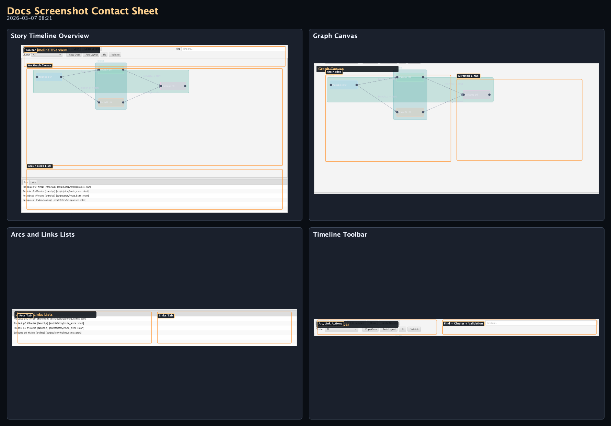

# Story Timeline Screenshots (Generated)

### Visual Reference (Auto-Generated)

_Generated by `./gradlew :editor:generateDocsScreenshots -Djvn.docs.profile=story-timeline` on 2026-03-07 08:21._

#### Contact Sheet

#### Story Timeline Overview

Complete Story Timeline workspace with toolbar, graph canvas, and arc/link tabs.

#### Timeline Toolbar

Create/edit/open arcs, auto-layout, fit, validate, find, and cluster filtering controls.

#### Graph Canvas

Drag nodes, connect arcs, inspect clustered routes, and review link directions.

#### Arcs and Links Lists

Use tabs for quick selection, rename/edit context menus, and keyboard operations.
