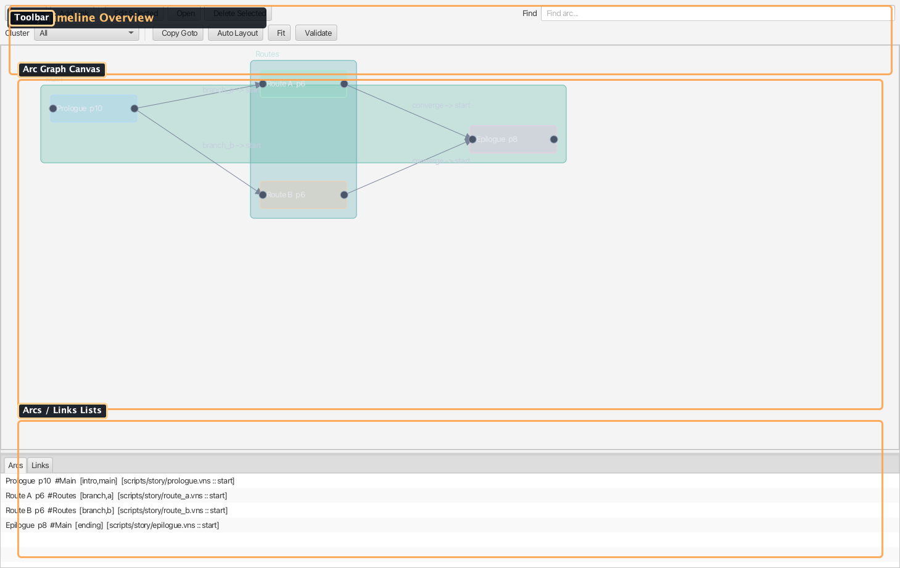
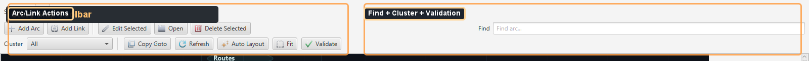
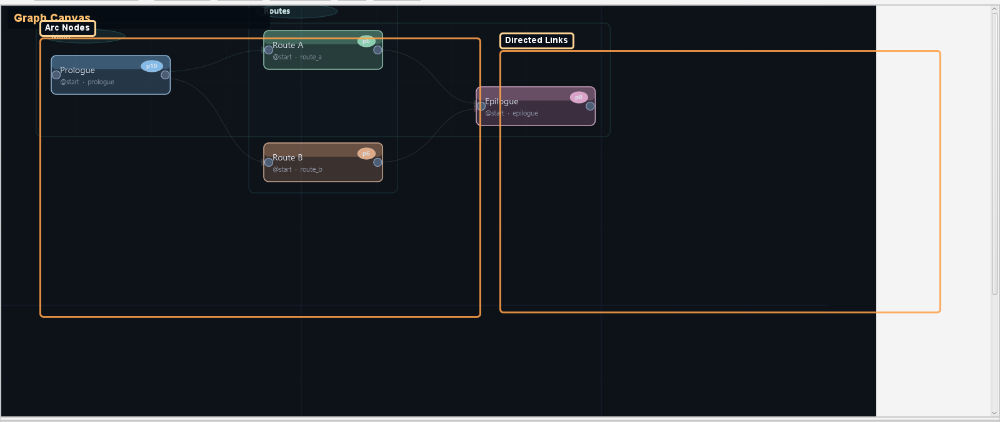
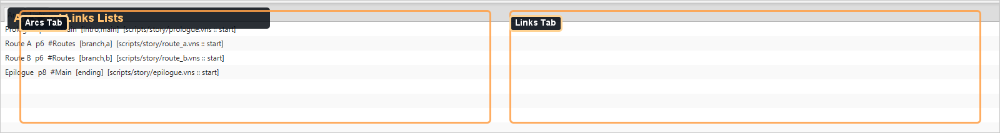

# Sidebar — Story Timeline

Multi-arc story planning tool for VNS projects. Manages narrative arcs, links between them, and visualizes the story graph.

Source: `modules/editor/src/main/java/com/jvn/editor/ui/StoryTimelineView.java`

---

## Overview

The Story Timeline lets authors plan and visualize the high-level narrative structure of a VNS project. Each story beat is an **arc** that points to a `.vns` script file, and arcs are connected by **links** that represent narrative transitions.

- **Default side:** Left
- **Tab name:** Timeline
- **State file:** `config/timeline/story.timeline` (legacy fallback files are still loadable)

---

## Concepts

### Arc

A named story segment. Each arc has:

| Field | Description |
|-------|-------------|
| **Name** | Unique arc identifier (e.g., "Prologue", "Chapter 1") |
| **Script** | Relative path to the `.vns` script file |
| **Entry Label** | Optional label within the script to start at |
| **Cluster** | Optional grouping tag for visual organization |
| **X / Y** | Position on the story graph canvas |

### Link

A directed connection between arcs:

| Field | Description |
|-------|-------------|
| **From Arc** | Source arc name |
| **From Label** | Optional label within the source arc |
| **To Arc** | Target arc name |
| **To Label** | Optional label within the target arc (defaults to arc's entry label) |

### Cluster

An optional grouping tag assigned to arcs. The cluster filter ComboBox lets you show only arcs in a specific cluster, useful for large projects with many story branches.

---

## UI Layout

The view is split vertically:
- **Top 76%** — story graph canvas in a scrollable, pannable viewport
- **Bottom 24%** — tabbed list views for Arcs and Links



---

## Toolbar

### Primary Row

| Button | Description |
|--------|-------------|
| **Add Arc** | Opens a dialog to name the arc, then prompts for a `.vns` script file. Creates the arc on the graph. |
| **Add Link** | Opens a dialog with From Arc/Label → To Arc/Label ComboBoxes. Creates a directed link. |
| **Edit Selected** | Opens an edit dialog for the currently selected arc or link. |
| **Open** | Opens the selected arc's `.vns` script file in the editor. |
| **Delete Selected** | Removes the selected arc (and all its links) or the selected link. |
| **Find** | Text field that highlights matching arc nodes on the graph. |



### Secondary Row

| Button | Description |
|--------|-------------|
| **Cluster** | ComboBox filter — "All" or a specific cluster name. Filters the graph view. |
| **Copy Goto** | Copies a `[goto arc:label]` VNS snippet for the selected link to the clipboard. |
| **Auto Layout** | Automatically repositions all arc nodes using a layout algorithm. |
| **Fit** | Zooms the graph to fit all nodes in the viewport. |
| **Validate** | Checks all arcs and links for correctness (see [Validation](#validation)). |

### Responsive Toolbar

When the panel is narrow, the toolbar automatically switches to icon-only mode (hiding button text labels). It reverts to text+icon mode when there is enough width.

---

## Story Graph Canvas

The graph area renders arcs as rectangular nodes and links as directed edges with arrowheads.

### Interactions

| Action | Result |
|--------|--------|
| **Drag a node** | Repositions the arc on the canvas (position is persisted) |
| **Click a node** | Selects the arc in the Arcs list |
| **Double-click a node** | Opens the arc's `.vns` script file |
| **Right-click a node** | Delete arc context action |
| **Ctrl/Cmd + Scroll** | Zoom the graph (0.6× – 2.0×) |
| **Pan** | Scroll bars or drag the canvas background |
| **Drag a `.vns` file onto the graph** | Creates an arc from the dropped file automatically |

### Graph Hints

When the graph is empty, a hint label is displayed: *"Add an arc or drag a .vns script here to start your timeline."*

### Find / Highlight

Typing in the Find text field highlights matching arc nodes on the canvas. Selecting an arc or link in the list views also highlights the corresponding node.



---

## Arc & Link Lists

### Arcs Tab

Each row displays: `ArcName  [script.vns :: entryLabel]`

| Action | Shortcut |
|--------|----------|
| Open arc script | Double-click or Enter |
| Delete arc | Delete / Backspace key |

**Context menu:** Open Script, Edit Arc..., Delete Arc

### Links Tab

Each row displays: `FromArc:fromLabel  ->  ToArc:toLabel`

| Action | Shortcut |
|--------|----------|
| Open target arc | Double-click or Enter |
| Delete link | Delete / Backspace key |

**Context menu:** Open Target Arc, Edit Link..., Copy Goto, Delete Link



---

## Edit Dialogs

### Edit Arc

| Field | Description |
|-------|-------------|
| **Name** | Arc display name (must be unique) |
| **Script** | Relative path to `.vns` file (with Browse... button) |
| **Entry Label** | Optional starting label within the script |
| **Cluster** | Optional grouping tag |

Renaming an arc automatically updates all links that reference it.

### Edit Link

| Field | Description |
|-------|-------------|
| **From Arc** | ComboBox of all arcs |
| **From Label** | Optional source label |
| **To Arc** | ComboBox of all arcs |
| **To Label** | Optional target label |

---

## Validation

The **Validate** button runs comprehensive checks:

1. **Script file existence** — verifies each arc's `.vns` file exists on disk
2. **Entry label resolution** — parses the script and confirms the entry label exists using `VnScriptParser`
3. **Link target resolution** — verifies each link's target arc exists and its target label resolves

Results are shown in a dialog:
- **"Timeline OK"** if no issues found
- A scrollable text area listing all issues if problems are detected

Example validation output:
```text
Missing script for arc 'Chapter 3': scripts/ch3.vns
Arc 'Prologue' missing entry label 'start_battle'
Link target label missing: Chapter 2:ending_b
```

---

## Drag-and-Drop

You can drag `.vns` files directly from the OS file manager or the Project Explorer onto the story graph canvas:
- The arc is created automatically with the filename as the arc name
- The script path is set to the project-relative path of the dropped file
- Only `.vns` files are accepted (other file types are ignored)

---

## File Format

The timeline is persisted as a line-delimited text file (`.jvn/story-timeline.txt`):

```text
ARC|Prologue|scripts/prologue.vns|start|40.0|40.0
ARC|Chapter 1|scripts/ch1.vns|begin|270.0|40.0
ARC|Chapter 2|scripts/ch2.vns||270.0|180.0
LINK|Prologue|end_choice_a|Chapter 1|begin
LINK|Prologue|end_choice_b|Chapter 2|
```

### Arc Line Format

`ARC|name|script|entryLabel|x|y`

- Fields are `|`-delimited
- Empty fields are stored as empty strings

### Link Line Format

`LINK|fromArc|fromLabel|toArc|toLabel`

---

## State Persistence

- Node positions are saved as part of the timeline file
- The timeline is loaded automatically when a project is opened
- Changes trigger auto-save
- Cluster filter state and zoom level are session-only (not persisted)

---

## Related Docs

- [Sidebar Utilities Overview](../overview/sidebar-utilities.md) — all sidebar panels
- [VNS Scripting](../../../scripting/vns/overview/vns-scripting.md) — VNS script format and commands
- [Label Flow Map](../right/sidebar-label-flow-map.md) — per-script label flow visualization
