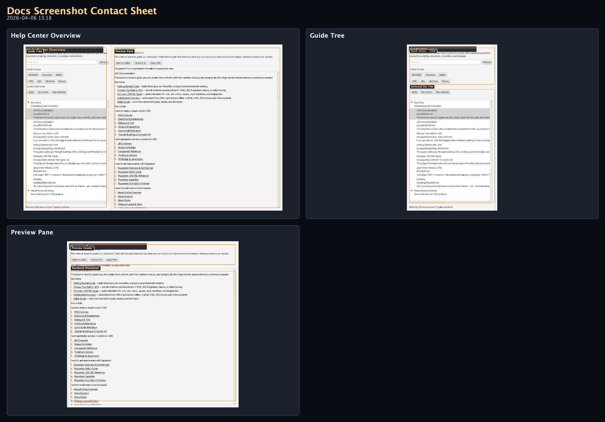
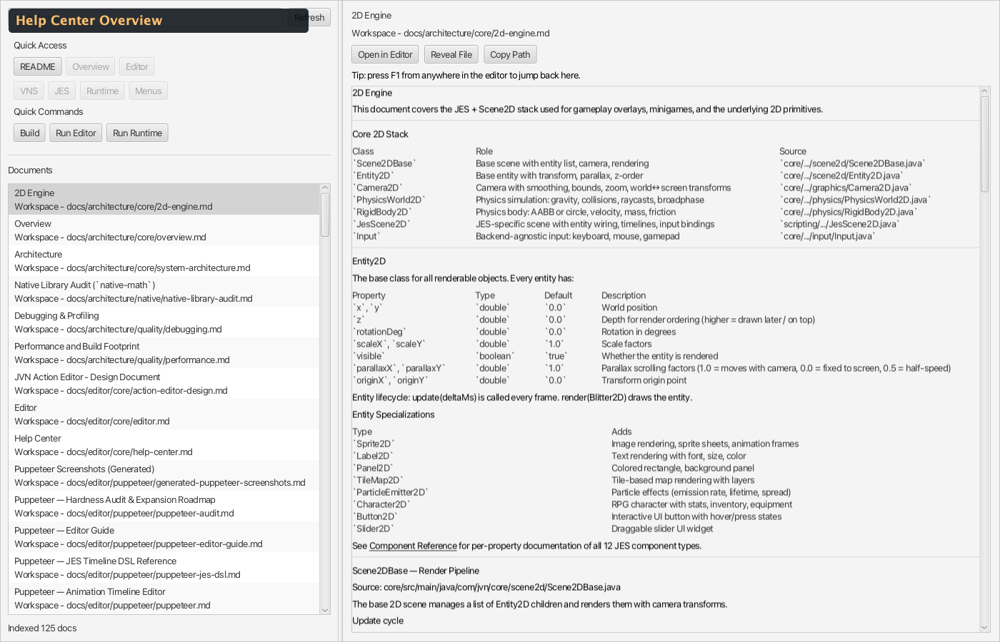
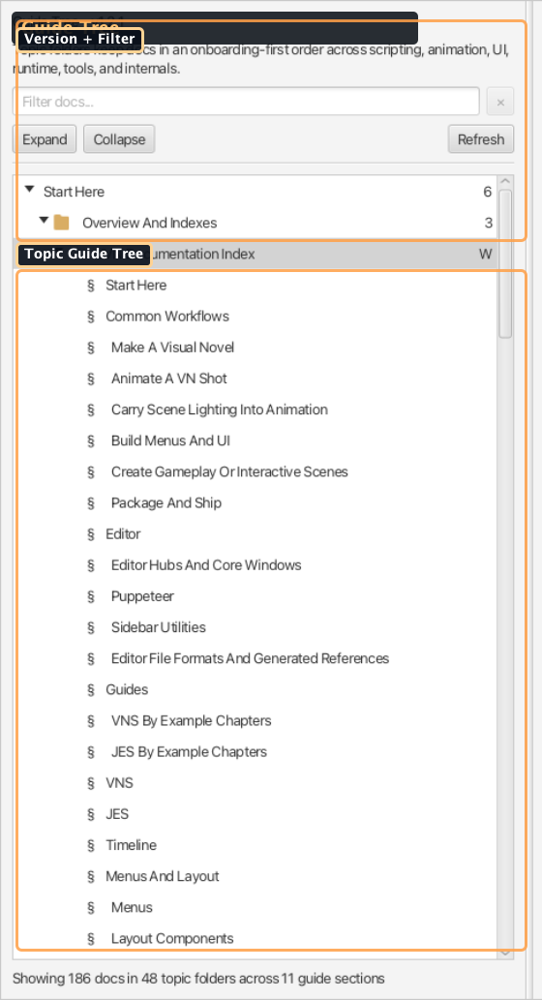
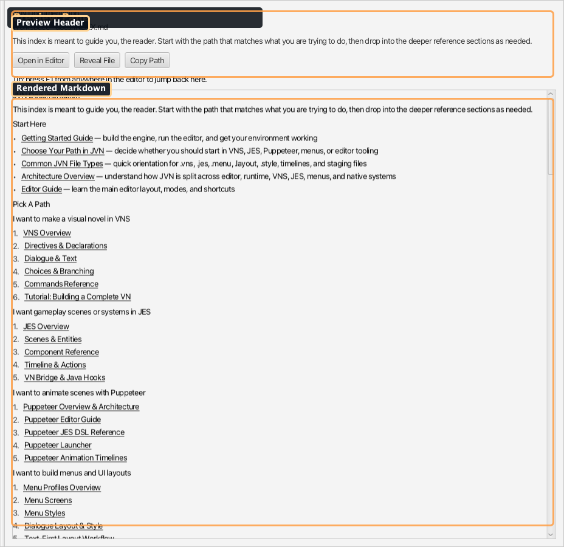

# Help Center Screenshots (Generated)

### Visual Reference (Auto-Generated)

_Generated by `./gradlew :editor:generateDocsScreenshots -Djvn.docs.profile=help-center` on 2026-04-06 13:18._

#### Contact Sheet

#### Help Center Overview

Guide tree and markdown preview in one workspace.

#### Guide Tree

Progressive documentation tree with onboarding-first sections, topic folders, and heading anchors.

#### Preview Pane

Document metadata header and rendered Markdown preview for the selected page.
