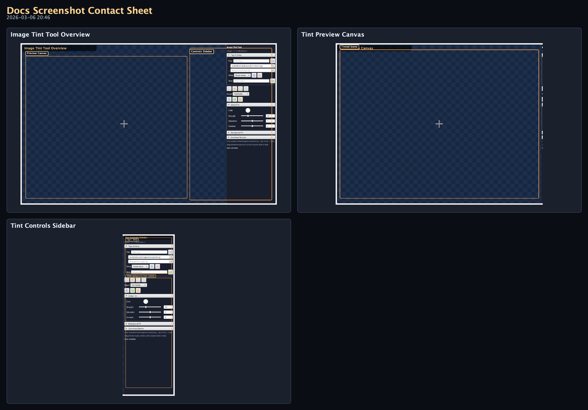
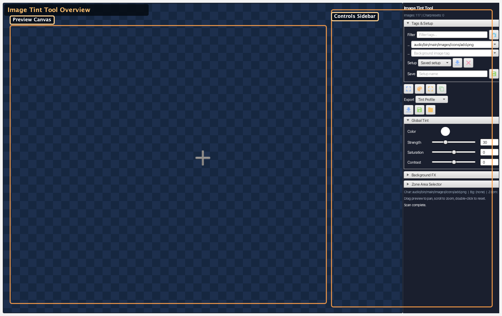
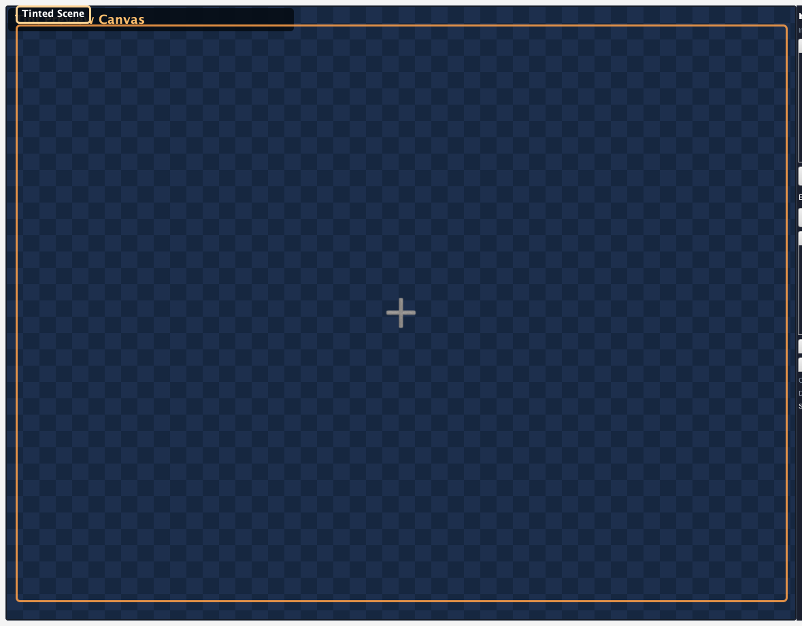
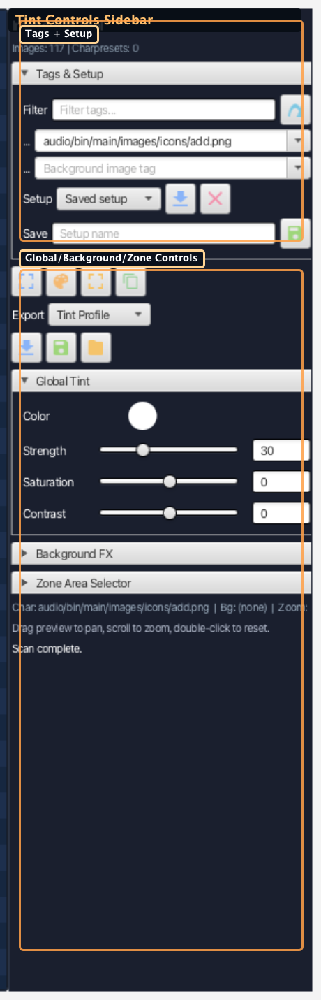

# Image Tint Tool Screenshots (Generated)

### Visual Reference (Auto-Generated)

_Generated by `./gradlew :editor:generateDocsScreenshots -Djvn.docs.profile=image-tint` on 2026-03-06 20:46._

#### Contact Sheet

#### Image Tint Tool Overview

Full tint tool workspace with preview canvas and controls sidebar.

#### Tint Preview Canvas

Live composite preview with pan/zoom and zone drawing overlays.

#### Tint Controls Sidebar

Tag/setup controls, global tint sliders, background FX, and zone settings.
