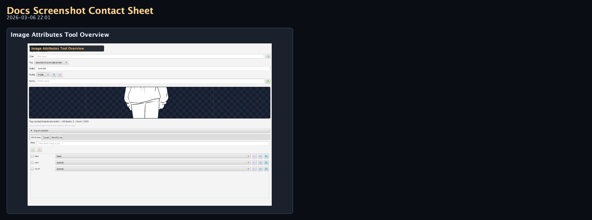
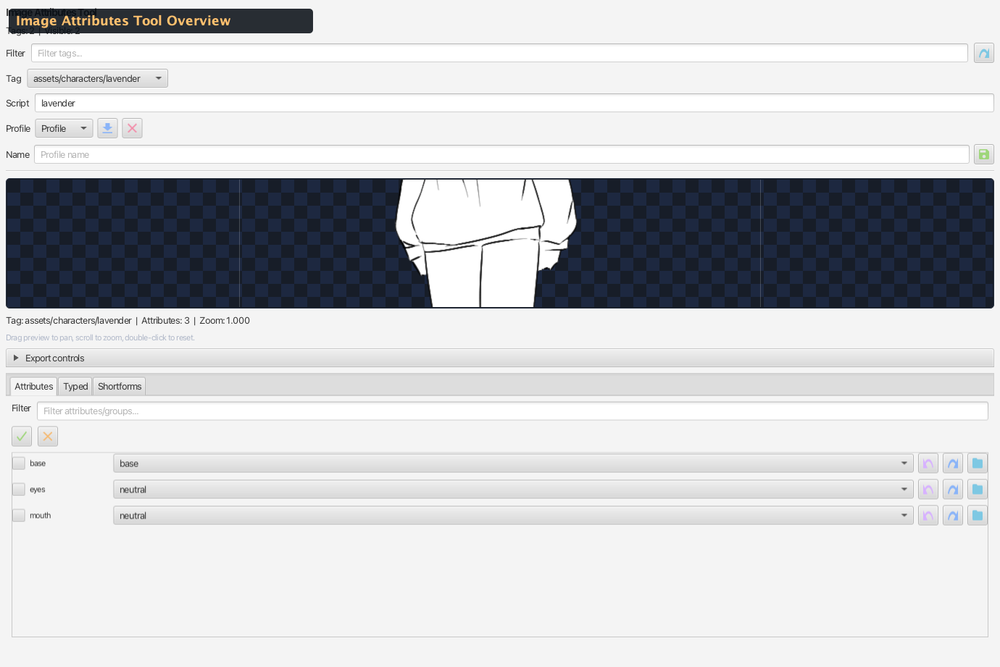

# Sidebar — Image Attributes Tool

Dedicated tool for selecting and previewing character image attributes by group, with conflict-safe selection, profiles, and multiple export formats.

Source: `editor/src/main/java/com/jvn/editor/ui/ImageAttributesToolView.java`

---

## Overview

The Image Attributes Tool provides a structured approach to character image assembly. Rather than browsing individual files, you select a character tag and then pick attributes per group (eyes, mouth, outfit, etc.). The tool resolves file paths automatically, previews the result, and exports ready-to-use VNS script strings.

- **Default side:** Right
- **Tab name:** Image Attributes Tool
- **Implements:** `ImageToolPanel` (shared interface for all three image tools)
- **State file:** `.jvn/image-attributes-tool.properties`

---

## Workflow

1. **Select a tag** — choose a character image tag from the ComboBox (derived from project directory structure)
2. **Pick attributes** — use per-group ComboBox selectors to choose options (eyes, mouth, brow, hair, etc.)
3. **Preview** — the composited image updates in real-time on the preview canvas
4. **Export** — copy the formatted script string for use in VNS scripts

---

## UI Layout

<!-- AUTO-IMAGE_ATTRIBUTES-SCREENSHOTS:START -->
### Visual Reference (Auto-Generated)

_Generated by `./gradlew :editor:generateDocsScreenshots -Djvn.docs.profile=image-attributes` on 2026-03-06 22:01._

#### Contact Sheet

#### Image Attributes Tool Overview

Full Image Attributes Tool sidebar utility view.
<!-- AUTO-IMAGE_ATTRIBUTES-SCREENSHOTS:END -->

---

## Panel Elements

| Element | Description |
|---------|-------------|
| **Tag selector** | ComboBox listing all discovered character tags in the project |
| **Filter** | Text field to narrow the tag list |
| **Script Tag** | Override field — the tag name used in exported script snippets (defaults to directory name) |
| **Preview canvas** | Composited image with drag-to-pan, scroll-to-zoom, double-click-to-reset |
| **Expression readout** | The computed attribute expression string |
| **Format selector** | ComboBox for choosing the export format |
| **Copy button** | Copies the formatted snippet to the system clipboard |
| **Profiles** | Save/load/delete named attribute profiles |

---

## Export Formats

| Format | Example Output |
|--------|---------------|
| **`show + tag + attrs`** | `[show hero center eyes_happy mouth_smile]` |
| **`tag + attrs`** | `hero eyes_happy mouth_smile` |
| **`attrs only`** | `eyes_happy mouth_smile` |
| **`JVN @charimg + [show]`** | `@charimg hero happy assets/char/hero/eyes_happy.png\|mouth_smile.png` `[show hero center happy]` |

---

## Tabs

### Attributes Tab

Visual per-group selectors:

- Each group has a **checkbox** (marks it for swap/randomize operations) and a **ComboBox** of available options
- Groups are auto-detected from the project's file naming conventions
- A filter text field narrows the visible groups
- Selecting an option immediately updates the preview

### Typed Tab

Free-text attribute input:

- Syntax options:
  - `eyes=happy mouth=smile` (key=value pairs)
  - `eyes_happy mouth_smile` (underscore-joined tokens)
- **Real-time toggle** — when enabled, the preview updates as you type
- Press **Enter** to apply the typed expression to the visual selectors

### Shortforms Tab

Named aliases for attribute combinations:

- **Define:** `happy = eyes_neutral mouth_happy brow_relaxed`
- **Save** — store the shortform with a name
- **Delete** — remove a saved shortform
- **Apply** — click a shortform name to apply it to the current selections
- Shortforms are persisted per-tag in the state file

---

## Profiles

Profiles save a complete set of attribute selections under a name:

| Action | Description |
|--------|-------------|
| **Save** | Prompts for a name, stores current attribute selections |
| **Load** | Applies a previously saved profile's selections |
| **Delete** | Removes a saved profile |

Profiles are stored per-tag and persist across sessions in `.jvn/image-attributes-tool.properties`.

---

## Tool Row Actions

| Button | Description |
|--------|-------------|
| **◀ Swap** | Cycles all marked (checked) groups one option backward |
| **Swap ▶** | Cycles all marked (checked) groups one option forward |
| **Randomize** | Picks a random option per group (all or marked-only) |
| **Clear** | Deselects all attribute options |
| **Defaults** | Resets all groups to their first option |
| **Fullscreen** | Expands the panel to fill the entire editor window |

---

## Group Token Aliases

The tool normalizes attribute group names from file naming conventions:

| Input Tokens | Normalized Group |
|-------------|-----------------|
| `eye`, `eyes` | `eyes` |
| `mouth`, `lip`, `lips` | `mouth` |
| `brow`, `eyebrow`, `eyebrows` | `brow` |
| `outfit`, `clothes` | `outfit` |
| `accessory`, `accessories`, `acc` | `accessory` |
| `base`, `body`, `hair`, `face` | (kept as-is) |

---

## Catalog Scanning

When `refreshCatalog()` is called:

1. Scans project image directories for character sprite folders
2. Parses file names to extract group names and option names per tag
3. Groups files by tag → group → option
4. Populates the tag ComboBox and group selectors
5. Restores persisted selections for the current tag

---

## State Persistence

All state is persisted per-tag in `.jvn/image-attributes-tool.properties`:

| State | Persisted |
|-------|-----------|
| Selected tag | ✓ |
| Per-group attribute selections | ✓ |
| Active group checkboxes | ✓ |
| Script tag override | ✓ |
| Shortforms | ✓ |
| Profiles | ✓ |
| Export format selection | ✓ |

---

## Differences from Layered Image Visualizer

| Feature | Image Attributes Tool | Layered Image Visualizer |
|---------|----------------------|--------------------------|
| **Focus** | Attribute-based selection (tag + groups) | Layer-based composition (render order) |
| **Render order** | Automatic from group priority | Manual render-order controls |
| **View controls** | Basic preview | Focus X/Y, Crop, Zoom sliders |
| **Presets** | Profiles (save/load attribute sets) | Presets (save/load layer selections) |
| **Game framing** | Not available | Match Game Framing toggle |
| **Export** | `[show]`, tag+attrs, `@charimg` | `@charimg`, `@charpreset`, `[show]`, recipes |

Both tools work with the same underlying image assets but approach them from different angles.

---

## Related Docs

- [Sidebar Utilities Overview](../overview/sidebar-utilities.md) — all 14 sidebar panels
- [Layered Image Visualizer](sidebar-layered-image-visualizer.md) — layer-based composition
- [Image Tint Tool](sidebar-image-tint-tool.md) — color tinting and grading
- [Asset Browser](sidebar-asset-browser.md) — general asset discovery
