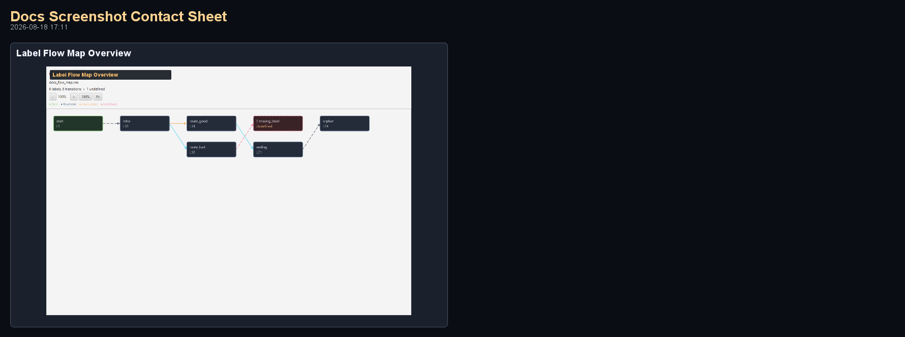
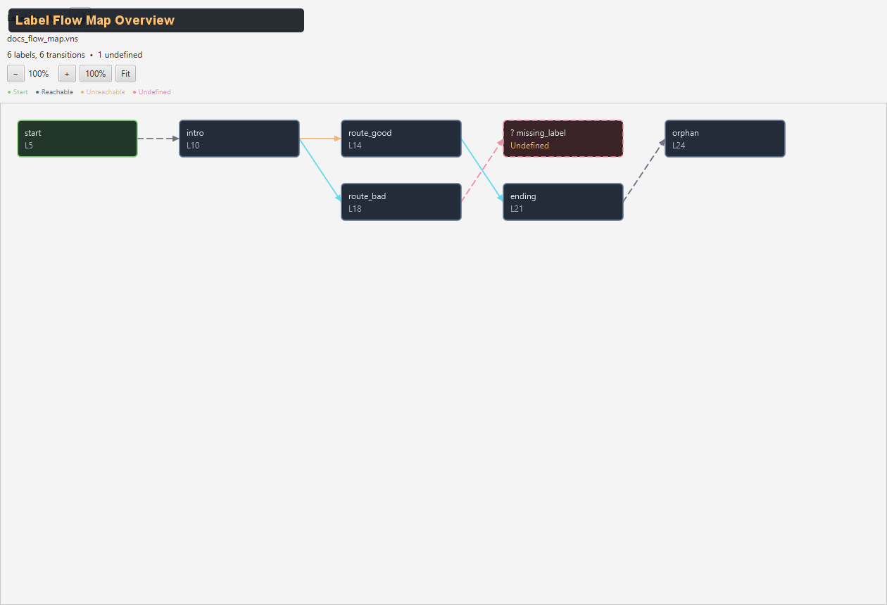

# Sidebar — Label Flow Map

Visual directed graph showing label-to-label control flow within a single VNS script.

Source: `modules/editor/src/main/java/com/jvn/editor/ui/VnsFlowMapView.java`

---

## Overview

The Label Flow Map renders every label in the active `.vns` script as a rectangular node and every transition (goto, choice, fallthrough) as a directed edge with an arrowhead. It gives authors an at-a-glance view of script structure and makes it easy to spot broken jumps, unreachable labels, and complex branching.

- **Default side:** Right
- **Tab name:** Label Flow
- **Updates:** Automatically when the active `.vns` file changes

---

## UI Layout

<!-- AUTO-LABEL_FLOW_MAP-SCREENSHOTS:START -->
### Visual Reference (Auto-Generated)

_Generated by `./gradlew :editor:generateDocsScreenshots -Djvn.docs.profile=label-flow-map` on 2026-08-18 17:11._

#### Contact Sheet



#### Label Flow Map Overview



Full Label Flow Map sidebar utility view.
<!-- AUTO-LABEL_FLOW_MAP-SCREENSHOTS:END -->

---

## Panel Elements

| Element | Description |
|---------|-------------|
| **Title** | "Label Flow Map" — bold header |
| **File name** | Active `.vns` file name, or "No active .vns file" |
| **Summary** | Label/transition counts plus unreachable and undefined totals when present |
| **Zoom toolbar** | Zoom out, zoom in, reset to 100%, and fit graph |
| **Legend** | Start, reachable, unreachable, and undefined node meanings |
| **Graph pane** | Scrollable, pannable canvas with nodes and edges |

---

## Graph Layout Algorithm

Nodes are positioned using a BFS layering algorithm:

1. **Start label** is placed at depth 0 (leftmost column)
2. BFS traversal follows outgoing edges to assign increasing depth to connected labels
3. Labels not reachable from the start label are appended at the end (sorted by line number) and marked as unreachable
4. **Unresolved targets** (labels referenced but not defined) are placed one depth beyond their source
5. Within each depth column, nodes are sorted by line number then alphabetically
6. Columns are spaced 230px apart horizontally, rows 90px apart vertically
7. 24px margins on all sides

### Layout Constants

| Constant | Value | Description |
|----------|-------|-------------|
| `NODE_WIDTH` | 170px | Node rectangle width |
| `NODE_HEIGHT` | 52px | Node rectangle height |
| `X_GAP` | 230px | Horizontal spacing between depth columns |
| `Y_GAP` | 90px | Vertical spacing between nodes in a column |
| `MARGIN_X` | 24px | Left/top margin |
| `MARGIN_Y` | 24px | Top margin |

---

## Node Appearance

Each node is a rounded rectangle (`arcWidth: 10`, `arcHeight: 10`) containing:
- **Label name** — white text (`#e6e9f0`) at (x+10, y+22)
- **Line number** — gray text (`#aab2c5`) at (x+10, y+40), displayed as "L42"

### Node Colors by Type

| Node Type | Fill | Stroke | Description |
|-----------|------|--------|-------------|
| **Start label** | `#23362a` (dark green) | `#8bd17c` (green) | The first label in the script |
| **Normal label** | `#252c39` (dark blue) | `#5e718f` (blue-gray) | Any defined label |
| **Unreachable label** | `#3a3023` (dark amber) | `#f0b673` (orange, dashed) | Defined but not reachable from the start label |
| **Unresolved target** | `#3a2327` (dark red) | `#f38ba8` (red, dashed) | Referenced but not defined — broken jump |

Unresolved nodes display `? labelName` as the label text and "Undefined" instead of a line number, in orange (`#f0b673`).

---

## Edge Appearance

Edges are drawn as lines with arrowheads connecting the right side of the source node to the left side of the target node.

### Edge Colors by Transition Kind

| Kind | Color | Style | Description |
|------|-------|-------|-------------|
| **JUMP** | `#66d9ef` (cyan) | Solid | Direct `[goto label]` |
| **CHOICE** | `#8bd17c` (green) | Solid | Choice branch target |
| **IF_GOTO** | `#f0b673` (orange) | Solid | Conditional goto |
| **FALLTHROUGH** | `#6b7280` (gray) | Dashed | Sequential flow to next label |
| **Unresolved** | `#f38ba8` (red) | Dashed | Target label does not exist |

### Arrowheads

Each edge terminates with a filled triangular arrowhead (10px length, 9px width) colored to match the edge.

---

## Interactions

| Action | Result |
|--------|--------|
| **Click a defined node** | Jumps to that label's line in the editor (via `onOpenLine` callback) |
| **Pan** | Use scroll bars to navigate the graph |
| **Hover** | Shows reachability/line details; cursor changes over clickable nodes |
| **Zoom − / +** | Changes graph scale in 10% steps |
| **100%** | Restores actual-size graph rendering |
| **Fit** | Fits the graph bounds into the current viewport |
| **Ctrl/Cmd + mouse wheel** | Zooms while the pointer remains over the graph |

Unresolved (undefined) nodes are not clickable since they have no valid line number. Zoom is bounded to keep the graph usable, and the current percentage remains visible in the toolbar.

---

## Empty State

When no labels are found in the active script, the graph shows: *"No labels found in this script."*

When no `.vns` file is active:
- File label shows "No active .vns file"
- Summary shows "Open a .vns script to inspect label flow."
- Graph is cleared

---

## Analysis Source

The flow map receives its data from the same `VnsScriptAnalyzer.Analysis` object used by VNS Diagnostics:

```java
Analysis {
    List<LabelNode> labels();    // name + line number
    List<FlowEdge> edges();      // from → to with kind and definedTarget flag
    String startLabel();          // first label in the script
}
```

This means the flow map and diagnostics panel always show consistent data from the same analysis pass.

---

## Practical Uses

- **Spot broken jumps** — red dashed nodes and edges immediately show undefined goto targets
- **Find unreachable labels** — labels far to the right with no incoming edges are likely dead code
- **Understand branching** — green choice edges show where the story branches
- **Navigate quickly** — click any node to jump directly to that label in the editor
- **Verify flow** — trace the path from start through choices and gotos to verify story logic

---

## Related Docs

- [Sidebar Utilities Overview](../overview/sidebar-utilities.md) — all sidebar panels
- [VNS Diagnostics](sidebar-vns-diagnostics.md) — text-based diagnostic companion
- [VNS Scripting](../../../scripting/vns/overview/vns-scripting.md) — VNS script format and commands
- [Story Map](../left/sidebar-story-timeline.md) — cross-script arc-level flow
