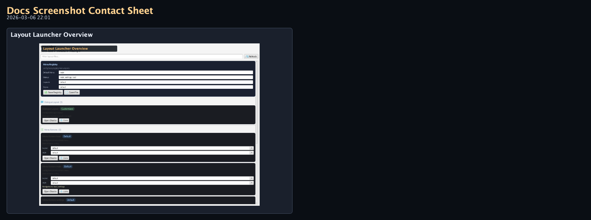
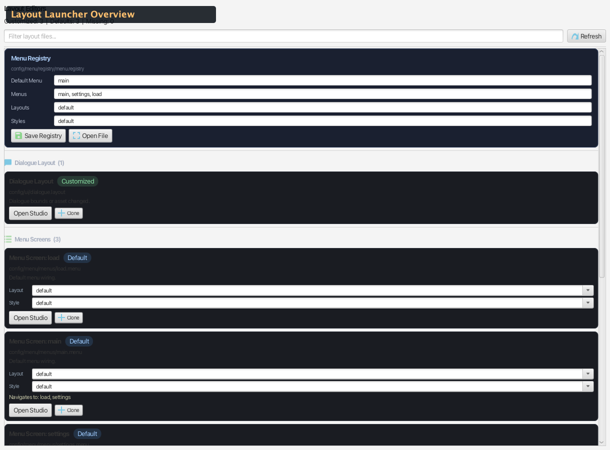

# Sidebar — Layout Launcher

Quick-status and launch panel for all layout-related visual editors. Shows which layout, style, and screen files exist and whether they've been customized.

Source: `editor/src/main/java/com/jvn/editor/ui/LayoutEditorLauncherView.java`

---

## Overview

The Layout Launcher provides a centralized dashboard for all layout customization files in a JVN project. It scans for dialogue layouts, menu layouts, menu styles, and menu screen definitions, reports their customization status, and offers one-click launch into the appropriate visual editor.

- **Default side:** Right
- **Tab name:** Layout Launcher
- **Refreshes:** On project load and via the Refresh button

---

## UI Layout

<!-- AUTO-LAYOUT_LAUNCHER-SCREENSHOTS:START -->
### Visual Reference (Auto-Generated)

_Generated by `./gradlew :editor:generateDocsScreenshots -Djvn.docs.profile=layout-launcher` on 2026-03-06 22:01._

#### Contact Sheet



#### Layout Launcher Overview



Full Layout Launcher sidebar utility view.
<!-- AUTO-LAYOUT_LAUNCHER-SCREENSHOTS:END -->

---

## File Types Tracked

| Item Type | Default Path | Visual Editor |
|-----------|-------------|---------------|
| **Dialogue Layout** | `config/ui/dialogue.layout` | `DialogueLayoutEditorView` |
| **Menu Layout** | `config/menu/layouts/<name>.layout` | `MenuLayoutVisualEditor` |
| **Menu Style** | `config/menu/styles/<name>.style` | `MenuStyleVisualEditor` |
| **Menu Screen** | `config/menu/menus/<name>.menu` | `MenuScreenVisualEditor` |

### Default Paths

The launcher knows these standard project paths:

| Constant | Path |
|----------|------|
| `DEFAULT_DIALOGUE_LAYOUT` | `config/ui/dialogue.layout` |
| `DEFAULT_MENU_LAYOUT` | `config/menu/layouts/default.layout` |
| `DEFAULT_MENU_STYLE` | `config/menu/styles/default.style` |
| `DEFAULT_MENU_REGISTRY` | `config/menu/registry/menu.registry` |
| `DEFAULT_MENU_DIR` | `config/menu/menus/` |

---

## Status Badges

Each layout item displays a colored status badge:

| Status | Color | Meaning |
|--------|-------|---------|
| **DEFAULT** | Gray | File exists but matches the auto-generated default |
| **CUSTOMIZED** | Green | File exists and has been modified from the default |
| **MISSING** | Red | Expected file was not found on disk |

Status detection works by comparing the file content hash against a known default template hash, or by simply checking file existence.

---

## Item List

Each item in the list shows:

| Element | Description |
|---------|-------------|
| **Title** | Item type and name (e.g., "Menu Layout: default") |
| **Path** | Relative file path |
| **Status badge** | DEFAULT / CUSTOMIZED / MISSING |
| **Detail** | Additional info (file size, last modified, etc.) |
| **Open button** | Launches the corresponding visual editor |

---

## Actions

| Action | Description |
|--------|-------------|
| **Filter** | Text field narrows the item list by name or path |
| **Refresh** | Rescans the project directory for layout files |
| **Open** (per item) | Opens the visual editor for that specific layout file |

When you click **Open**, the editor launches the appropriate visual editor in a new window or tab:

- **Dialogue Layout** → `DialogueLayoutEditorView` — textbox geometry, name box, choice buttons, action button bounds
- **Menu Layout** → `MenuLayoutVisualEditor` — list positioning, line height, alignment, title position
- **Menu Style** → `MenuStyleVisualEditor` — colors, fonts, button skins, background assets
- **Menu Screen** → `MenuScreenVisualEditor` — item list, actions, labels, advanced fields, item bounds

---

## Registry Panel

The bottom section shows the menu registry state:

| Field | Description |
|-------|-------------|
| **Registry file** | Path to `menu.registry` |
| **Default menu** | The menu ID configured as the startup menu |
| **Registered menus** | List of all registered menu screen IDs |

The registry panel validates cross-references — for example, if a menu screen references a layout or style that doesn't exist, it's flagged.

---

## Data Model

```java
enum ItemType {
    DIALOGUE_LAYOUT,
    MENU_LAYOUT,
    MENU_STYLE,
    MENU_SCREEN
}

enum StatusKind {
    DEFAULT,
    CUSTOMIZED,
    MISSING
}

record LayoutItem(
    ItemType type,
    String name,
    String path,
    StatusKind status,
    String detail
)
```

---

## Refresh Behavior

When `refreshStatus()` is called:

1. Scans `config/ui/` for dialogue layout files
2. Scans `config/menu/layouts/` for menu layout files
3. Scans `config/menu/styles/` for menu style files
4. Scans `config/menu/menus/` for menu screen files
5. Reads `config/menu/registry/menu.registry` for registry data
6. Computes status for each discovered file
7. Rebuilds the item list UI

---

## Related Docs

- [Sidebar Utilities Overview](../overview/sidebar-utilities.md) — all 14 sidebar panels
- [Menu Flow Editor](sidebar-menu-flow-editor.md) — visual menu navigation wiring
- [Menu Screens](../../../scripting/ui/menus/menu-screens.md) — `.menu` file format
- [Menu Layouts](../../../scripting/ui/layout/structure/menu-layouts.md) — `.layout` file format
- [Menu Styles](../../../scripting/ui/menus/menu-styles.md) — `.style` file format
- [Dialogue Layout](../../../scripting/ui/layout/components/dialogue-layout.md) — textbox geometry and buttons
