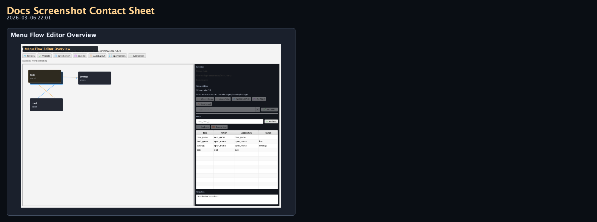
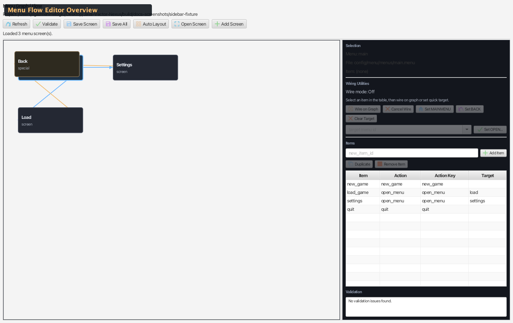

# Sidebar — Menu Flow Editor

Visual flow editor for menu-to-menu navigation and `menu.registry` wiring. Lets teams wire `OPEN_MENU`, `BACK`, and `MAIN_MENU` actions between menu screens on a node graph, then register screens and set the default menu entry point from the same sidebar.

Source: `modules/editor/src/main/java/com/jvn/editor/ui/MenuFlowEditorView.java`

---

## Overview

The Menu Flow Editor loads all `.menu` screen files from the project, renders each as a node on a graph canvas, and draws directed edges representing navigation targets. Authors can visually wire menu items to target screens, validate all navigation paths, and save changes back to the `.menu` files.

- **Default side:** Right
- **Tab name:** Menu Flow
- **State source:** `config/menu/menus/*.menu` and `config/menu/registry/menu.registry`

---

## UI Layout

<!-- AUTO-MENU_FLOW_EDITOR-SCREENSHOTS:START -->
### Visual Reference (Auto-Generated)

_Generated by `./gradlew :editor:generateDocsScreenshots -Djvn.docs.profile=menu-flow-editor` on 2026-03-06 22:01._

#### Contact Sheet



#### Menu Flow Editor Overview



Full Menu Flow Editor sidebar utility view.
<!-- AUTO-MENU_FLOW_EDITOR-SCREENSHOTS:END -->

---

## Graph Canvas

Each menu screen is rendered as a rectangular node (184×72px) on a scrollable, pannable canvas.

### Node Contents

- **Menu ID** — bold title
- **Item count** — number of items in the screen
- **Color coding** — normal screens are blue/gray, missing targets are red

### Special Nodes

| Node | Description |
|------|-------------|
| **`__back__`** | Virtual node representing the BACK action (go to previous screen) |
| **`__missing__::id`** | Virtual node for unresolved navigation targets (displayed in red) |

### Edges

Directed edges show navigation flow:
- **OPEN_MENU** items draw an edge from the source screen to the target screen
- **BACK** items draw an edge to the `__back__` virtual node
- **MAIN_MENU** items draw an edge to the menu registered as the main menu

### Graph Interactions

| Action | Result |
|--------|--------|
| **Click a node** | Selects that screen, populates the item table |
| **Click a node in Wire Mode** | Sets the wired item's target to that screen |
| **Pan** | Scroll the graph canvas |
| **Escape** | Cancel wire mode |

---

## Toolbar

### Primary Row

| Button | Icon Color | Description |
|--------|-----------|-------------|
| **Refresh** | Blue | Reload all `.menu` files from disk |
| **Validate** | Green | Check all navigation targets resolve correctly |
| **Save Screen** | Light blue | Save the currently selected screen's `.menu` file |
| **Save All** | Purple | Save all modified screens to disk |
| **Auto Layout** | Tan | Automatically position nodes on the graph |
| **Open Screen** | Blue | Open the selected screen's `.menu` file in the text editor |
| **Add Screen** | Green | Create a new `.menu` file with a prompted ID |

---

## Registry Wiring

The right-hand sidebar includes a registry section for editing `config/menu/registry/menu.registry` without leaving the flow editor.

### Controls

| Control | Description |
|--------|-------------|
| **Registry path** | Shows the effective registry file path resolved from the project manifest |
| **Menus** | Read-only summary of currently registered menu IDs |
| **Selected screen status** | Shows whether the current screen is registered and whether it is the default menu |
| **Default** | Editable combo box for `defaultMenu` |
| **Layouts** | Editable comma-separated `layouts=` list |
| **Styles** | Editable comma-separated `styles=` list |
| **Register Selected** | Add the selected screen to `menus=` |
| **Unregister Selected** | Remove the selected screen from `menus=` |
| **Sync Screens** | Replace `menus=` with all discovered `.menu` files |
| **Save Registry** | Write the registry file to disk |
| **Open Registry** | Open the registry file in the text editor, creating it if needed |

### Registry Diagnostics

Validation now also checks:

- Screens that exist on disk but are missing from `menus=`
- IDs listed in `menus=` that do not have matching `.menu` files
- `defaultMenu` values that do not resolve to an existing screen
- Reachability from the effective registry entry point

---

## Item Table

An editable `TableView` showing items in the currently selected menu screen.

### Columns

| Column | Type | Description |
|--------|------|-------------|
| **Item** | Text (editable) | Unique item identifier within the screen |
| **Action** | ComboBox | Action type (see below) |
| **Action Key** | Text (editable) | Raw action key written to the `.menu` file |
| **Target** | Text (editable) | Target menu ID for actions that use one |

### Action Types

| Action | Description |
|--------|-------------|
| `OPEN_MENU` | Navigate to another menu screen (requires target) |
| `BACK` | Return to the previous screen in the navigation stack |
| `MAIN_MENU` | Return to the main menu |
| `QUIT` | Exit the application |
| `START_GAME` | Start a new game |
| `LOAD_GAME` | Open the load game screen |
| `SAVE_GAME` | Open the save game screen |
| `SETTINGS` | Open the settings screen |
| `CUSTOM` | Custom action (uses `actionKey` for delegation) |

### Item Table Actions

| Button | Icon Color | Description |
|--------|-----------|-------------|
| **Wire on Graph** | Tan | Enter wire mode — click a graph node to set as OPEN_MENU target |
| **Cancel Wire** | Orange | Exit wire mode |
| **Set MAIN_MENU** | Light blue | Set selected item's action to MAIN_MENU |
| **Set BACK** | Purple | Set selected item's action to BACK |
| **Clear Target** | Orange | Clear the selected item's navigation target |
| **Quick Target** | ComboBox | Select a target menu ID from a dropdown |
| **Set OPEN_MENU** | Green | Set selected item to OPEN_MENU with the quick target value |
| **Add Item** | Green | Add a new item (from text field or via prompt) |
| **Duplicate** | Light blue | Duplicate the selected item |
| **Remove Item** | Orange | Delete the selected item |

### Context Menu

Right-click a table row for:
- Edit ID, Edit Label
- Set Action → (submenu of all action types)
- Wire Target, Clear Target
- Duplicate, Remove

---

## Wire Mode

Wire mode provides a visual way to connect menu items to target screens:

1. Select an item in the item table
2. Click **Wire on Graph** (or right-click → Wire Target)
3. The `wireModeLabel` updates to "Wire mode: OPEN_MENU"
4. Click any node on the graph canvas
5. The item's action is set to `OPEN_MENU` and target is set to the clicked node's menu ID
6. Wire mode exits automatically

**Cancel:** Press **Escape** or click **Cancel Wire**.

---

## Diagnostics

The bottom text area shows validation results. Click **Validate** to run checks:

### Checks Performed

| Check | Description |
|-------|-------------|
| **Target resolution** | Every `OPEN_MENU` item's target must reference an existing screen |
| **Circular navigation** | Detects infinite loops (A → B → A with no BACK) |
| **Orphan screens** | Screens not reachable from the main menu |
| **Missing screens** | Referenced targets that don't have `.menu` files |
| **Duplicate IDs** | Multiple items with the same ID within a screen |

### Output Format

```text
✓ All navigation targets valid
  or
✕ main.load → target 'load_game' not found
✕ settings.back → BACK action but no navigation stack context
⚠ Screen 'credits' is not reachable from the main menu
```

---

## File Operations

### Loading

On project load or refresh:
1. Reads `config/menu/registry/menu.registry` for the registry configuration
2. Scans `config/menu/menus/` for all `.menu` files
3. Parses each `.menu` file into a `MenuScreenModel`
4. Builds the graph and populates the item table

### Saving

- **Save Screen** writes the selected screen's `MenuScreenModel` back to its `.menu` file using the properties format
- **Save All** iterates all modified screens and saves each one
- The serializer preserves custom `actionKey` fields for CUSTOM action types

### Adding Screens

The **Add Screen** button:
1. Prompts for a menu ID
2. Creates a new `.menu` file at `config/menu/menus/<id>.menu`
3. Adds the screen to the graph
4. Selects the new screen for editing

---

## Keyboard Shortcuts

| Key | Action |
|-----|--------|
| **Escape** | Cancel wire mode |
| **Delete** | Remove selected item from the table |

---

## Node Positions

Node positions on the graph are remembered during the session via `rememberedScreenPositions`. The **Auto Layout** button resets positions using an automatic layout algorithm. Positions are not persisted to disk across sessions.

---

## Related Docs

- [Sidebar Utilities Overview](../overview/sidebar-utilities.md) — all sidebar panels
- [Layout Launcher](sidebar-layout-launcher.md) — launch individual layout/style editors
- [Menu Screens](../../../scripting/ui/menus/menu-screens.md) — `.menu` file format
- [Menu Profiles](../../../scripting/ui/menus/menu-profiles.md) — registry, loader, action types
