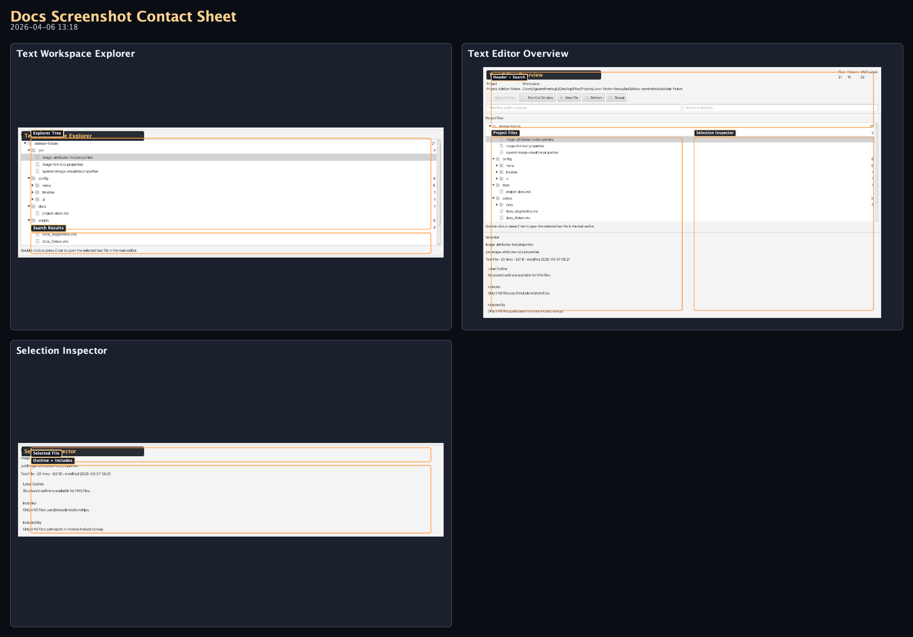
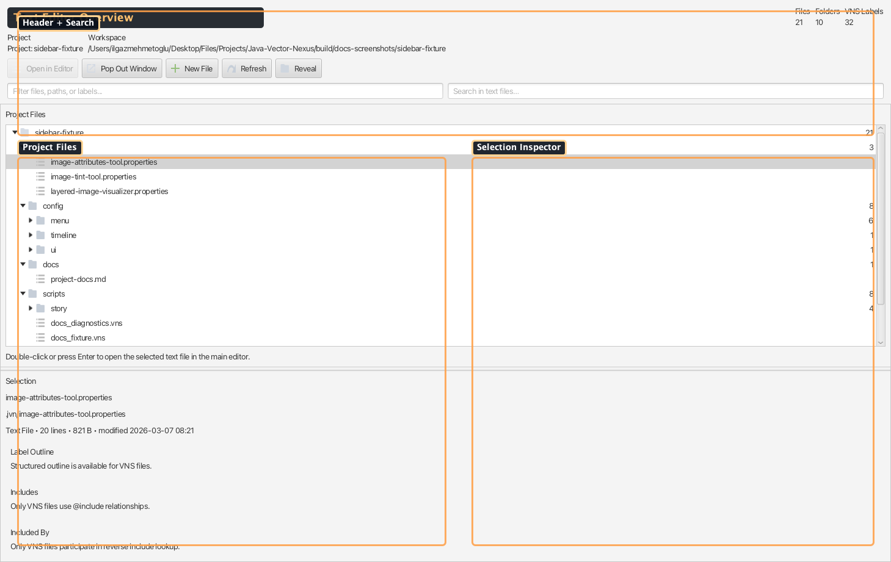
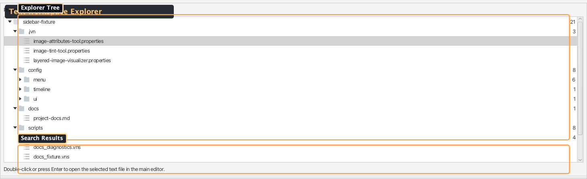
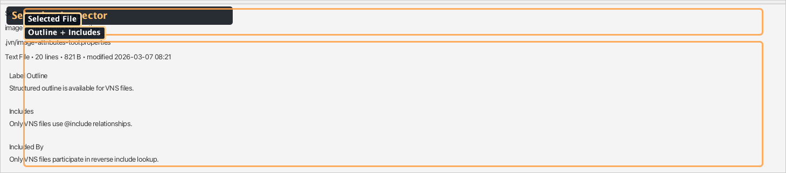

# Sidebar — Text Editor

A focused JVN text explorer and launcher panel. Browse project text files in a tree view, inspect VNS label outlines and include dependencies where relevant, search across indexed files, and pop out a dedicated tabbed text editor window.

Source: `editor/src/main/java/com/jvn/editor/ui/ScriptEditorLauncherView.java`

---

## Overview

The Text Editor sidebar is designed to behave like a small IDE explorer for JVN text files. It scans the project workspace for editable text assets, builds a workspace model with VNS label/include analysis where available, and provides quick access to open, create, rename, delete, and search files.

- **Default side:** Right (hidden by default)
- **Tab name:** Text Editor
- **Panel chooser entry:** Text Editor

## UI Layout

<!-- AUTO-TEXT_EDITOR-SCREENSHOTS:START -->
### Visual Reference (Auto-Generated)

_Generated by `./gradlew :editor:generateDocsScreenshots -Djvn.docs.profile=text-editor` on 2026-04-06 13:18._

#### Contact Sheet

#### Text Editor Overview

Header, search/filter controls, project tree, and selection inspector in the text workspace.

#### Text Workspace Explorer

Indexed project text files with hierarchy browsing and file-search context.

#### Selection Inspector

Path, metadata, label outline, and include relationships for the selected text file.
<!-- AUTO-TEXT_EDITOR-SCREENSHOTS:END -->

---

## Features

| Feature | Description |
|---------|-------------|
| **Project tree** | Hierarchical tree of indexed JVN text files across the project workspace |
| **Filter** | Live case-insensitive filter across filenames, paths, and labels |
| **Search in text files** | Debounced full-text search across all indexed text file contents (300ms debounce) |
| **Label outline** | Shows all labels defined in the selected VNS file |
| **Include graph** | "Includes" and "Included By" lists for the selected VNS file |
| **Open in editor** | Double-click or Enter to open in the main editor tab |
| **Pop Out Window** | Launches a dedicated tabbed text editor window |
| **New File** | Create a new text file with an extension-aware starter template |
| **Rename / Delete** | Right-click context menu or keyboard shortcuts (F2, Delete) |
| **Reveal** | Open the selected file's containing folder in the system file manager |
| **Workspace stats** | File count, folder count, and total VNS label count |

---

## UI Sections

### 1. Header Card

- **Project path** and **workspace root** path
- **Stats row** — three mini cards showing file count, folder count, and VNS label count
- **Action buttons:**
  - **Open in Editor** — opens the selected text file in the main editor
  - **Pop Out Window** — launches the dedicated editor window
  - **New File** — creates a new text file
  - **Refresh** — rescans the workspace
  - **Reveal** — opens the file in the system file manager

### 2. Explorer Filter & Search

- **Explorer Filter** — filters the tree view by filename, path, or label name
- **Search in Text Files** — full-text content search across indexed text files; results appear as clickable entries with line numbers

### 3. Project Explorer Tree

A tree view showing the indexed text workspace hierarchy:

- **Folder nodes** — with file count badges
- **File nodes** — indexed JVN text files
- **Color-coded icons** — folders in gold, files in gray
- **Double-click** or **Enter** to open in the main editor
- **Context menu** — Open, Open in Pop-Out, New File Here, Rename, Delete, Copy Path, Reveal

### 4. Selection Inspector

When a file is selected, the bottom panel shows:

- **Selection title** — filename
- **Path** — relative path from project root
- **Metadata** — file size, last modified date, line count, label count
- **Label Outline** — clickable list of all labels for VNS files
- **Includes** — VNS files that this file includes
- **Included By** — VNS files that include this file

---

## Pop-Out IDE Window

The **Pop Out Window** button opens a standalone text editor window with:

- **Tabbed editing** — multiple text files open as tabs
- **Per-file editor routing** — VNS, JES, timeline, DSL, and generic text editors
- **Configurable font size** — inherits editor preferences
- **Status bar** — current file path and diagnostics

---

## Keyboard Shortcuts

| Shortcut | Action |
|----------|--------|
| **Enter** | Open selected file in main editor |
| **F2** | Rename selected file |
| **Delete / Backspace** | Delete selected file (with confirmation) |
| **F5** | Refresh workspace |

---

## Workspace Model

The sidebar builds a `WorkspaceSnapshot` by scanning the project text workspace:

- Discovers supported text files recursively
- Parses VNS files to extract labels and include directives
- Builds an include dependency graph (includes / included-by)
- Computes per-folder file counts
- All analysis runs on the JavaFX application thread (files are typically small)

---

## Related Docs

- [Sidebar Utilities Overview](../overview/sidebar-utilities.md) — all sidebar panels
- [VNS Diagnostics](sidebar-vns-diagnostics.md) — live error/warning diagnostics for VNS scripts
- [Label Flow Map](sidebar-label-flow-map.md) — visual label-to-label flow graph
- [Editor Guide](../../core/editor.md) — VNS editing modes and preview
