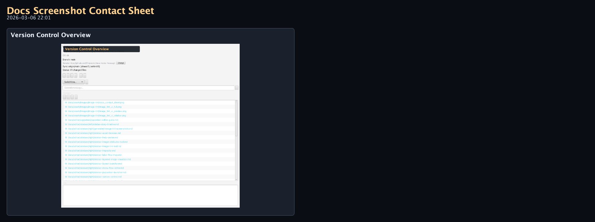
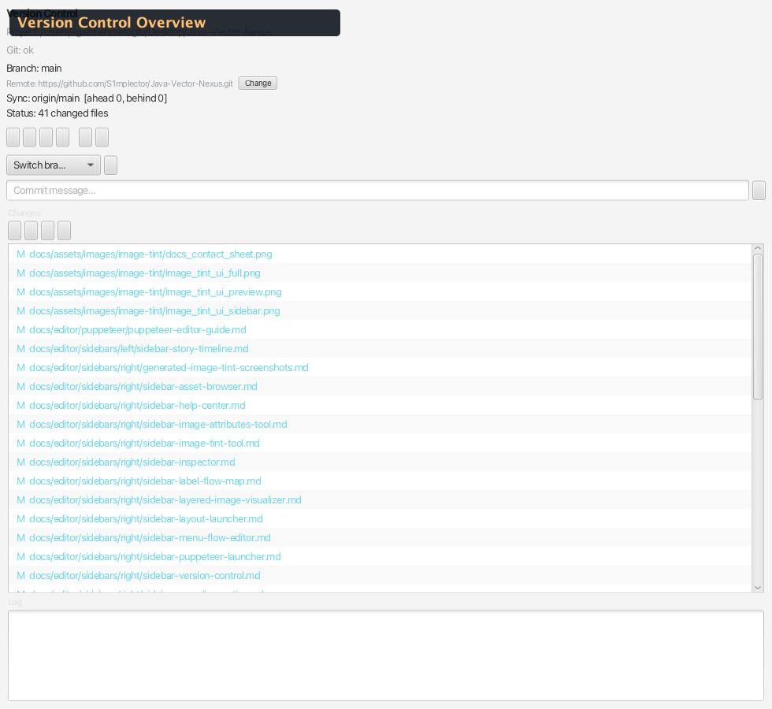

# Sidebar — Version Control

Team-focused Git control panel integrated into the JVN editor. Supports init, commit, push, pull, branch management, stash, and remote setup.

Source: `modules/editor/src/main/java/com/jvn/editor/ui/VersionControlView.java`

---

## Overview

The Version Control panel provides a complete Git workflow without leaving the editor. It is designed around plain-language actions: save a local snapshot, check online for incoming work, get updates, and send saved snapshots online. It also handles repository initialization, remote configuration (including GitHub repo creation via `gh` CLI), branching, staging, committing, pushing, pulling, stashing, and per-file diff viewing.

- **Default side:** Right
- **Tab name:** Version Control
- **Backend:** `GitVcsService` (Git-only, no LFS)
- **Auto-refresh:** Periodic status polling via `Timeline` timer

---

## UI Layout

<!-- AUTO-VERSION_CONTROL-SCREENSHOTS:START -->
### Visual Reference (Auto-Generated)

_Generated by `./gradlew :editor:generateDocsScreenshots -Djvn.docs.profile=version-control` on 2026-03-06 22:01._

#### Contact Sheet

#### Version Control Overview

Full Version Control sidebar utility view.
<!-- AUTO-VERSION_CONTROL-SCREENSHOTS:END -->

---

## Status Display

| Label | Description |
|-------|-------------|
| **Repo** | Project directory name |
| **Git** | Detected Git version (e.g., "Git: 2.43.0") or "Git: not found" |
| **Branch** | Current branch name (e.g., "Branch: main") |
| **Incoming** | Whether the remote has snapshots this local copy does not have |
| **Sync** | Local snapshots that have not been uploaded yet |
| **Status** | Count of changed files |
| **Next step** | Plain-language recommendation for what to do next |
| **Online check** | Last time the panel checked the remote repository |
| **Conflict** | Shown in red (`#f38ba8`) when merge conflicts exist |
| **Remote** | Remote URL or "Remote: not configured" (shown in orange `#f0b673`) |

---

## Repository Initialization

When no `.git` directory exists, a prominent warning banner is displayed:

| Element | Description |
|---------|-------------|
| **⚠ Repository Not Initialized** | Orange warning title |
| **Hint text** | "Repository is not initialized for this project." |
| **Create initial commit** | Checkbox (default: checked) — auto-commits all files after init |
| **Initialize** | Button — runs `git init` and optionally `git add -A && git commit -m "Initial commit"` |

The banner has an orange background with rounded corners and orange border for high visibility.

---

## Remote Setup

When a repo exists but has no remote, a setup guide banner is shown:

### Option A — Create GitHub Repository

Requires the `gh` CLI to be installed:

| Element | Description |
|---------|-------------|
| **Visibility** | ComboBox: Private (default) or Public |
| **Create GitHub Repository** | Green button — runs `gh repo create` with the project name |

### Option B — Add Remote Manually

| Element | Description |
|---------|-------------|
| **Add Remote** | Button — opens a text input dialog for the remote URL |

The dialog prompts for a URL (e.g., `https://github.com/user/repo.git`) and runs `git remote add origin <url>`.

---

## Sync Toolbar

| Button | Icon Class | Tooltip | Git Command |
|--------|-----------|---------|-------------|
| **Refresh** | `vcs-icon-refresh` | Refresh status and check online when needed | `git status`, `git branch`, `git remote`, periodic `git fetch --all --prune` |
| **Check Online** | `vcs-icon-fetch` | Check whether the remote has incoming work | `git fetch --all --prune` |
| **Get Updates** | `vcs-icon-pull` | Download incoming snapshots safely | `git pull --rebase --autostash` |
| **Send Online** | `vcs-icon-push` | Upload saved snapshots to the remote | `git push`, or `git push -u origin <branch>` when no upstream is set |

---

## Stash Toolbar

| Button | Icon Class | Tooltip | Git Command |
|--------|-----------|---------|-------------|
| **Shelve** | `vcs-icon-stash` | Temporarily put changes aside | `git stash` |
| **Restore Shelf** | `vcs-icon-stash-pop` | Bring back the latest shelved changes | `git stash pop` |

---

## Branch Management

| Element | Description |
|---------|-------------|
| **Branch ComboBox** | Lists local branches. Select one to switch, or type a new branch name. |
| **New Branch** | Creates and switches to the typed branch name (`git switch -c <name>`) |

---

## Changed Files List

A `ListView` showing all files with uncommitted changes. Each entry shows:
- **Status label** — New, Changed, Added, Deleted, Renamed, Copied, or Conflict
- **File path** — project-relative path

### Interactions

| Action | Result |
|--------|--------|
| **Click** | Selects the file for per-file actions |
| **Double-click** | Opens the file in the editor |
| **Enter** | Same as double-click |

### Per-File Action Buttons

| Button | Icon Class | Tooltip | Git Command |
|--------|-----------|---------|-------------|
| **Stage** | `vcs-icon-stage` | Stage selected | `git add <file>` |
| **Unstage** | `vcs-icon-unstage` | Unstage selected | `git reset HEAD <file>` |
| **Discard** | `vcs-icon-discard` | Discard changes after confirmation | `git restore -- <file>` or `git clean -f -- <file>` for untracked files |
| **Diff** | `vcs-icon-diff` | Show diff | `git diff <file>` (shown in log area) |

**Warning:** The Discard action permanently removes uncommitted changes to the selected file.

---

## Commit

| Element | Description |
|---------|-------------|
| **Commit message** | TextField with placeholder "Describe what changed..." |
| **Save Snapshot** | Saves all changed files into a local Git commit |

### Commit Workflow

1. Type a commit message in the text field
2. Press **Enter** or click **Save Snapshot**
3. Runs: `git add -A && git commit -m "<message>"`
4. The commit message field is cleared on success
5. Status refreshes automatically

The commit stages all changes (`-A`) before committing, ensuring nothing is accidentally left unstaged.

---

## Log Area

A read-only `TextArea` at the bottom showing recent Git operation output:
- Command executed (e.g., `> git push origin main`)
- Git response (e.g., "Everything up-to-date")
- Error messages if operations fail

The log is useful for debugging failed operations.

---

## Auto-Refresh

The panel uses a `Timeline`-based periodic refresh to keep the status display current:
- Polls `git status` at regular intervals
- Updates branch, sync, and changed files displays
- Pauses during active operations to avoid conflicts

---

## Threading

All Git operations run on a dedicated background thread (`jvn-vcs-worker`, daemon) to keep the UI responsive:
- Operations are queued via `ExecutorService`
- Results are marshaled back to the JavaFX Application Thread via `Platform.runLater()`
- The `busy` flag prevents concurrent operations

---

## Button Styling

Primary toolbar buttons use text, icons, color, and tooltips. The panel highlights the next likely action: **Get Updates** when incoming work exists, **Save Snapshot** when local files changed, or **Send Online** when local snapshots have not been uploaded.

Per-file buttons remain compact icon buttons with tooltips because they operate on the selected file.

---

## Keyboard Shortcuts

| Key | Context | Action |
|-----|---------|--------|
| **Enter** | Commit message field | Commit all changes |
| **Enter** | Changed files list | Open selected file |

---

## Related Docs

- [Sidebar Utilities Overview](../overview/sidebar-utilities.md) — all sidebar panels
- [Version Control Guide](../../../project-setup/collaboration/version-control.md) — Git workflow documentation
- [Project Explorer](../left/sidebar-project-explorer.md) — file tree navigation
