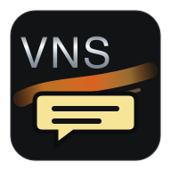
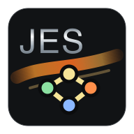
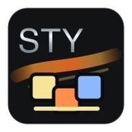

# JVN Language Tools


Syntax highlighting, editor behavior, and snippets for Java Vector Nexus projects in VS Code.

JLT is meant for day-to-day script and config editing beside the JVN editor. Use VS Code when you want fast multi-file editing, search/replace, Git review, or broad project navigation. Use the JVN editor when you need live diagnostics, previews, visual tools, Puppeteer editing, asset pickers, or runtime-aware validation.

## Supported Files

| DSL | Icon | Files | Development Use |
| --- | --- | --- | --- |
| VNS |  | `.vns` | Story scripts, dialogue, labels, choices, VN/JES bridge calls |
| JES |  | `.jes` | Scenes, entities, components, animation timelines, minigames |
| Story Map |  | `.storymap`, `.timeline` | Route/arc planning and script-link maps |
| Menu |  | `.menu`, `.registry` | Menu screens, item actions, menu registration |
| Layout |  | `.layout` | UI bounds, button placement, screen layout geometry |
| Style / Theme |  | `.style`, `.theme` | Colors, fonts, skins, theme-level presentation |
| Stage Preset |  | `.stagepreset` | Lighting and tint presets exported from editor tools |

SVG icon sources live in `images/dsl/`; this README uses PNG previews because the VS Code Marketplace blocks SVG images in extension READMEs.

## What You Get

- Syntax highlighting for JVN script/config files.
- Comment, bracket, quote, and folding behavior tuned for each DSL.
- Snippets for common VNS, JES, Story Map, and config structures.
- File associations for project files that VS Code would otherwise treat as plain text.
- Optional **JVN DSL Icons** file icon theme for DSL files in the Explorer.
- Passive operation: no background scanner, no project mutation, no extension-host startup cost.

## File Icons In Explorer

VS Code file explorer icons are controlled by the active **File Icon Theme**. Installing JLT registers the icon theme, but VS Code will not switch to it automatically.

To use the JVN DSL icons:

1. Open Command Palette.
2. Run **Preferences: File Icon Theme**.
3. Select **JVN DSL Icons**.

This theme gives JVN-specific icons to `.vns`, `.jes`, `.storymap`, `.timeline`, `.menu`, `.registry`, `.layout`, `.style`, `.theme`, `.stagepreset`, and `jvn.project`.

## Practical Workflow

1. Open a JVN game project folder in VS Code.
2. Edit story flow in `scripts/**/*.vns`.
3. Jump to related animation/minigame files in `.jes`.
4. Use workspace search for labels, asset ids, menu actions, or variables.
5. Switch back to the JVN editor for preview, diagnostics, visual staging, and build/export checks.

This extension intentionally complements the JVN editor. It does not try to replace the runtime-aware tools already built into JVN.

## Useful Snippet Prefixes

VNS:

- `scenario` - scenario header with include and start label
- `character` - character declaration and neutral image
- `background` - reusable background alias
- `show` - character show command
- `choice` - branching choice block
- `if` - conditional dialogue block
- `jespush` - push a JES scene and return to VNS
- `timeline` - inline VNS timeline block
- `calltimeline` - run a registered JES timeline

JES:

- `scene` - scene block
- `sprite` - sprite entity
- `timeline` - timeline block
- `move` - move action
- `fade` - fade action
- `parallel` - parallel timeline actions
- `audio` - play audio cue

Story Map:

- `arc` - route/story arc node
- `link` - arc-to-arc link
- `cluster` - route cluster metadata

Config:

- `menuitem` - menu item label/action/target
- `layoutbutton` - common button bounds
- `stylecolors` - fill/stroke/text colors
- `stagepreset` - lighting preset skeleton

## Recommended Editing Habits

- Keep VNS labels and Story Map arc ids stable; they are good search anchors.
- Use snippets for repeated structure, then adjust names and paths immediately.
- Keep generated visual assets and hand-written script/config changes in separate commits when possible.
- Run the JVN editor diagnostics before treating VS Code edits as final.
- Prefer the JVN editor for refactors that need asset awareness or live runtime context.

## Current Limitations

JLT is a lightweight language package. It does not currently provide:

- Parser diagnostics
- Go-to-definition
- Rename symbol
- Asset existence checks
- Label graph validation
- Runtime preview

Those features belong in the JVN editor for now. A future language server can share analyzer code once the external API is stable.

## Install From VSIX

Package the extension:

```sh
npm run package
```

Then install the generated `.vsix`:

```sh
code --install-extension jvn-language-tools-0.1.3.vsix
```

Users can also install it through VS Code's Extensions view with **Install from VSIX...**.

## Extension Development

Run this extension directly from the repository:

```sh
code --extensionDevelopmentPath="$PWD"
```

Install it into your local VS Code extensions folder without packaging:

```sh
mkdir -p "$HOME/.vscode/extensions/jvn-language-tools"
rsync -a --delete ./ "$HOME/.vscode/extensions/jvn-language-tools/"
```

Restart VS Code after copying.

Package through the official VS Code extension tool:

```sh
npm run package
```

Publish to the Marketplace:

```sh
npx @vscode/vsce login Simplector
npm run publish
```
